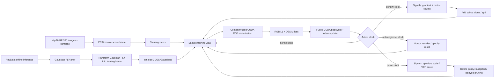

# FasterGSFusedRapid：基于前馈初始化、融合训练后端与多视角一致性密度控制的快速 3DGS 训练

> 论文主体草稿。本文暂不写相关工作、详细横向对比和实验结果；实验部分只列需要补充的数据。

## 摘要

3D Gaussian Splatting（3DGS）通过显式 3D Gaussian 表示和可微 rasterization 实现高质量新视角合成，但训练阶段仍然依赖较长的优化过程、频繁的 densification/pruning，以及大规模 Gaussian 参数的反向传播和优化器更新。本文提出 FasterGSFusedRapid，一个保持标准 3DGS 表示和 RGB 重建目标不变的快速训练管线。该管线从四个层面减少训练成本：首先，利用离线 AnySplat 预测的 Gaussian PLY 作为初始化，降低从稀疏 SfM 点云长出完整场景结构的优化距离；其次，引入多视角一致性密度控制，用训练视角上的高误差像素贡献分数约束 clone、split 和 pruning，减少局部梯度导致的冗余 Gaussian 增长；第三，在 rasterizer preprocess 中使用 compact-box 风格的 tile contribution 判断，减少无效 Gaussian-tile instance；最后，将 RGB rasterization、backward 和 Adam 更新融合到 CUDA 后端中，减少 PyTorch optimizer、梯度张量和 Python 调度开销。当前维护版本为 RGB-only 训练，不使用 Metric3D/depth supervision。方法目标不是改变 3DGS 的表达能力，而是在保留其核心训练语义的前提下，把初始化、结构控制和训练执行路径改造成更快、更可控的系统。

## 1. 引言

3DGS 的训练效率瓶颈来自三个相互耦合的因素。第一，原始训练通常从 SfM 稀疏点云初始化，早期需要大量 iteration 和 densification 操作才能形成足够密的 Gaussian 分布。第二，原始 densification 主要依赖单视角或局部累积的 view-space gradient，容易在遮挡边界、局部噪声和偶然高误差区域产生冗余 Gaussian。第三，随着 Gaussian 数量增长，rasterization backward 和 optimizer update 成为训练主耗时；如果 optimizer 仍由 PyTorch 外层管理，大量参数张量和 moment 张量会带来额外 kernel launch、内存读写和调度开销。

本文的核心观点是：在不改变标准 3DGS 表示和 RGB photometric loss 的前提下，训练速度可以通过更好的初始化、更严格的密度增长条件，以及更融合的 CUDA 训练后端共同提升。也就是说，我们不试图设计新的 Gaussian primitive，也不引入新的渲染目标，而是保持 3DGS 的 `mean + scale + rotation + opacity + SH color` 参数化，继续使用 RGB L1+DSSIM 损失，并围绕训练系统本身做优化。

FasterGSFusedRapid 的设计遵循以下原则：

- **初始化应减少优化距离。** 如果能从 AnySplat 生成的较密 Gaussian prior 开始，训练不必完全依赖 SfM sparse points 和漫长 clone/split 过程重建粗结构。
- **密度控制应关注多视角一致性。** 一个 Gaussian 是否应该增殖，不应只由局部 gradient 决定，还应看它是否在多个训练视角的高误差像素上持续产生贡献。
- **训练热路径应尽量留在 CUDA 内。** 每个 iteration 都执行的 forward、backward 和 Adam update 应减少 Python/PyTorch 边界开销。
- **核心 3DGS 语义应保持稳定。** 表示、RGB loss、SH schedule、opacity reset、clone/split 几何规则等核心机制保持与 3DGS 主线一致，避免用不兼容目标换取表面速度。

基于这一逻辑，本文推荐的实验 baseline 使用 v0.4.27 配置：它在 v0.4.23 严格质量基线之上只去除普通训练 loop 中重复的 mode setter 开销，不改变训练数学、采样、densification/pruning、Morton ordering、AnySplat 初始化或 schedule。该版本的 7 scenes repeat=3 平均训练时间为 88.9945s，平均 PSNR 为 28.5726，因此作为当前主线的最新严格质量基线。

## 2. 方法总览

给定一个带有已知相机参数的 Mip-NeRF 360 场景，FasterGSFusedRapid 的训练流程分为五个阶段：

1. 离线生成 AnySplat Gaussian PLY；
2. 将 PLY 中的 Gaussian 参数变换到训练数据使用的 Mip-NeRF 360 坐标系；
3. 用 compact/fused CUDA renderer/backward/Adam 训练标准 3DGS Gaussian；
4. 用统一结构编辑目标解释 densification 与 pruning；
5. 在 action-specific callback 中计算结构信号，并分别执行 clone/split 与 budgeted/delayed pruning。

整体流程如下：



### 2.1 相比原版 3DGS 的系统性进步

原版 3DGS 已经给出了高质量的显式 Gaussian 表示和 tile-based differentiable rasterization。FasterGSFusedRapid 的进步不在于替换这套表示，而在于把训练系统中最耗时、最容易产生冗余、最难复现实验的环节分别工程化。可以按以下维度理解：

| 维度 | 原版 3DGS | FasterGSFusedRapid | 主要收益 |
| --- | --- | --- | --- |
| 初始化 | 从 SfM sparse point cloud 初始化 | 从 AnySplat Gaussian PLY 初始化，并同步应用 Mip-NeRF 360 world transform | 降低从稀疏结构长成完整场景的优化距离，使 17k/18k schedule 成为可行选择 |
| 表示与目标 | 标准 anisotropic Gaussian + RGB L1/DSSIM | 保持同一 Gaussian 参数化和 RGB photometric loss | 速度提升不是靠换表示或换监督目标获得，便于和 3DGS 主线对照 |
| 密度增长 | 主要依赖 view-space gradient clone/split | signed/abs gradient 仍保留，但必须通过 multi-view high-error contribution gate | 减少单视角噪声、遮挡边缘和局部梯度 spike 造成的冗余 Gaussian 增长 |
| 删除策略 | opacity/scale 等局部规则 | opacity/scale + VCP score + confirmation/budget + split parent replacement | 删除更接近“低贡献/不稳定结构优先”，并控制一次 pruning 的风险 |
| Rasterizer 覆盖 | 3-sigma bbox 会产生较多 Gaussian-tile pairs | compact-box 风格 tile contribution test，只保留有效 tile instance | 减少无效 splat/tile 工作量，降低排序和 blend 压力 |
| 训练热路径 | rasterization/backward 后由 PyTorch optimizer 更新参数 | custom autograd bridge 只传 `grad_image`，CUDA backward 中融合梯度计算和 Adam 更新 | 减少 `.grad` tensor、Python optimizer 调度和多 kernel update 开销 |
| 参数状态 | PyTorch 参数和 optimizer state 由框架隐式维护 | 参数 tensor、Adam moments、densification info、VCP hits 在 prune/sort/split 时显式同步 | 适配动态 Gaussian 集合，同时避免 state 错配导致的隐性训练错误 |
| 内存局部性 | Densification 后参数顺序自然 append | 周期性 Morton/z-order 重新排列参数和 moments | 改善 preprocess、blend、backward、Adam 中按 Gaussian id 访问的 locality |
| 并行执行 | tile-based splatting | 保留 tile sort，并进一步使用 bucket 化调度长 tile primitive list | 缓解不同 tile primitive 数差异造成的负载不均 |

因此本文的贡献可以概括为“保留 3DGS 的渲染语义，重写训练系统”。AnySplat 初始化解决早期结构搜索成本，multi-view 结构编辑解决冗余增长和删除风险，compact tile culling 减少无效 rasterization work，fused CUDA backend 解决每步数值更新成本，Morton/bucket/cache 解决内存局部性和负载均衡问题。

这个对照也说明哪些部分不应被过度声称。当前维护版没有引入新的 Gaussian primitive，没有改变 alpha blending 公式，没有把 Metric3D/depth supervision 作为主线，也没有实现完整的 learned controller 或所有扩展结构因子。它的优势来自一组互相配合的训练系统改造，而不是单一 trick。

优化参数仍是标准 3DGS 参数：

$$
G_i = \{\boldsymbol{\mu}_i,\mathbf{s}_i,\mathbf{q}_i,o_i,\mathbf{c}_i\},
$$

其中 $\boldsymbol{\mu}_i \in \mathbb{R}^3$ 是 3D mean，$\mathbf{s}_i \in \mathbb{R}^3$ 是 log-space anisotropic scale，$\mathbf{q}_i$ 是 quaternion rotation，$o_i$ 是 raw opacity logit，$\mathbf{c}_i$ 是 SH color coefficients。物理 opacity 为

$$
\alpha_i^{0} = \sigma(o_i).
$$

Gaussian 的 3D covariance 仍采用标准 3DGS 参数化：

$$
\Sigma_i = R(\mathbf{q}_i)\operatorname{diag}(\exp(2\mathbf{s}_i))R(\mathbf{q}_i)^\top.
$$

给定相机 $v$，mean 投影为

$$
\mathbf{u}_{i,v} = \pi_v(\boldsymbol{\mu}_i),
$$

2D covariance 由投影 Jacobian $J_{i,v}$ 和 world-to-camera 线性部分 $W_v$ 得到：

$$
\Sigma'_{i,v} = J_{i,v} W_v \Sigma_i W_v^\top J_{i,v}^\top + \lambda I.
$$

这里 $\lambda I$ 表示 rasterization 中的 2D dilation/stability term。令

$$
Q_{i,v} = (\Sigma'_{i,v})^{-1},
$$

则 Gaussian $i$ 对像素 $\mathbf{p}$ 的屏幕空间响应为

$$
g_{i,v}(\mathbf{p}) =
\exp\left(
-\frac{1}{2}(\mathbf{p}-\mathbf{u}_{i,v})^\top
Q_{i,v}
(\mathbf{p}-\mathbf{u}_{i,v})
\right).
$$

像素级 alpha 为

$$
\alpha_{i,v}(\mathbf{p}) = \sigma(o_i) g_{i,v}(\mathbf{p}).
$$

按深度排序后的 front-to-back alpha blending 为

$$
T_{i,v}(\mathbf{p}) = \prod_{j<i} (1-\alpha_{j,v}(\mathbf{p})),
$$

$$
\hat{\mathbf{I}}_v(\mathbf{p}) =
\sum_i T_{i,v}(\mathbf{p})\alpha_{i,v}(\mathbf{p})
\mathbf{C}_i(\mathbf{d}_{i,v})
+ T_{\mathrm{final},v}(\mathbf{p})\mathbf{b}_v,
$$

其中 $\mathbf{C}_i(\mathbf{d}_{i,v})$ 是由 SH coefficients 和 view direction 计算得到的颜色，$\mathbf{b}_v$ 是背景颜色。训练目标为 RGB-only photometric loss：

更具体地，若当前 active SH basis 数为 $B_t$，则颜色为

$$
\mathbf{C}_i(\mathbf{d}) =
\operatorname{clamp}_{\ge 0}
\left(
\sum_{b=0}^{B_t-1} Y_b(\mathbf{d})\mathbf{c}_{i,b}
\right),
$$

其中 $Y_b$ 是 SH basis，$B_t$ 随训练 step 增加。当前实现保留 3DGS 的渐进式 SH 激活：

$$
B_t = \min\left((\lfloor t/T_{\mathrm{sh}}\rfloor + 1)^2,\; B_{\max}\right),
$$

其中 $T_{\mathrm{sh}}=1000$，$B_{\max}=16$ 对应 SH degree 3。这样即使 AnySplat PLY 中含有 higher-order SH，训练早期仍先优化低频颜色和几何。

$$
\mathcal{L}_{\mathrm{rgb}} =
\lambda_1\|\hat{\mathbf{I}}_v-\mathbf{I}_v\|_1
+ \lambda_s \mathcal{L}_{\mathrm{DSSIM}}(\hat{\mathbf{I}}_v,\mathbf{I}_v).
$$

当前维护版不使用 depth loss。曾经实现过 Metric3D inverse-depth supervision，但该分支增加 CUDA ABI、buffer、显存和调试复杂度，实验中未带来稳定收益，因此 v0.4.14 后回到 RGB-only 主线。

## 3. AnySplat 初始化与坐标对齐

### 3.1 动机

原版 3DGS 从 SfM sparse point cloud 初始化，这种初始化可靠但稀疏。大量训练时间被用于通过 clone/split 逐步补足密度，尤其是在大场景和复杂遮挡区域。AnySplat 提供的是更接近最终结构的 Gaussian prior，因此可以显著缩短从粗结构到可用结构的优化距离。

但直接读取 AnySplat PLY 并不够。Mip-NeRF 360 数据加载过程中会对场景做 PCA/rescale；如果 AnySplat 输出的 Gaussian 没有同步变换到训练 camera frame，即使 prior 本身质量较好，也会因为坐标、尺度或旋转不一致而破坏训练。

### 3.2 Gaussian PLY 导入

训练配置启用：

```yaml
ANYSPLAT_INITIALIZATION:
  ACTIVE: true
  PATH: anysplat_init/point_cloud.ply
  REQUIRE: true
  SET_ACTIVE_SH_DEGREE: false
```

`REQUIRE=true` 的设计是为了保证实验 fail-fast。如果 AnySplat PLY 缺失，训练不应静默退化为 SfM 初始化，否则不同 run 的语义会混在一起。`SET_ACTIVE_SH_DEGREE=false` 则表示即使 PLY 中存在 higher-order SH，训练也从 degree 0 开始激活，后续继续遵循 3DGS 的 SH schedule。

### 3.3 坐标变换

导入 AnySplat PLY 后，需要同步变换 Gaussian 的 mean、scale 和 rotation：

- mean 乘以 dataset world transform 并加 translation；
- scale 的 log 参数加上 uniform scale 的 `log`；
- rotation 左乘 dataset transform 中的旋转部分；
- quaternion 重新归一化，并规范到 `w >= 0`。

该步骤的动机是保证 prior 和训练 camera frame 一致。只变换 mean 不够，因为 Gaussian 的 ellipsoid 尺度和朝向也直接影响 rasterization、densification threshold 和 pruning 判断。坐标对齐后，AnySplat 初始化才真正成为有用的训练起点，而不是错误坐标下的噪声。

更形式化地，设数据集预处理给出的 similarity transform 为

$$
\mathbf{x}' = \rho R_T \mathbf{x} + \mathbf{t},
$$

其中 $\rho$ 是 uniform scale，$R_T$ 是旋转矩阵。AnySplat PLY 中的 Gaussian 参数变换为

$$
\boldsymbol{\mu}'_i = \rho R_T\boldsymbol{\mu}_i + \mathbf{t},
$$

$$
\mathbf{s}'_i = \mathbf{s}_i + \log \rho,
$$

$$
R(\mathbf{q}'_i) = R_T R(\mathbf{q}_i).
$$

最后将 $R(\mathbf{q}'_i)$ 转回 quaternion 并归一化。这个变换保持 ellipsoid 在新坐标系下的几何意义：位置、尺度和朝向都与 camera frame 一致。

## 4. Fused CUDA 训练后端

### 4.1 动机

在 3DGS 训练中，每个 iteration 都要执行 rasterization、loss backward 和 optimizer update。当 Gaussian 数量达到数十万到数百万时，训练时间主要集中在 backward 和 Adam 更新。原版 PyTorch optimizer 路径需要构造 `.grad` 张量，并由 Python/PyTorch 调度多个参数组的 Adam kernel。FasterGSFusedRapid 将这些高频数值训练语义融合到 CUDA backend 中。

这并不意味着 Python 不再参与训练。Python 仍负责 view sampling、RGB loss 组合、callback 调度、clone/split/prune 的动态 tensor 管理和实验配置管理。CUDA 负责每步高频路径：RGB rasterization、alpha/bucket backward、projection/covariance/SH backward、visible/invisible Adam update、densification statistics 和 metric-count render。

### 4.2 Autograd bridge

外层训练仍调用：

```python
loss.backward()
```

但 `_Rasterize.backward` 不向 Gaussian 参数返回 PyTorch gradients。参数和 moment tensors 被标记为 non-differentiable，backward 返回全 `None`。PyTorch autograd 只负责把 RGB loss 对 rendered image 的梯度 `grad_image` 传入 `_C.backward`。随后 CUDA backend 原地更新 Gaussian 参数和 Adam moments。

这样保留了 PyTorch loss 写法的灵活性，同时绕开了 PyTorch `.grad` tensor 和 `torch.optim.Adam.step()` 的开销。

### 4.3 Backward + Adam 融合

CUDA backward 分为两层：

1. `blend_backward_cu` 从 RGB loss 回传到 2D splat 层面的 `mean2d`、conic、opacity 和 color 梯度；
2. `preprocess_backward_cu` 将这些梯度回传到 raw 3D Gaussian 参数，并直接调用 Adam 更新。

可见 Gaussian 的 mean、scale、rotation、opacity 和 SH coefficients 均在 CUDA 中调用 fused Adam helper 更新。不可见 Gaussian 虽然没有当前 view 的新梯度，但仍需要推进 Adam moment decay；因此 backend 额外执行 `adam_step_invisible`，保证不同 Gaussian 的 optimizer state 随全局 step 同步推进。

这个设计的动机是保持 Adam 语义，而不是简单跳过不可见 Gaussian。若不可见 Gaussian 的 moments 不衰减，它们的优化时间尺度会与可见 Gaussian 不一致，偏离标准 Adam。

CUDA 中每个参数 $\theta$ 的 Adam 更新仍采用标准形式。对可见 Gaussian，梯度为 $g_t$：

$$
\mathbf{m}_t = \beta_1\mathbf{m}_{t-1} + (1-\beta_1)g_t,
$$

$$
\mathbf{v}_t = \beta_2\mathbf{v}_{t-1} + (1-\beta_2)g_t^2,
$$

$$
\theta_t =
\theta_{t-1}
- \eta_t
\frac{\mathbf{m}_t/(1-\beta_1^t)}
{\sqrt{\mathbf{v}_t/(1-\beta_2^t)}+\epsilon}.
$$

实现上，host 端预先计算 bias correction，device 端更新 moments 并原地写回参数。对不可见 Gaussian，相当于使用 $g_t=0$ 推进 moments：

$$
\mathbf{m}_t = \beta_1\mathbf{m}_{t-1},\quad
\mathbf{v}_t = \beta_2\mathbf{v}_{t-1}.
$$

因此 invisible update 不是额外优化目标，而是为了保持全局 Adam step 语义。

### 4.4 Densification statistics side output

训练窗口内，CUDA backward 同时维护三通道 densification info：

$$
\mathbf{D}_i = \{d_i,\; g_i^{\mathrm{sgn}},\; g_i^{\mathrm{abs}}\}.
$$

其中 denominator 记录可见/处理次数，signed gradient 用于 clone 候选，absolute gradient 用于 split 候选。该统计直接来自 RGB backward 中已经计算出的 `grad_mean2d`，因此不需要额外 backward。

在一次 densification interval 内，CUDA 对每个可见 Gaussian 累积：

$$
d_i \leftarrow d_i + 1,
$$

$$
g_i^{\mathrm{sgn}} \leftarrow
g_i^{\mathrm{sgn}} + \|\nabla_{\mathbf{u}_i}\mathcal{L}\|_2,
$$

$$
g_i^{\mathrm{abs}} \leftarrow
g_i^{\mathrm{abs}} + \left\||\nabla_{\mathbf{u}_i}\mathcal{L}|\right\|_2.
$$

其中 $\mathbf{u}_i$ 是 projected 2D mean。后续 density-control callback 使用 $d_i$ 对梯度统计做可见性归一。

在实现中，只有当前 view 中实际触达 tile 的 Gaussian 才更新这些统计。记

$$
\chi_{i,v} =
\mathbb{1}\left[n_{\mathrm{tiles}}(i,v)>0\right],
$$

则更严格地可写为

$$
d_i \leftarrow d_i + \chi_{i,v}.
$$

这避免了不可见 Gaussian 因没有当前 view 梯度而污染 density-control 统计。

densification 结束后，trainer 传入空 densification buffer，CUDA 走不更新统计的模板分支，从而跳过无用 helper 和 atomic。动机是：densification 结束后这些统计没有下游消费者，继续维护只会增加后期 backward 成本。

## 5. 统一结构编辑理论

### 5.1 边际收益/边际代价准则

本文把 densification 和 pruning 都看成对 Gaussian 集合 $\mathcal{G}$ 的离散结构编辑。一次编辑 $a$ 会把当前集合变成 $\mathcal{G}_a$，并带来 loss 与成本变化：

$$
\Delta\mathcal{L}(a)
=
\mathcal{L}(\mathcal{G}_a)-\mathcal{L}(\mathcal{G}),
\quad
\Delta\mathcal{C}(a)
=
\mathcal{C}(\mathcal{G}_a)-\mathcal{C}(\mathcal{G}).
$$

统一目标可以写成

$$
\min_{\mathcal{G}}
\mathcal{L}(\mathcal{G})+\lambda\mathcal{C}(\mathcal{G}),
$$

因此编辑 $a$ 值得执行，当且仅当

$$
\Delta\mathcal{L}(a)+\lambda\Delta\mathcal{C}(a)<0.
$$

这个式子同时覆盖增加和删除：

$$
\mathrm{add}:\quad
-\Delta\mathcal{L}(a_i^+)>\lambda\Delta\mathcal{C}(a_i^+),
$$

$$
\mathrm{delete}:\quad
\Delta\mathcal{L}(a_i^-)<\lambda(-\Delta\mathcal{C}(a_i^-)).
$$

也就是说，增加关注“新增单位成本能降低多少 loss”，删除关注“节省单位成本会增加多少 loss”。二者共享同一个边际 loss/cost 观点，但执行动作方向相反。

### 5.2 单位成本 add/delete 准则

进一步地，对 clone/split 候选 $a_i^{+}$，新增 Gaussian 会增加成本，$\Delta\mathcal{C}(a_i^{+})>0$，因此应按单位成本 loss reduction 排序：

$$
U_i^{+}
=
\frac{-\Delta\mathcal{L}(a_i^{+})}
{\Delta\mathcal{C}(a_i^{+})}.
$$

对删除候选 $a_i^{-}$，删除 Gaussian 会降低成本，$\Delta\mathcal{C}(a_i^{-})<0$，因此应按单位节省成本带来的 loss increase 排序：

$$
U_i^{-}
=
\frac{\Delta\mathcal{L}(a_i^{-})}
{-\Delta\mathcal{C}(a_i^{-})}.
$$

理想策略是增加 $U_i^{+}$ 高的结构，删除 $U_i^{-}$ 低的结构。但真实 $\Delta\mathcal{L}$ 无法直接求，所以需要用可计算信号近似。当前实现中，增加方向主要使用局部梯度压力和多视角 high-error contribution：

$$
\hat{U}_i^{+}
\propto
r_i^{\mathrm{grad}}\cdot r_i^{\mathrm{mv}}.
$$

删除方向则使用 opacity、scale、multi-view pruning score 和 split replacement 等信号近似删除风险：

$$
\hat{U}_i^{-}
\approx
f_{\mathrm{keep}}\left(
\sigma(o_i), r_i, s_i^{-}, m_i^{\mathrm{replace}}
\right).
$$

### 5.3 同源信号与方向相关判别

上述统一观点给出一个直接结论：densification 和 pruning 应该共享同源观测信号，但使用方向相关的判别函数。设 Gaussian 的结构状态为

$$
\mathbf{z}_i =
\left[
g_i,\,
s_i^{-},\,
\sigma(o_i),\,
\nu_i,\,
r_i,\,
\rho_i,\,
\eta_i
\right],
$$

其中 $g_i$ 是 view-space gradient pressure，$s_i^{-}$ 是 multi-view high-error contribution score，$\sigma(o_i)$ 是物理 opacity，$\nu_i$ 是 view coverage，$r_i$ 是尺度，$\rho_i$ 是局部冗余度，$\eta_i$ 是跨视角稳定性。理论上可以写成

$$
\hat{U}_i^{+}=f_{\mathrm{add}}(\mathbf{z}_i),
\quad
\hat{U}_i^{-}=f_{\mathrm{del}}(\mathbf{z}_i).
$$

这里 $f_{\mathrm{add}}$ 和 $f_{\mathrm{del}}$ 共享输入，但不应简单互为相反数。原因是 high-error contribution 本身有二义性：它可能说明该区域容量不足，也可能说明当前 Gaussian 正在错误解释该区域。方向取决于它和 gradient、visibility、opacity、scale、redundancy、stability 的组合。

一个可实现但当前未完整启用的统一 controller 可以拆成三个中间量：

$$
D_i =
\bar{g}_i\bar{s}_i\bar{\nu}_i\bar{\eta}_i(1-\bar{\rho}_i),
$$

$$
R_i =
\bar{\alpha}_i\bar{\nu}_i\bar{\eta}_i(1-\bar{\rho}_i),
$$

$$
Q_i =
\bar{s}_i(1-\bar{\nu}_i)
+ \mathbb{1}[\bar{r}_i>\tau_r]
+ \bar{\rho}_i.
$$

其中 $D_i$ 表示容量需求，$R_i$ 表示保留价值，$Q_i$ 表示不一致风险。增加策略可偏向 $D_i$ 高的 Gaussian，删除策略可偏向 $R_i-\lambda_QQ_i$ 低的 Gaussian。当前代码没有实现这个完整 controller，而是用分解规则分别近似 add 和 delete。

### 5.4 Hysteresis 与 action-specific clocks

Add/delete 不应该使用完全对称的单阈值，而应形成 hysteresis：

$$
\tau_{\mathrm{add}} > \tau_{\mathrm{keep}} > \tau_{\mathrm{delete}}.
$$

只有当边际收益明显足够高时才增加容量，只有当边际保留价值明显足够低时才删除容量，中间区域保持不变。当前实现中的 importance threshold、budgeted pruning、delayed VCP、opacity reset 后再 large-scale pruning，本质上都在形成这种保守的结构编辑区间。

统一目标也不要求 add 和 delete 以相同频率执行。更合理的形式是“统一评价框架 + action-specific clocks”。设第 $t$ 个 iteration 允许执行的结构动作集合为

$$
\mathcal{A}_t =
\mathcal{A}^{\mathrm{add}}\mathbb{1}[t\in\mathcal{T}_{\mathrm{add}}]
\cup
\mathcal{A}^{\mathrm{prune}}\mathbb{1}[t\in\mathcal{T}_{\mathrm{prune}}]
\cup
\mathcal{A}^{\mathrm{reset}}\mathbb{1}[t\in\mathcal{T}_{\mathrm{reset}}],
$$

其中 $\mathcal{T}_{\mathrm{add}}$、$\mathcal{T}_{\mathrm{prune}}$ 和 $\mathcal{T}_{\mathrm{reset}}$ 分别是 densification、VCP pruning 和 opacity reset 的触发时钟。Densification 的错误通常只是增加计算成本，后续仍可通过 pruning 修正；pruning 则会直接删除参数和 optimizer state，错误代价更高。因此当前实现让 add 高频触发，让 VCP pruning 和 opacity reset 低频触发。

实践上，真实 $\Delta\mathcal{L}$ 无法直接计算。FasterGSFusedRapid 因此采用分解式规则控制器：先构造一组可计算信号，再分别进入增加策略和删除策略。本文后续实现章节按以下顺序展开：

1. 定义结构控制需要的信号；
2. 说明这些信号如何通过 CUDA metric-count render 计算；
3. 用这些信号决定 clone/split；
4. 用这些信号决定 low-opacity、large-scale、budgeted pruning 和 delayed VCP pruning。

这种写法的重点是：理论上统一，工程上分解。我们没有把所有信号压成单一标量 $V_i$，因为单一 score 需要跨场景、跨 iteration 和跨 Gaussian population 校准，反而更难调参。

### 5.5 结构控制因子 taxonomy

为了避免把不同层级的量混在一起，本文把结构控制相关量先分成四类：

| 类别 | 例子 | 回答的问题 | 当前角色 |
| --- | --- | --- | --- |
| 原始观测信号 | view-space gradient、metric counts、opacity、scale | 这个 Gaussian 在训练和渲染中表现如何？ | 从 CUDA/PyTorch 状态直接读出或统计 |
| 派生判据 | importance gate、low-opacity mask、large-scale mask、VCP score mask、split parent mask | 它是否进入 add/delete 候选集合？ | 把原始信号阈值化或组合成候选 mask |
| 执行策略 | clone、split、delayed confirmation、top-$B$ budget pruning、stochastic sampling | 候选被怎样执行，什么时候执行，删多少？ | 控制结构编辑的动作、时钟和幅度 |
| 未实现扩展信号 | view coverage、score stability、redundancy、occlusion visibility | 还能补充哪些可靠性证据？ | 只作为未来扩展，不进入当前结果 |

从信号来源看，结构控制因子还可以归纳为几何、视觉贡献、优化动态和系统资源四组：

| 因子组 | 代表信号 | 对结构编辑的含义 | 当前使用情况 |
| --- | --- | --- | --- |
| 几何相关因子 | depth/surface proximity、local density、covariance/scale | 接近可靠表面的 Gaussian 删除风险更高；局部过密说明可能冗余；scale 过大时可能需要 split 或 prune | 当前使用 scale 参与 split/large-scale prune；depth、local density 和 merge-style redundancy 未启用 |
| 视觉贡献因子 | perceptual importance、edge/detail region、view-dependent contribution、tile/pixel coverage | 高频边缘或多视角稳定贡献区域应保留或 densify；平滑、低覆盖、低 alpha contribution 区域可更激进 prune | 当前使用 multi-view score 和 metric counts；LPIPS/SSIM attribution、edge mask、coverage 输出未启用 |
| 优化相关因子 | gradient magnitude、learning dynamics、training stage、redundancy/correlation | 高梯度说明容量不足，适合 clone/split；长期低梯度低贡献说明可 prune；训练早期偏增长，后期偏压缩 | 当前使用 signed/abs gradient、densification window、VCP window 和 split replacement；相关性/merge 未启用 |
| 系统和资源因子 | memory budget、Gaussian count、VRAM、tile pressure、temporal consistency | 超过资源预算时应提高 prune 优先级或限制 densify；动态场景还需跨时间帧一致性 | 当前通过 schedule、budget fraction 和 Gaussian 数间接控制；temporal consistency 不属于静态 Mip-NeRF 360 设置 |

这张 taxonomy 的作用是说明统一结构编辑框架的设计空间。当前 FasterGSFusedRapid 并不声称已经实现所有因子；为了可复现和避免额外开销，主线只保留 gradient、opacity、scale、multi-view score、VCP confirmation/budget 和阶段性 schedule 这些已验证信号。第 6 章只展开增长侧，第 7 章只展开删除侧。

## 6. 增长因子与增加策略

### 6.1 当前使用的增长因子

原版 3DGS 的 densification 主要依赖 view-space gradient。这个信号简单有效，但它是局部的：一个 Gaussian 在某个视角上梯度大，并不一定说明它在多视角重建中稳定有用。遮挡边界、局部噪声、错误 opacity 或单视角高误差都可能触发冗余增长。

FasterGSFusedRapid 引入 FastGS/RapidGS 风格的多视角 score。其核心思想是：一个 Gaussian 是否值得 clone/split，应同时满足两个条件：

1. 它在训练过程中产生了足够大的 gradient signal；
2. 它在多个训练视角的 high-error pixels 上确实有贡献。

当前增长侧实际采用三类低成本因子：

| 增长因子 | 信号来源 | 作用 |
| --- | --- | --- |
| 局部优化压力 | signed/abs view-space gradient | 找出当前 Gaussian 容量不足、需要 clone/split 的位置 |
| 多视角高误差贡献 | metric-count render 得到的 importance score | 避免只由单视角 spike 触发增长，要求候选确实参与解释多视角高误差区域 |
| 训练阶段 | densification window、SH schedule、Morton/order window | 早中期允许增长，后期停止结构扩张，把训练预算留给收敛 |

因此，第 6 章讨论的是“什么时候增加容量”。Opacity、low-value VCP score、delete budget 等删除侧因素放在第 7 章单独讨论。

### 6.2 从预算受限结构编辑推导多视角一致性

我们可以把 densification 看成一个预算受限的结构编辑问题，而不是一个单纯的梯度阈值问题。给定当前 Gaussian 集合 $\mathcal{G}$，多视角训练目标为

$$
\mathcal{L}(\mathcal{G}) =
\sum_{v\in\mathcal{V}}
\sum_{\mathbf{p}}
\ell\left(
\hat{\mathbf{I}}_v(\mathbf{p};\mathcal{G}),
\mathbf{I}_v(\mathbf{p})
\right).
$$

一次理想的 densification 希望选择一组新增 Gaussian $\Delta\mathcal{G}$，使加入这些 Gaussian 后的多视角 loss 下降最大：

$$
\Delta\mathcal{G}^{\star}
=
\arg\max_{\Delta\mathcal{G}}
\left[
\mathcal{L}(\mathcal{G})
-
\mathcal{L}(\mathcal{G}\cup\Delta\mathcal{G})
\right],
$$

同时还要满足新增 Gaussian 数量和训练时间预算约束。这个目标无法直接求解，因为对每个候选 clone/split 都重新优化并评估 loss reduction 代价过高。

原版 3DGS 使用 accumulated view-space mean gradient 作为可计算 proxy：

$$
r_i^{\mathrm{grad}}
=
\|\nabla_{\mathbf{u}_i}\mathcal{L}\|_2.
$$

这个 proxy 表示局部优化压力：如果 Gaussian 的 projected mean 梯度较大，说明当前参数附近存在较强的 loss 驱动。但 $r_i^{\mathrm{grad}}$ 不是充分条件。高梯度可能来自单视角遮挡边界、背景/alpha 合成误差、局部纹理噪声，或附近 Gaussian 的竞争；这些情况并不一定意味着 clone 或 split 该 Gaussian 能稳定降低多视角重建误差。

因此，我们引入第二个必要信号：Gaussian 是否反复参与解释多视角高误差区域。记 Gaussian $i$ 的多视角高误差贡献为 $r_i^{\mathrm{mv}}$。densification 候选不再只由梯度决定，而由两个条件共同决定：

$$
\mathrm{densify}_i
=
\mathbb{1}[r_i^{\mathrm{grad}}>\tau_g]
\land
\mathbb{1}[r_i^{\mathrm{mv}}>\tau_{\mathrm{mv}}].
$$

这个形式对应一个直观的必要条件分解：

- 如果 $r_i^{\mathrm{grad}}$ 高但 $r_i^{\mathrm{mv}}$ 低，Gaussian 可能只是局部不稳定，不应优先分配新增容量；
- 如果 $r_i^{\mathrm{mv}}$ 高但 $r_i^{\mathrm{grad}}$ 低，该区域虽然误差高，但当前 Gaussian 未表现出需要 clone/split 的局部优化压力；
- 只有二者都高时，新增容量才更可能降低真实多视角 loss。

这也是本文采用多视角一致性密度控制的动机：它把 densification 从“哪里梯度大就增长”改写为“哪里既有局部优化压力、又稳定参与多视角残差，才增长”。这样可以减少 Gaussian budget 被局部、偶然或单视角误差信号消耗。

### 6.3 信号具体实现：metric-count render

在 density-control callback 中，训练器采样 `K=10` 个 training views。对每个 view：

1. 渲染 unclamped score image；
2. 与 GT RGB 计算 per-pixel L1 error；
3. 对 error map 做 min-max normalization；
4. 用 `FASTGS_LOSS_THRESHOLD` 得到 high-error mask；
5. 调用 metric-count render，统计每个 Gaussian 对 high-error pixels 的贡献次数。

重要的是，metric-count render 统计的是实际 rasterization 中贡献到 high-error pixels 的 Gaussian，而不是简单判断 Gaussian 的投影 bbox 是否覆盖像素。这保证 score 与训练 rasterization 的 alpha、visibility 和 tile contribution 语义一致。

记采样训练视角集合为 $\mathcal{V}_K$。对视角 $v$，先计算每像素 RGB 误差：

$$
e_v(\mathbf{p}) =
\frac{1}{3}\|\hat{\mathbf{I}}_v(\mathbf{p})-\mathbf{I}_v(\mathbf{p})\|_1.
$$

归一化后得到 high-error mask：

$$
M_v(\mathbf{p}) =
\mathbb{1}\left[
\frac{e_v(\mathbf{p})-\min_{\mathbf{p}}e_v(\mathbf{p})}
{\max_{\mathbf{p}}e_v(\mathbf{p})-\min_{\mathbf{p}}e_v(\mathbf{p})+\epsilon}
> \tau_e
\right].
$$

令 $A_{i,v}(\mathbf{p})$ 表示 Gaussian $i$ 在视角 $v$ 对像素 $\mathbf{p}$ 实际产生有效 alpha contribution：

$$
A_{i,v}(\mathbf{p}) =
\mathbb{1}\left[
\alpha_{i,v}(\mathbf{p}) \ge \tau_\alpha
\right]
\mathbb{1}\left[
T_{i,v}(\mathbf{p}) > \tau_T
\right]
\mathbb{1}\left[i \in \mathcal{S}_v(\mathbf{p})\right],
$$

其中 $\mathcal{S}_v(\mathbf{p})$ 是 rasterizer 中像素 $\mathbf{p}$ 的可见有序 Gaussian 列表，$\tau_\alpha$ 是最小 alpha 阈值，$\tau_T$ 是 transmittance early-stop 阈值。metric-count render 计算：

$$
h_{i,v} = \sum_{\mathbf{p}} M_v(\mathbf{p}) A_{i,v}(\mathbf{p}).
$$

densification importance score 为：

$$
s_i^{+} =
\left\lfloor
\frac{1}{K}\sum_{v\in\mathcal{V}_K} h_{i,v}
\right\rfloor.
$$

pruning score 使用 photometric loss 加权 count 后再归一化：

$$
\tilde{s}_i^{-} =
\sum_{v\in\mathcal{V}_K} \ell_v h_{i,v},
$$

$$
s_i^{-} =
\operatorname{norm}(\tilde{s}_i^{-}),
$$

其中 $\ell_v$ 是视角 $v$ 的 RGB photometric loss。$s_i^{+}$ 用于判断是否值得 densify，$s_i^{-}$ 用于判断是否多视角不一致或低价值。

这个定义强调：score 不是单纯的 2D bbox 覆盖次数，而是受真实 alpha、transmittance、tile visibility 和 high-error mask 共同约束的贡献计数。因此它和训练 render 的可见性语义一致。

### 6.4 增加策略：score-gated Clone/Split

基础候选由 densification info 给出：

$$
c_i^{0} =
\mathbb{1}\left[
g_i^{\mathrm{sgn}} \ge \tau_g d_i
\right],
$$

$$
p_i^{0} =
\mathbb{1}\left[
g_i^{\mathrm{abs}} \ge \tau_a d_i
\right].
$$

然后引入 importance gate：

$$
c_i =
c_i^{0}
\land
\mathbb{1}[s_i^{+} > \tau_{\mathrm{imp}}],
$$

$$
p_i =
p_i^{0}
\land
\mathbb{1}[s_i^{+} > \tau_{\mathrm{imp}}].
$$

令 Gaussian 的最大物理尺度为

$$
r_i = \max_k \exp(s_{i,k}),
$$

small/large 分流为

$$
\mathrm{small}_i =
\mathbb{1}[r_i \le \tau_{\mathrm{dense}} R_{\mathrm{scene}}],
$$

其中 $R_{\mathrm{scene}}$ 是 training cameras extent。最终 clone/split mask 为

$$
\mathcal{C}_i = c_i \land \mathrm{small}_i,
$$

$$
\mathcal{P}_i = p_i \land \neg \mathrm{small}_i.
$$

small Gaussian 走 clone，large Gaussian 走 split。Clone 复制原 Gaussian，不改变 scale；split 则在 parent ellipsoid 内采样两个 child，并将 child scale 乘以标准 3DGS shrink factor。split parent 随后立即 prune，只保留两个 child。

Clone 的数学形式是直接复制：

$$
G_{i'} \leftarrow G_i.
$$

Split 对每个 parent $i$ 生成两个 child。采样 $\boldsymbol{\epsilon}_k \sim \mathcal{N}(0,I)$，$k\in\{1,2\}$：

$$
\boldsymbol{\mu}_{i,k}' =
\boldsymbol{\mu}_i
+ R(\mathbf{q}_i)\operatorname{diag}(\exp(\mathbf{s}_i))\boldsymbol{\epsilon}_k,
$$

$$
\mathbf{s}_{i,k}' =
\mathbf{s}_i + \log \gamma,\quad \gamma=0.625.
$$

child 继承 parent 的 SH、opacity 和 rotation；parent 随后被删除。

该设计保留了 3DGS 的几何增长规则，但在候选选择上更保守。这样可以减少只由单视角局部 gradient 触发的冗余增长，为缩短训练 schedule 提供条件。

从集合角度看，一次 density-control callback 后的 Gaussian 集合为

$$
\mathcal{G}_{t^+}
=
\left(\mathcal{G}_{t^-}
\cup \mathcal{G}_{\mathrm{clone}}
\cup \mathcal{G}_{\mathrm{split}}\right)
\setminus
\mathcal{G}_{\mathrm{prune}}.
$$

其中 $\mathcal{G}_{\mathrm{split}}$ 的 parent 被包含在 $\mathcal{G}_{\mathrm{prune}}$ 中。这个写法突出当前方法的语义：density control 是“受 score 约束的结构编辑”，不是连续参数优化的一部分。

### 6.5 增长侧可扩展信号

上述推导也自然允许在增加策略里引入更多 reliability signals。下面这些具体信号尚未进入当前 baseline，本文只把它们作为未来增长侧扩展讨论。它们应当经过单独 ablation，而不能直接写成当前方法贡献。

一个更一般的 densification gate 可以写为

$$
\mathrm{densify}_i =
\prod_k
\mathbb{1}\left[r_i^{(k)}>\tau_k\right],
$$

或写成 soft priority：

$$
S_i =
\sum_k w_k r_i^{(k)}.
$$

潜在增长侧额外信号包括：

| 因子组 | 未实现信号 | 数学形式示例 | 动机 |
| --- | --- | --- | --- |
| 几何 | 表面接近度 | $r_i^{\mathrm{surf}}=-d(\boldsymbol{\mu}_i,\mathcal{S})$ | 在可靠表面附近且仍有高误差的位置优先细化 |
| 几何 | 局部稀疏度 | $r_i^{\mathrm{knn}}=\frac{1}{K}\sum_{j\in\mathcal{N}_K(i)}\|\boldsymbol{\mu}_i-\boldsymbol{\mu}_j\|_2$ | 稀疏且高误差区域比过密区域更值得 densify |
| 视觉 | 视角覆盖度 | $r_i^{\mathrm{view}}=\frac{1}{K}\sum_{v\in\mathcal{V}_K}\mathbb{1}[h_{i,v}>0]$ | 区分“来自多个视角的稳定高误差”和“单视角 spike” |
| 视觉 | 误差稳定性 | $r_i^{\mathrm{stab}}=-\operatorname{Var}_{v\in\mathcal{V}_K}(h_{i,v})$ | 避免某一个 view 极端误差主导 densification |
| 视觉 | 透射率加权可见性 | $r_i^{\mathrm{vis}}=\sum_{v,\mathbf{p}}M_v(\mathbf{p})A_{i,v}(\mathbf{p})T_{i,v}(\mathbf{p})$ | 优先增加真正影响最终像素颜色的可见 Gaussian |
| 视觉 | perceptual/edge 权重 | $r_i^{\mathrm{perc}}=\sum_{v,\mathbf{p}}P_v(\mathbf{p})A_{i,v}(\mathbf{p})$ | 在 LPIPS/SSIM 敏感或边缘细节区域更积极细化 |
| 优化 | 梯度历史稳定性 | $r_i^{\mathrm{hist}}=\operatorname{EMA}(r_i^{\mathrm{grad}})$ | 避免偶然一个 interval 的 gradient spike 触发结构增长 |
| 系统 | 资源预算门控 | $r_i^{\mathrm{budget}}=\mathbb{1}[N<N_{\max}]S_i$ | 只有在 Gaussian 数和 VRAM 预算允许时放宽增长 |
| 系统 | temporal consistency | $r_i^{\mathrm{time}}=\operatorname{EMA}_{\tau}(h_{i,\tau})$ | 动态场景中跨时间帧稳定高贡献才更适合 densify |

这些扩展与本文的预算受限结构编辑观点一致，但需要额外实验验证。为保持当前方法清晰和可复现，v0.4.27 baseline 不包含这些未实现信号。

## 7. 删除因子与减少策略

### 7.1 动机

AnySplat 初始化和 densification 都会提供模型容量。如果没有 pruning，Gaussian 数量会持续增长，导致 backward、Adam update 和显存压力上升。Pruning 的目标不是简单让模型更小，而是删除低贡献、过大或多视角不一致的 Gaussian，使剩余容量集中在真正影响重建质量的位置。

### 7.2 当前使用的删除因子

删除方向需要额外判据，因为 pruning 的错误代价高于 densification：错误增长通常只是增加计算成本，后续仍可删除；错误删除则会直接移除参数和 optimizer state。当前代码已经使用的删除因子包括：

| 删除因子 | 依赖的原始信号/状态 | 作用 |
| --- | --- | --- |
| low-opacity mask | $\sigma(o_i)<\tau_o$ | 删除几乎不贡献颜色的 Gaussian |
| large-scale mask | $r_i>\tau_rR_{\mathrm{scene}}$ | 删除过大的异常 splat |
| multi-view VCP mask | $s_i^{-}>\tau_p$ | 标记后期多视角不一致候选 |
| split replacement mask | split parent state | parent 被 children 替代后删除 |

这些判据只回答“哪些 Gaussian 是候选”。真正执行删除时，还会叠加删除策略：

| 删除策略 | 当前实现 | 作用 |
| --- | --- | --- |
| delayed confirmation | VCP hit counter | 要求候选连续多次出现，降低误删 |
| pruning budget | top-$B$ confirmed candidates | 限制单次删除幅度 |

因此，当前方法不是简单的“高 score 增加、低 score 删除”。同一个 high-error contribution 需要结合 gradient、opacity、scale 和多视角稳定性解释：如果 high-error contribution 伴随高 gradient 和稳定可见性，它更像容量不足信号；如果它伴随低 opacity、异常 scale 或不稳定 coverage，它更像错误解释或低价值信号。

### 7.3 从预算受限删除推导 pruning

与 densification 对应，pruning 也可以看成一个预算受限的结构编辑问题。给定当前 Gaussian 集合 $\mathcal{G}$，删除子集 $\mathcal{R}\subset\mathcal{G}$ 后得到

$$
\mathcal{G}' = \mathcal{G}\setminus\mathcal{R}.
$$

理想 pruning 希望在尽可能减少训练和渲染成本的同时，不显著增加多视角重建 loss。可以写成：

$$
\mathcal{R}^{\star}
=
\arg\max_{\mathcal{R}\subset\mathcal{G}}
\left[
\mathcal{C}(\mathcal{G})-\mathcal{C}(\mathcal{G}\setminus\mathcal{R})
\right]
\quad
\mathrm{s.t.}\quad
\mathcal{L}(\mathcal{G}\setminus\mathcal{R})-\mathcal{L}(\mathcal{G})
\le \delta_{\mathcal{L}},
$$

其中 $\mathcal{C}$ 表示训练或渲染成本，$\delta_{\mathcal{L}}$ 是可接受质量损失。这个目标同样不能直接求解，因为逐个测试删除候选并重新优化代价过高。

因此 pruning 需要可计算 proxy。一个 Gaussian 适合删除，通常需要满足以下至少一种条件：

1. **低贡献**：opacity 很低，对像素颜色贡献小；
2. **几何异常**：scale 过大或 rotation 退化，容易造成不稳定 splat；
3. **多视角低价值/不一致**：它虽然参与渲染，但与高误差区域的贡献模式说明它没有稳定帮助重建；
4. **结构替换**：split parent 已被两个 child 替代，应删除 parent 避免重复解释。

当前实现将 pruning 写成多个 mask 的组合：

$$
m_i^{\mathrm{prune}}
=
m_i^{\mathrm{opacity}}
\lor
m_i^{\mathrm{scale}}
\lor
m_i^{\mathrm{score}}
\lor
m_i^{\mathrm{replace}}.
$$

其中

$$
m_i^{\mathrm{opacity}}=
\mathbb{1}[\sigma(o_i)<\tau_o],
$$

$$
m_i^{\mathrm{scale}}=
\mathbb{1}[r_i>\tau_r R_{\mathrm{scene}}],
$$

$$
m_i^{\mathrm{score}}=
\mathbb{1}[s_i^{-}>\tau_p],
$$

而 $m_i^{\mathrm{replace}}$ 表示 split parent pruning。这样 pruning 的含义就不是“删掉所有小 opacity 点”这么简单，而是在成本约束下删除低贡献、异常或已被替换的 Gaussian。

这个推导和 densification 是对偶的：densification 寻找“值得增加容量”的位置，pruning 寻找“删除后损失可控、但能降低成本”的位置。两者都服务于同一个目标：把有限 Gaussian budget 分配给最能降低多视角重建误差的结构。

### 7.4 Densification-stage pruning

每轮 adaptive density control 后，系统构造常规 prune mask：

- raw opacity 低于阈值；
- opacity reset interval 后，scale 过大；
- split parent 需要删除；
- 可选地，根据 pruning score 做加权预算采样。

当 pruning score 可用时，不直接删除所有候选，而是按 score 构造采样权重，并限制每轮删除预算。这继承 RapidGS 风格，避免一次性过度删除导致质量突降。

每轮 pruning 后，会 clamp opacity 上界并清空 opacity moments。动机是防止 opacity 在 densification 后快速饱和，同时避免旧 Adam 动量马上抵消 reset/clamp。

opacity clamp 可写为

$$
o_i \leftarrow \min(o_i,\operatorname{logit}(\tau_{\mathrm{op,max}})),
$$

对应当前实现中 density-control 后的 opacity 上界。周期性 opacity reset 则使用更低的阈值：

$$
o_i \leftarrow \min(o_i,\operatorname{logit}(\tau_{\mathrm{reset}})),
\quad \tau_{\mathrm{reset}}\approx 0.01.
$$

若 $\mathbf{m}_{o_i},\mathbf{v}_{o_i}$ 是 opacity 的 Adam moments，则 reset/clamp 后令

$$
\mathbf{m}_{o_i}\leftarrow 0,\quad \mathbf{v}_{o_i}\leftarrow 0.
$$

这样避免旧动量在下一步把 opacity 推回 reset 前的方向。

常规 pruning mask 可写为：

$$
m_i^{\mathrm{base}} =
\mathbb{1}[\sigma(o_i)<\tau_o]
\lor
\mathbb{1}[r_i>\tau_r R_{\mathrm{scene}}].
$$

当 pruning score 可用时，不直接使用 $m_i^{\mathrm{base}}$ 全量删除，而是在候选集合

$$
\mathcal{B}=\{i\mid m_i^{\mathrm{base}}=1\}
$$

上构造采样概率：

$$
P(i) =
\frac{w_i}{\sum_{j\in\mathcal{B}}w_j},
\quad
w_i =
\frac{1}{\epsilon+\max(1-s_i^{-},0)}.
$$

然后按预算 $B=\lfloor 0.5|\mathcal{B}|\rfloor$ 采样删除。这种 budgeted stochastic pruning 比硬阈值删除更保守，能降低单轮 pruning 对质量的冲击。

### 7.5 VCP pruning

后期 VCP pruning 的入口是 `prune_multiview_inconsistent`。它不是 clone/split 之后顺手执行的常规 pruning，而是在单独的 VCP window 内重新渲染若干训练视角，重新计算 multi-view pruning score，然后执行一次显式结构删除。

这里的 **multi-view pruning score** 指前文定义的 $s_i^{-}$。具体地，对采样视角集合 $\mathcal{V}_K$，先用当前模型渲染 RGB，得到归一化后的 high-error mask $M_v(\mathbf{p})$；然后 metric-count render 统计 Gaussian $i$ 在这些 high-error pixels 上的有效 alpha contribution：

$$
h_{i,v}=\sum_{\mathbf{p}}M_v(\mathbf{p})A_{i,v}(\mathbf{p}).
$$

再用该视角的 photometric loss $\ell_v$ 加权并归一化：

$$
\tilde{s}_i^{-}=\sum_{v\in\mathcal{V}_K}\ell_v h_{i,v},
\quad
s_i^{-}=
\frac{\tilde{s}_i^{-}-\min_j\tilde{s}_j^{-}}
{\max_j\tilde{s}_j^{-}-\min_j\tilde{s}_j^{-}+\epsilon}.
$$

因此 $s_i^{-}$ 不是一个可学习参数，也不是 opacity；它是一个临时统计量，表示 Gaussian $i$ 在多视角 high-error 区域中的加权贡献强度。当前实现按照 FastGS/RapidGS 的语义，把高于阈值的 $s_i^{-}$ 视为后期需要清理的多视角不一致候选。

这里的 **low-opacity mask** 是由当前物理 opacity 直接得到的删除条件：

$$
m_i^{\mathrm{low\text{-}op}}=
\mathbb{1}[\sigma(o_i)<\tau_{\mathrm{vcp},\alpha}],
$$

其中 $o_i$ 是 raw opacity logit，$\sigma(o_i)$ 是渲染时真实使用的 opacity。代码里对应 `self.opacities.flatten() < min_opacity`。

VCP pruning 最终使用两个条件的并集：

$$
m_i^{\mathrm{vcp}} =
m_i^{\mathrm{low\text{-}op}}
\lor
\mathbb{1}[s_i^{-}>\tau_{\mathrm{vcp}}].
$$

也就是说，一个 Gaussian 会被 VCP 删除，当且仅当它已经几乎不贡献颜色，或者它在 multi-view pruning score 下超过阈值。

为了把统一理论中的“pruning 更保守”落到工程实现中，当前代码进一步暴露两个 VCP 控制参数。第一个是 delayed confirmation。设 $c_{i,t}^{\mathrm{vcp}}$ 是第 $t$ 次 VCP callback 的候选 mask：

$$
c_{i,t}^{\mathrm{vcp}} =
m_i^{\mathrm{low\text{-}op}}
\lor
\mathbb{1}[s_i^{-}>\tau_{\mathrm{vcp}}],
$$

维护一个 per-Gaussian hit counter：

$$
H_{i,t} =
\begin{cases}
\min(H_{i,t-1}+1,K), & c_{i,t}^{\mathrm{vcp}}=1,\\
0, & c_{i,t}^{\mathrm{vcp}}=0,
\end{cases}
$$

其中 $K$ 是 confirmation passes。只有当

$$
H_{i,t}\ge K
$$

时才真正允许删除。默认 $K=1$，完全保持旧版 VCP 语义；当 $K>1$ 时，Gaussian 必须在多个 VCP pass 中持续表现为低价值或不一致，才会被删除。

第二个参数是 pruning budget。若当前确认删除集合为 $\mathcal{P}_t$，budget fraction 为 $\beta$，则最多删除

$$
B_t=\lceil \beta |\mathcal{P}_t| \rceil
$$

个 Gaussian。删除优先级由 multi-view pruning score 和 low-opacity 条件共同决定：

$$
\pi_i =
\max(s_i^{-}, m_i^{\mathrm{low\text{-}op}}).
$$

当 $\beta<1$ 时，只删除 $\pi_i$ 最高的 $B_t$ 个候选。默认 $\beta=1$，保持旧版直接 threshold pruning；较小的 $\beta$ 则把 VCP 变成 budgeted ranking，降低一次性误删风险。

与 densification-stage pruning 相比，VCP 仍然是低频、后期的显式删除动作。新增 delayed/budgeted 机制不改变 score 的语义，只改变删除动作的执行策略。

在 v0.4.14 语义基线中，默认 VCP start 等于 18k，主训练 loop 下基本不触发。后续 v0.4.15-v0.4.22 将 VCP window 前移，用于探索更短 schedule 下的模型规模控制。实验判断显示，v0.4.20 的 no-VCP control 比 v0.4.19 更慢且 Gaussian 更多，说明短 schedule 下 early VCP 仍有价值。

### 7.6 删除侧可扩展信号

删除侧也可以接入更多可靠性证据，但必须比增长侧更保守。下面这些信号尚未进入当前 baseline，本文只作为未来减少策略的扩展方向：

| 因子组 | 未实现信号 | 数学形式示例 | 动机 |
| --- | --- | --- | --- |
| 几何 | 远离表面 | $q_i^{\mathrm{float}}=\mathbb{1}[d(\boldsymbol{\mu}_i,\mathcal{S})>\tau_s]\mathbb{1}[\sigma(o_i)<\tau_\alpha]$ | 远离可靠表面且低 opacity 的点更可能是漂浮冗余 |
| 几何 | 局部过密 | $q_i^{\mathrm{dense}}=\mathbb{1}[r_i^{\mathrm{knn}}<\tau_{\mathrm{near}}]$ | 过密区域可优先删除低贡献点或未来做 merge |
| 视觉 | 低覆盖剪枝 | $q_i^{\mathrm{lowcov}}=\mathbb{1}[c_i^{\mathrm{pixel}}<\tau_c]$ | 投影覆盖有效像素很少的 Gaussian 对最终图像贡献有限 |
| 视觉 | perceptual-insensitive 区域 | $q_i^{\mathrm{perc}}=\mathbb{1}[\sum P_v(\mathbf{p})A_{i,v}(\mathbf{p})<\tau_p]$ | 对 LPIPS/SSIM 敏感区域贡献低的点可更积极删除 |
| 优化 | 冗余剪枝 | $q_i^{\mathrm{red}}=\mathbb{1}[r_i^{\mathrm{knn}}<\tau_{\mathrm{near}}]\mathbb{1}[\sigma(o_i)<\tau_{\alpha}^{\mathrm{keep}}]$ | 在局部已有足够解释时，优先删除低 opacity 冗余点 |
| 优化 | score 波动剪枝 | $q_i^{\mathrm{var}}=\mathbb{1}[\operatorname{Var}_t(s_{i,t}^{-})>\tau_{\mathrm{var}}]$ | 只在少数 pass 异常高的 score 更像不稳定候选，应进入确认而不是直接删除 |
| 系统 | 资源预算优先级 | $q_i^{\mathrm{budget}}=\mathbb{1}[N>N_{\max}]\,\pi_i$ | 当 Gaussian 数或 VRAM 超预算时，按低贡献优先级提高删除强度 |
| 系统 | temporal consistency | $q_i^{\mathrm{time}}=\mathbb{1}[\operatorname{EMA}_{\tau}(h_{i,\tau})<\tau_h]$ | 动态场景中跨时间帧稳定低贡献才更适合删除 |
| 验证 | 软删除验证 | $\Delta\mathcal{L}_i^{\mathrm{sup}}=\mathcal{L}(\sigma(o_i)\leftarrow \epsilon)-\mathcal{L}$ | 先临时压低 opacity，再确认是否真的可以删除 |

这些扩展与第 5 章的统一目标一致，但需要单独实验验证。当前 v0.4.27 主线不包含这些未实现删除因子。

## 8. 工程实现与训练稳定性细节

本章讨论当前主线已经实现的工程路径。与原版 3DGS 相比，FasterGSFusedRapid 不改变 tile-based splatting、front-to-back alpha blending 和 RGB loss，而是把训练执行拆成四个互相配合的优化层：compact rasterization 减少无效 Gaussian-tile work，bucket 化 backward 缓解 tile 间负载不均，fused CUDA Adam 降低每步参数更新开销，显式状态同步保证动态结构编辑后 optimizer state 不错位。

| 工程层 | 原版 3DGS 主要做法 | 当前实现 | 作用 |
| --- | --- | --- | --- |
| Tile 覆盖 | 由投影 bbox 产生 Gaussian-tile pairs | compact-box 风格 contribution test，只保留有效 tile instance | 减少 instance 数、排序量和 blend/backward work |
| Tile 排序 | key/value radix sort 后按 tile range blend | 保留 depth/tile radix sort，并记录 instance range、bucket count、processed count | 保持 3DGS 可见性语义，为 backward 提供可复用结构 |
| Blend/backward | tile-local traversal | forward 保存 per-bucket color/transmittance，backward 以 bucket 为单位调度 | 将重 tile 拆成多个 CUDA work item |
| Optimizer | PyTorch `.grad` + Adam step | `_Rasterize.backward` 直接调用 CUDA backward，并在 CUDA 中更新参数和 moments | 减少大梯度张量和 Python optimizer 调度 |
| 动态状态 | 参数和 optimizer state 由框架隐式维护 | prune/sort/split 同步参数、moments、densification info、VCP hits | 适配不断变化的 Gaussian 集合 |
| 内存与缓存 | 依赖默认 allocator 和临时 tensor | `expandable_segments`、必要时 `empty_cache`、pose cache、empty tensor sentinel | 降低碎片化和 Python/CUDA 边界开销 |

这张表也限定了本文的工程 claim：当前主线使用 compact-box 风格 tile culling、bucket backward、fused Adam、Morton ordering 和缓存策略；1-minute 方案中的 Neural-Gaussian、pose refinement 和 Metric3D depth supervision 不属于当前维护版主贡献。

### 8.1 显存控制、CUDA allocator 与缓存

FasterGSFusedRapid 的显存压力主要来自三类对象：Gaussian 参数和 Adam moments、rasterization 中间 buffers、训练图像和相机数据。当前配置使用 `PRELOADING_LEVEL=2` 将训练图像预加载到 VRAM，减少每步 CPU/GPU 数据搬运抖动；同时不预计算全部 rays，因为 3DGS rasterization 直接由相机参数、Gaussian 参数和 tile grid 驱动，提前展开 ray tensor 会额外占用显存且不进入主热路径。

训练开始时优先启用 PyTorch CUDA allocator 的 `expandable_segments`。如果当前环境不支持该 allocator 选项，则在 densification/pruning 等改变 tensor 形状的阶段后显式 `torch.cuda.empty_cache()`，降低长时间训练中的碎片化风险。这个策略不改变数值计算，但能提高动态 Gaussian 集合下的大 tensor 重新分配稳定性。

Renderer 侧缓存两类小对象。第一，训练 view 的 `w2c` 和 camera position 会按 view 内部 pose 对象 id 缓存为 contiguous CUDA tensor，避免每次 render 重复构造相机张量。第二，空 `float32` 和 `bool` sentinel tensor 会按 device 复用，用于无 densification info 或无 metric map 的 render 调用，避免在 Python/CUDA 边界反复创建 `torch.empty(0)`。这些优化单次收益很小，但它们处在每步训练和多视角 score render 的高频路径上。

### 8.2 Morton ordering 与参数局部性

Densification 会不断 append 新 Gaussian，破坏参数 tensor 的空间局部性。当前版本周期性按 Morton/z-order 重排 Gaussian 参数、densification state、VCP state 和 Adam moments。该操作不改变 Gaussian 集合或参数值，只改变 tensor 顺序；同步 moments 是必要条件，否则 Adam state 会错配到错误 Gaussian。

动机是改善 fused CUDA backend 的内存局部性，尤其是在 preprocess、blend、backward 和 Adam update 都按 Gaussian id 访问参数时。Morton ordering 把空间邻近的 Gaussian 尽量放到相近 index，使投影后触达相近 tile 的 primitive 在参数内存上也更集中，从而减少 cache miss 和不规则访存。

形式化地，设 Morton code 给出排列 $\pi$。排序后所有 per-Gaussian tensor 都应用同一个排列：

$$
\Theta'_{i}=\Theta_{\pi(i)},\quad
\mathbf{m}'_{i}=\mathbf{m}_{\pi(i)},\quad
\mathbf{v}'_{i}=\mathbf{v}_{\pi(i)}.
$$

这里 $\Theta_i$ 表示 Gaussian 参数，$\mathbf{m}_i,\mathbf{v}_i$ 表示 Adam moments。该操作不改变集合 $\{G_i\}$，只改变存储顺序。

### 8.3 Compact box 与并行 tile instance 生成

原版 3DGS 的 tile assignment 以投影 bbox 为基础，bbox 内的 tile 不一定都有实际贡献。FastGS/Speedy-Splat 一类方法指出，这会产生多余 Gaussian-tile pairs，从而增加排序、blend 和 backward 成本。当前实现采用 compact-box 风格的 tile contribution 判断：在 preprocess 中先得到每个 Gaussian 的屏幕 bounds，再对候选 tile 判断该 Gaussian 在 tile 内可能达到的最大贡献；只有满足贡献阈值的 tile 才进入 instance list。

设 tile $T$ 内对 Gaussian $i$ 的最小 Mahalanobis power proxy 为

$$
P_i(T)=
\min_{\mathbf{p}\in T}
\frac{1}{2}
(\mathbf{p}-\mathbf{u}_i)^\top Q_i(\mathbf{p}-\mathbf{u}_i).
$$

当 $P_i(T)$ 已经大于 alpha 截断对应阈值时，该 Gaussian 在 tile 内对所有像素的贡献都低于有效 alpha 阈值，可以跳过该 tile。代码中 `will_primitive_contribute` 使用 tile corner/edge 上的最大贡献点近似这个判断；`compute_exact_n_touched_tiles` 先统计真实 touched tile 数，再只为这些 tile 生成 instance。

为了避免大 Gaussian 或近相机 Gaussian 拖慢单个线程，tile 统计采用两级策略：覆盖 tile 很少时在线程内顺序处理；覆盖 tile 较多时使用 warp-level cooperative 路径，把剩余 tile contribution check 分摊到一个 warp 内。这样既保留 compact coverage 的精确性，又降低 tile count 差异带来的控制流长尾。

### 8.4 Sorting、bucket 化 blend 与负载均衡

有效 instance 生成后，backend 先按 depth 对 visible primitives 排序，再生成 tile instance keys，并按 tile id 进行 radix sort。排序后的连续区间对应每个 tile 的 front-to-back primitive 列表，blend kernel 可以按 tile 独立执行 alpha compositing。这个设计保留 3DGS 的可见性语义：每个 tile 内仍按深度近似顺序执行 front-to-back blending。

不同 tile 的 primitive 数差异很大。背景 tile 可能几乎没有 Gaussian，近景边缘 tile 可能有很长的 primitive list。若 backward 固定一个 block 处理一个 tile，重 tile 会成为长尾。当前 backend 在 tile range 之上构建 bucket，将每个 tile 的 primitive list 按 32 个 primitive 为粒度拆成多个 bucket，并记录 bucket 到 tile 的映射。

Forward blend 在每 32 个 primitive 边界保存当前颜色和 transmittance，形成 `bucket_color_transmittance`；同时记录每个 tile 的 final transmittance、pixel processed count 和 max processed count。Backward 以 bucket 为调度单位，读取这些中间状态恢复 alpha compositing 梯度。这样不需要完整保存每个 primitive/pixel 的所有中间量，也不需要完全重放 forward 状态；重 tile 会自然产生更多 bucket，从而改善负载均衡。

### 8.5 Torch autograd bridge 与 fused CUDA 更新

训练路径仍使用 PyTorch 组合 RGB loss，但 Gaussian 参数本身不走 PyTorch `.grad` 和 `torch.optim.Adam.step()`。`_Rasterize` 是一个自定义 autograd function：forward 返回 rendered RGB image，并把 primitive/tile/instance/bucket buffers 保存到 autograd context；backward 接收 loss 对 image 的 `grad_image`，然后调用 `_C.backward`。

在 `_C.backward` 内部，CUDA 同时完成两件事：计算可见 Gaussian 的 mean、scale、rotation、opacity 和 SH 梯度，并立即用 fused Adam helper 原地更新参数和 moments。不可见 Gaussian 没有当前 view 的新梯度，但 moments 仍按全局 step 推进 decay，因此 backend 额外执行 invisible Adam step，保持 optimizer state 与训练 iteration 对齐。

这个 bridge 的关键约束是：PyTorch 只负责 loss 图和 `grad_image`，CUDA 负责参数更新。Gaussian 参数、moments、densification info 和 metric counts 都被标记为 non-differentiable tensor，避免 autograd 构造大规模 `.grad` 张量。v0.4.27 的主线不改变这个数学路径，只减少普通训练 loop 中重复 mode setter 的 Python 侧固定开销。

### 8.6 RGB-only ABI 与 3DGS 语义保持

当前维护版本删除 depth/inverse-depth supervision 后，CUDA ABI 回到 RGB-only：forward 输出 RGB 和必要 backward buffers，backward 接收 RGB gradient 并更新 Gaussian 参数。删除 depth path 的动机是降低 ABI、buffer、VRAM 和调试复杂度，并保持与原版 3DGS 的监督目标一致。

工程优化不应改变核心 3DGS 语义。当前主线仍保留标准 Gaussian 参数化、SH progressive activation、RGB L1+DSSIM loss、front-to-back alpha blending、opacity reset、clone/split 几何规则和 split parent pruning。训练 render、score render 和 metric-count render 使用一致的相机与背景语义；对于带 alpha 或非默认背景的数据，GT 合成也使用同一背景色，否则 high-error mask 和 pruning score 会偏向背景区域。

Opacity reset 的目的不是改变目标函数，而是避免早期 opacity 饱和导致遮挡关系锁死。对于非黑背景，额外早期 reset 可以减少背景颜色与 opacity 的耦合，使后续 densification/pruning 的信号更接近真实几何和视觉贡献。

## 9. 推荐配置与版本选择

本文建议将 v0.4.27 作为当前论文主实验 baseline。它继承 v0.4.23 的 17k schedule、density/Morton end、early VCP、AnySplat 初始化、RGB-only CUDA ABI 和所有 densification/pruning 阈值，只在普通训练 iteration 中避免重复执行 `model.train()`、`dataset.train()` 和 `loss.train()`。因此 v0.4.27 是语义等价的热路径整理，而不是新的结构控制策略。

v0.4.27 的 7 scenes repeat=3 均值为：

| version | train time | PSNR | SSIM | LPIPS | n_gaussians |
| --- | ---: | ---: | ---: | ---: | ---: |
| v0.4.27 | 88.9945s | 28.5726 | 0.8526 | 0.2595 | 713,310 |

相比 v0.4.23，v0.4.27 平均训练时间从 89.70s 降到 88.99s，同时 PSNR 从 28.5601 升到 28.5726。由于该改动不改变训练数学和结构编辑语义，本文将它作为新的严格质量基线。后续更激进配置或代码实验只有在满足

$$
Q_{\mathrm{candidate}} \ge Q_{\mathrm{v0.4.27}} - 0.01
$$

时，才应替换主 baseline。以 PSNR 衡量，这一门槛为

$$
\mathrm{PSNR}_{\mathrm{candidate}} \ge 28.5626.
$$

可以把版本选择写成受质量约束的预算问题。设训练预算为 $N$，质量指标为 $Q(N)$，训练时间为 $T(N)$，则选择

$$
N^\star =
\arg\min_N T(N)
\quad
\mathrm{s.t.}\quad
Q(N_{\mathrm{ref}})-Q(N) \le \delta_Q.
$$

当前 $N_{\mathrm{ref}}$ 取 v0.4.27，$\delta_Q=0.01$dB。这个定义能避免只追求更短训练时间而牺牲主质量指标。

## 10. 讨论

FasterGSFusedRapid 的速度来自多层叠加，而非单一技巧。AnySplat 初始化减少早期结构搜索；multi-view score 限制无效 densification；pruning 控制 Gaussian 数量；compact-box 风格 tile culling 减少无效 rasterization instance；bucket backward 改善重 tile 的负载均衡；fused CUDA backend 降低每步 backward/Adam 开销；Morton ordering 和缓存策略降低工程层面的重复成本。

从复杂度角度看，设当前 Gaussian 数为 $N$，每个 view 产生的有效 Gaussian-tile instance 数为 $M$，像素数为 $P$。原始训练每步的主成本可粗略写为

$$
\mathcal{C}_{\mathrm{step}}
\approx
\mathcal{C}_{\mathrm{rast}}(M,P)
+ \mathcal{C}_{\mathrm{backward}}(M,P)
+ \mathcal{C}_{\mathrm{adam}}(N).
$$

FasterGSFusedRapid 分别作用在这些项上：

- AnySplat 初始化允许减少总 step 数 $N_{\mathrm{iter}}$；
- multi-view score 和 pruning 降低中后期 $N$ 和 $M$ 的增长；
- compact tile culling 直接降低 $M$；
- bucket backward 降低 tile primitive 分布不均造成的长尾；
- fused backward/Adam 将 $\mathcal{C}_{\mathrm{backward}}$ 和 $\mathcal{C}_{\mathrm{adam}}$ 合并，减少中间梯度写回和 kernel launch；
- Morton ordering 改善以 Gaussian id 访问参数和 moments 的局部性。

因此总训练时间可以理解为

$$
T_{\mathrm{train}}
\approx
\sum_{t=1}^{N_{\mathrm{iter}}}
\mathcal{C}_{\mathrm{step}}(N_t,M_t,P)
+ \sum_{k}\mathcal{C}_{\mathrm{score}}^{(k)}
+ \sum_{k}\mathcal{C}_{\mathrm{mutation}}^{(k)}.
$$

其中 score 和 mutation 是低频结构编辑成本。方法有效的条件是：额外的 $\mathcal{C}_{\mathrm{score}}$ 能被更小的 $N_t/M_t$、更短的 $N_{\mathrm{iter}}$ 和 fused backend 节省抵消。v0.4.27 目前是这一约束下的推荐折中点。

该方法保持质量的关键在于没有改变 3DGS 的核心优化目标。Gaussian 表示、RGB photometric loss、SH schedule、opacity reset、clone/split 几何规则和 alpha blending 语义都被保留。变化主要发生在初始化、候选筛选、tile work 裁剪、执行路径和训练 schedule 上。因此，当质量下降时，主要应从 schedule、pruning 强度、score threshold 和初始化坐标一致性解释，而不是把它归因于表示能力变化。

当前版本也有明确边界。第一，AnySplat 初始化是离线 prior，若数据集或相机坐标处理不一致，训练会失败或质量下降。第二，多视角 score render 有额外成本，必须通过减少冗余 Gaussian 或缩短 schedule 抵消。第三，compact tile culling 只减少低贡献 tile instance，不改变 alpha blending 公式；如果阈值过激，可能破坏细薄结构，因此当前实现保持与 alpha 截断一致的保守判断。第四，过度压缩 iteration 会带来可测质量损失，必须受 v0.4.27 的严格质量门槛约束。

## 11. 实验表格占位

实验部分应服务于本文主线，而不是展开工程日志。建议最终只保留三组表：

1. 主结果表：原版 3DGS、FastGS/RapidGS、Faster-GS/FasterGSFused、FasterGSFusedRapid v0.4.27。
2. 结构控制 ablation：无 multi-view score、只 densify gate、只 VCP、完整 v0.4.27。
3. 工程 ablation：无 AnySplat 初始化、无 compact tile culling、无 fused Adam、无 Morton/cache、完整 v0.4.27。

表格字段建议统一为 train time、PSNR、SSIM、LPIPS、final Gaussian count 和 peak VRAM。文字结论应强调 speed-quality-compactness trade-off，而不是只看单一指标。
