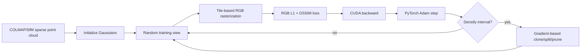
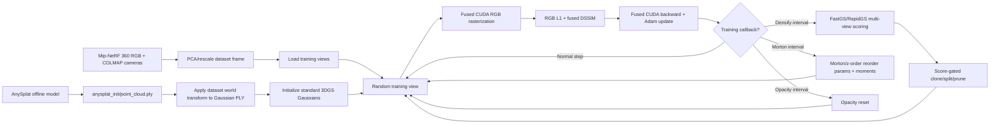
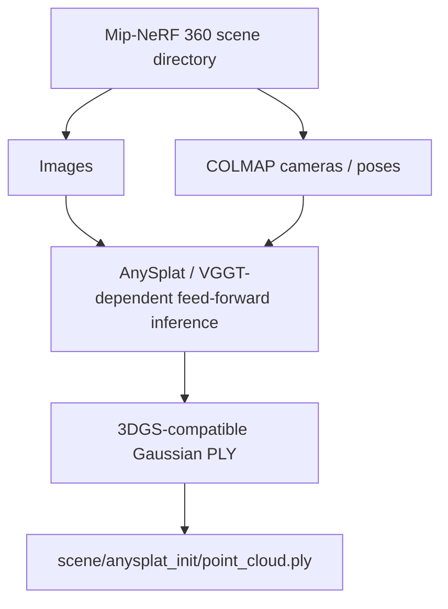
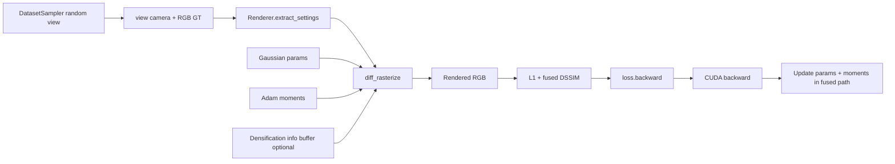
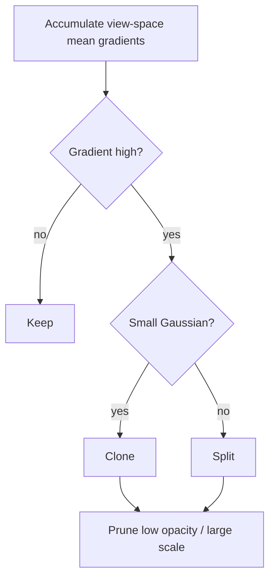
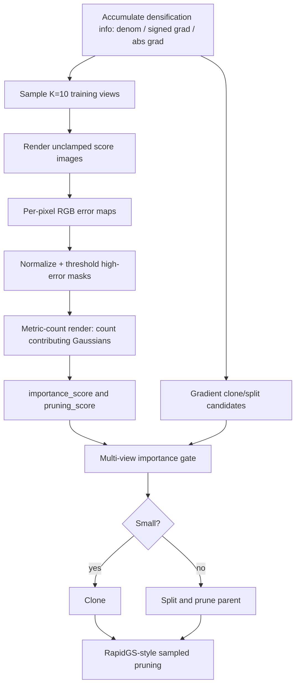
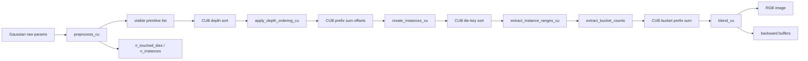

# FasterGSFusedRapid v0.4.14 相比原版 3DGS 的逐项改动说明

本文档只讨论当前维护版：

- 方法：`FasterGSFusedRapid`
- 配置：`configs/fastergsfusedrapid_v0_4_14_anysplat_only_no_depth`
- 版本标记：`fastergsfusedrapid-v0.4.14-anysplat-only-no-depth`
- benchmark：`fastergsfusedrapid_v0_4_14_anysplat_only_no_depth_r3`
- 代码基线：`38b511f Remove fused rapid depth path`

这里的“原版 3DGS”指 Kerbl et al. 的 3D Gaussian Splatting 训练管线：
从 SfM 点云初始化，优化标准 3D Gaussian 参数，用 RGB L1+DSSIM 损失，
每隔固定步数根据 view-space mean gradient 做 clone/split/prune，训练到
30k iteration，并用 tile-based differentiable rasterizer 做 forward/backward。

当前版本不是一个新的 Gaussian 表示法。它仍然训练标准 3DGS Gaussian，
但把原版 3DGS 的初始化、密度控制、CUDA 后端、optimizer 执行方式、实验
脚本和工程管线都换成了更快的版本。

## 0. Pipeline 总览

先把当前版本的端到端流程讲清楚。原版 3DGS 可以简化为：



当前 `FasterGSFusedRapid v0.4.14` 的流程是：



这张图里最重要的变化有四个：

1. **初始化入口变了。** 原版主要从 SfM sparse point cloud 开始；当前版本从
   AnySplat 生成的 Gaussian PLY 开始，并把它变换到 Mip-NeRF 360 的训练坐标系。
2. **训练 step 的执行位置变了。** 原版 backward 后通常回到 PyTorch Adam；
   当前版本把 backward 和 Adam update 融在 CUDA backend 里。
3. **densification 的依据变了。** 原版只看当前训练过程中累积的 image-space
   gradient；当前版本额外用 10 个训练视角做 multi-view high-error scoring。
4. **训练预算变了。** 原版常用 30k iteration；当前 v0.4.14 配置是 18k。

### 0.1 离线准备阶段

当前版本把一部分工作前移到了训练前：



这个阶段不是原版 3DGS 的一部分。原版 3DGS 的“先验”主要是 COLMAP sparse
point cloud；当前版本额外引入一个 feed-forward Gaussian prior。训练脚本本身
不在每个 iteration 调 AnySplat，它只消费已经生成好的 PLY。

离线阶段的输入输出表：

| 阶段 | 输入 | 输出 | 原版 3DGS 是否有 | 当前版本作用 |
| --- | --- | --- | --- | --- |
| COLMAP/Mip-NeRF 360 数据读取 | images, cameras, sparse points | dataset views, point cloud | 有 | 提供训练视角和 fallback point cloud |
| PCA/rescale | dataset coordinates | normalized training frame | 通常没有 | 统一 Mip-NeRF 360 场景尺度 |
| AnySplat prior | images, cameras, weights | Gaussian PLY | 没有 | 提供更密、更接近收敛状态的初始化 |
| PLY world transform | AnySplat PLY, dataset transform | transformed Gaussian tensors | 没有 | 保证 prior 和训练 camera frame 对齐 |

### 0.2 单个训练 iteration

当前版本每个普通训练 iteration 的数据流：



和原版 3DGS 的主要区别是：原版的 optimizer step 是单独的 PyTorch Adam
阶段；当前版本的参数更新已经在 CUDA backward path 里完成。因此当前 profiler
里的 `backward_ms` 应理解为“backward + fused optimizer 主成本”。

### 0.3 Densification/pruning 子流程

原版 3DGS 的 densification 子流程可以写成：



当前版本变成：



这个子流程体现了当前版本和原版 3DGS 的核心算法差异：当前版本不是简单减少
threshold 或减少 iteration，而是把“是否值得增殖 Gaussian”变成一个
multi-view consistency 问题。

### 0.4 训练时间线

当前 v0.4.14 的关键 callback 大致沿 iteration 分布如下：

```text
0                600              1000      3000      5000      10000     14900     18000
|----------------|----------------|---------|---------|---------|---------|---------|
init             densify starts    SH up     opacity   Morton    Morton    densify   train ends
                                  every 1k  reset     reorder   reorder   ends
```

详细表：

| 事件 | iteration 范围/间隔 | 原版 3DGS | 当前 v0.4.14 |
| --- | ---: | --- | --- |
| 总训练步数 | 30k 常用 | 30k | 18k |
| Densification start | 约 500/600 | 有 | 600 |
| Densification end | 约 15k | 有 | 14900 |
| Densification interval | 100 | gradient-only | gradient + multi-view score |
| SH degree up | 每 1000 | 有 | 有 |
| Opacity reset | 每 3000 | 有 | 有 |
| Morton reorder | 无标准项 | 无 | 每 5000，到 15000 |
| 后期 VCP pruning | 无 | 无 | 配置为 18000 起，但 18k 训练下主路径基本不触发 |
| Final cleanup | 有 prune/save | 有 | prune degenerate + Morton sort + drop moments |

## 0.5 模块级对照表

| 模块 | 原版 3DGS | 当前 v0.4.14 | 直接影响 |
| --- | --- | --- | --- |
| 初始化 | SfM sparse point cloud | AnySplat Gaussian PLY required | 缩短从粗结构到可用结构的优化距离 |
| 坐标系 | 使用 COLMAP/scene 坐标 | Mip-NeRF 360 PCA/rescale，并同步变换 PLY | 保证 prior 和 cameras 对齐 |
| 表示 | 标准 3D Gaussian | 标准 3D Gaussian | 表示能力不变 |
| RGB loss | L1 + DSSIM | 0.8 L1 + 0.2 fused DSSIM | 目标基本一致，执行更 fused |
| Depth loss | 无 | 无 | v0.4.14 回到 RGB-only |
| Densification 信号 | view-space gradient | signed/abs gradient + FastGS importance | 减少仅由局部梯度导致的冗余增长 |
| Pruning | opacity / scale | opacity / scale + pruning score sampling | 更偏向删多视角低贡献 Gaussian |
| Optimizer | PyTorch Adam | CUDA fused Adam moments | 减少 optimizer overhead |
| 参数布局 | PyTorch 参数 + optimizer state | 参数 tensor + parallel moment buffers | 需要手动同步 prune/sort/split |
| 排序 | tile instance sort | tile sort + Gaussian Morton reorder | 改善训练期间参数内存局部性 |
| 训练长度 | 30k | 18k | 主要速度来源之一 |
| Benchmark 产物 | 通常保留 | metrics 后删除模型 artifact | 支持 repeat 实验 |

## 0.6 代码入口表

| 功能 | 主要文件/函数 | 说明 |
| --- | --- | --- |
| AnySplat PLY 加载 | `Model.py::initialize_from_ply` | 读取 x/y/z、SH、opacity、scale、rotation |
| PLY 坐标变换 | `Model.py::apply_similarity_transform_to_gaussians` | mean/scale/rotation 同步变换 |
| Gaussian 初始化选择 | `Trainer.py::setup_gaussians` | 优先 AnySplat，当前配置 require |
| 普通训练 step | `Trainer.py::training_iteration` | sample view、render、loss、backward |
| 训练渲染 | `Renderer.py::render_image_training` | 调 `diff_rasterize` fused path |
| FastGS score | `Trainer.py::compute_fastgs_scores` | 采样视角、error map、metric counts |
| Metric-count render | `Renderer.py::render_image_metric_counts` | 返回 per-Gaussian high-error pixel counts |
| Clone/split/prune | `Model.py::adaptive_density_control` | gradient candidates + importance gate |
| Morton 排序 | `Model.py::apply_morton_ordering` | 对参数和 moments 同步排序 |
| 训练后清理 | `Trainer.py::finalize`, `Model.py::training_cleanup` | prune、sort、写 Gaussian 数 |

## 1. 总览：哪些没变，哪些变了

### 保持不变的核心

当前版本仍然保留原版 3DGS 的这些核心语义：

- 表示仍是 3D Gaussian：`mean + scale + rotation + opacity + SH color`。
- scale 仍用 log-space 参数，训练时通过 `exp` 激活。
- opacity 仍用 raw logit 参数，训练/渲染时通过 `sigmoid` 激活。
- rotation 仍用 quaternion，并在使用时归一化。
- covariance 仍由 `R S S^T R^T` 得到。
- 颜色仍使用 spherical harmonics，当前 `SH_DEGREE=3`。
- 主训练监督仍是 RGB photometric loss：`0.8 * L1 + 0.2 * DSSIM`。
- clone/split 的基础几何规则仍来自 3DGS：小 Gaussian clone，大 Gaussian
  split，split 子 Gaussian 缩放系数仍是 `1 / 1.6 = 0.625`。
- opacity reset 仍保留，默认每 `3000` iteration 把 opacity 上限压到约
  `0.01`。
- 训练后仍导出 3DGS-compatible PLY。

### 主要变化

当前版本相比原版 3DGS 的主要变化是：

- 初始化从“仅 SfM sparse point cloud”改为“优先读取 AnySplat 预测的
  Gaussian PLY”。
- Mip-NeRF 360 场景会做 PCA/rescale，AnySplat 初始化也要同步应用同一个
  world transform。
- 训练步数从原版常用 `30000` 改为当前配置的 `18000`。
- densification 不再只看 view-space gradient，而是额外受 FastGS/RapidGS
  multi-view score 约束。
- pruning 不再只是 low-opacity / large-scale，还加入了 multi-view score
  逻辑和 RapidGS 风格的采样式 pruning。
- training forward/backward/Adam 不再由原版 PyTorch optimizer 管理，而是
  走 fused CUDA backend。
- optimizer moments 不再挂在标准 PyTorch optimizer 里，而是作为 Gaussian
  tensor 的并行 buffer 管理。
- 定期做 Morton/z-order 排序，改善 densification 后的内存局部性。
- 当前维护版删除了 Metric3D/depth supervision 和 inverse-depth CUDA 路径，
  是 RGB-only。
- benchmark 脚本在评估后删除训练 checkpoint/model artifacts，避免 repeat
  实验占满磁盘。

## 2. 输入和数据预处理

### 原版 3DGS

原版 3DGS 通常使用 COLMAP/SfM 输出：

- camera pose；
- sparse point cloud；
- RGB training images；
- scene extent 用于学习率和 densification 尺度判断。

原版 3DGS 本身不依赖 Mip-NeRF 360 的 PCA/rescale 这种统一坐标预处理。

### 当前版本

当前配置明确面向 Mip-NeRF 360：

```yaml
GLOBAL:
  DATASET_TYPE: MipNeRF360
DATASET:
  APPLY_PCA: true
  APPLY_PCA_RESCALE: true
  NORMALIZE_RECENTER: false
```

这意味着数据集坐标会经过 PCA 和 rescale。这个变化带来一个直接后果：
如果初始化 Gaussian 来自外部 AnySplat PLY，不能直接用原坐标读进来，必须
把 Gaussian 的 mean、scale、rotation 一起变换到训练坐标系。

对应实现：

- `src/Methods/FasterGSFusedRapid/Model.py`
  - `apply_similarity_transform_to_gaussians`
  - `initialize_from_ply`
- `src/Methods/FasterGSFusedRapid/Trainer.py`
  - `setup_gaussians`

具体变换：

- mean：乘以 dataset world transform 的线性部分并加 translation；
- scale：log-scale 加上 uniform scale 的 `log`；
- rotation：从 world transform 的线性部分提取旋转矩阵，再左乘原 Gaussian
  rotation；
- quaternion：重新归一化并规范到 `w >= 0`。

这是相比原版 3DGS 很关键的工程差异。没有这个变换时，AnySplat 初始化和
训练 camera frame 不一致，质量会明显变差。

## 3. 初始化方式

### 原版 3DGS

原版初始化逻辑：

- 从 SfM sparse point cloud 创建初始 Gaussian；
- mean 来自点云位置；
- DC SH 由 RGB 颜色转换；
- higher-order SH 初始化为 0；
- scale 由 KNN 距离估计；
- rotation 初始化为单位 quaternion；
- opacity 初始化为 `0.1` 的 logit。

### 当前版本

当前版本优先使用 AnySplat 初始化：

```yaml
TRAINING:
  ANYSPLAT_INITIALIZATION:
    ACTIVE: true
    PATH: anysplat_init/point_cloud.ply
    REQUIRE: true
    SET_ACTIVE_SH_DEGREE: false
```

含义：

- `ACTIVE=true`：训练开始时读 `anysplat_init/point_cloud.ply`。
- `REQUIRE=true`：如果 PLY 不存在，直接报错，不 fallback 到 SfM 初始化。
- `SET_ACTIVE_SH_DEGREE=false`：即使 PLY 里有 `f_rest_*`，训练开始也只激活
  SH degree 0，后续按正常 3DGS schedule 逐步提升 SH degree。

相比原版 3DGS，这个变化最大。原版从 sparse SfM 点开始，需要通过大量
clone/split 建出密度；当前版本从 feed-forward model 预测出的较密 Gaussian
集合开始，所以可以把主训练步数降到 `18000`。

当前版本仍保留 fallback 初始化代码：

- 如果没有启用 AnySplat，或者以后配置允许 fallback，则可以走
  `initialize_from_point_cloud`；
- 这一路和原版 3DGS 更接近：KNN scale、单位 rotation、opacity=0.1。

但 v0.4.14 当前配置下，fallback 不应该发生。

## 4. Gaussian 参数存储

### 原版 3DGS

原版 3DGS 通常把每类 Gaussian 参数作为 PyTorch `nn.Parameter`，再交给
PyTorch Adam 管理 optimizer state。

参数包括：

- `_xyz`
- `_features_dc`
- `_features_rest`
- `_scaling`
- `_rotation`
- `_opacity`

### 当前版本

当前版本仍有同类参数，但存储方式不同：

- `_means`
- `_sh_coefficients_0`
- `_sh_coefficients_rest`
- `_scales`
- `_rotations`
- `_opacities`

更重要的是，每类参数旁边都有一份 fused Adam moment buffer：

- `moments_means`
- `moments_sh_coefficients_0`
- `moments_sh_coefficients_rest`
- `moments_scales`
- `moments_rotations`
- `moments_opacities`

每个 moment buffer 最后一维大小为 2，对应 Adam 的一阶和二阶矩。

这和原版 3DGS 的差异是：

- optimizer state 不由 PyTorch optimizer 对象独立持有；
- prune、sort、clone、split 时必须同步更新参数 tensor 和 moment tensor；
- backward/optimizer 可以在 CUDA backend 中融合执行；
- 代价是模型管理逻辑更复杂，不能随便只改 Gaussian 参数而忘记 moments。

## 5. SH 激活策略

### 原版 3DGS

原版 3DGS 从低阶 SH 开始训练，并每隔固定步数提升 active SH degree，直到
`SH_DEGREE=3`。

### 当前版本

当前版本也保留这一语义：

```yaml
MODEL:
  SH_DEGREE: 3
TRAINING:
  ANYSPLAT_INITIALIZATION:
    SET_ACTIVE_SH_DEGREE: false
```

训练回调：

```python
@training_callback(priority=110, start_iteration=1000, iteration_stride=1000)
def increase_sh_degree(...)
```

也就是说：

- 即使 AnySplat PLY 带了 higher-order SH；
- 当前版本也不会在第 0 步直接全部启用；
- 而是保持和 3DGS 类似的逐步激活节奏。

这个选择是为了避免 AnySplat 导出的 SH 在坐标变换后出现 harmonics 方向不一致
的问题。AnySplat 初始化提供几何和初始颜色，但 view-dependent SH 仍交给训练
逐步修正。

## 6. 训练损失

### 原版 3DGS

原版 3DGS 的主要损失是 RGB L1 加 DSSIM：

```text
L = (1 - lambda) * L1 + lambda * DSSIM
```

常用 `lambda=0.2`。

### 当前版本

当前版本保持这个损失，不加入 depth：

```yaml
TRAINING:
  LOSS:
    LAMBDA_L1: 0.8
    LAMBDA_DSSIM: 0.2
```

实现：

- `src/Methods/FasterGSFusedRapid/Loss.py`
- `src/Methods/FasterGSFusedRapid/Trainer.py::training_iteration`

和原版不同的地方不是 loss 公式，而是执行路径：

- `fused_dssim` 用 fused 实现；
- loss.backward() 触发的是 fused rasterizer 的 backward；
- CUDA backend 在 backward 中处理 Gaussian 梯度和 Adam update。

当前版本明确没有：

- Metric3D depth loss；
- inverse-depth loss；
- disparity loss；
- depth-gradient CUDA path。

这些在 v0.4.14 已从维护版删除。

## 7. Forward 渲染路径

### 原版 3DGS

原版 3DGS rasterizer 做：

- project Gaussian；
- 计算 2D covariance；
- tile culling；
- Gaussian/tile instance sorting；
- front-to-back alpha blending；
- backward 时重新遍历 tile list，回传梯度。

### 当前版本

当前版本仍是 tile-based differentiable splatting，但后端是
`FasterGSFusedRapidCudaBackend`。

训练渲染入口：

- `Renderer.py::render_image_training`
- 调用 `diff_rasterize`

普通 score/inference 渲染入口：

- `Renderer.py::render_image_fastgs_score`
- `Renderer.py::render_image_metric_counts`
- `Renderer.py::render_image_inference`
- 调用 `rasterize_forward`

相比原版 3DGS，当前 forward 有几个细节变化：

- 训练 forward 同时接收参数和 Adam moments；
- raw scale / raw opacity / raw rotation 直接传给 CUDA，由 CUDA 内部做激活；
- SH degree-0 和 SH rest 分开传入，不在 Python 侧拼接；
- 训练 forward 可选写 densification info；
- FastGS score forward 可以返回 metric counts；
- inference forward 才 clamp 到 `[0, 1]`，score render 保持 unclamped，贴近训练语义；
- camera pose tensor 有 cache，避免每次重复生成同一 view 的 `w2c/position` tensor；
- 当前维护版 forward 不再返回 depth 或 inverse depth。

这部分主要改变的是执行效率和额外统计输出，不改变最终 RGB alpha blending 的
基本目标。

### 7.1 CUDA forward 的实际执行流水线

当前训练 forward 不是一个单独的“大 rasterize kernel”，而是一串更细的
GPU/CUB 操作。入口在
`src/Methods/FasterGSFusedRapid/FasterGSFusedRapidCudaBackend/FasterGSFusedRapidCudaBackend/rasterization/src/forward.cu`。



和原版 3DGS 相比，关键差别不只是“用 CUDA 写了 rasterizer”，而是把
forward 拆成了适合 GPU 并行的几个阶段：

相关代码定位：

| 代码位置 | 主要内容 |
| --- | --- |
| `rasterization/src/forward.cu::forward` | forward host 端调度：preprocess、CUB sort/scan、instance 生成、tile range、bucket buffer、blend |
| `rasterization/include/kernels_forward.cuh::preprocess_cu` | projection、covariance、opacity/covariance/depth culling、精确 touched tile 计数 |
| `rasterization/include/kernel_utils.cuh::compute_exact_n_touched_tiles` | warp 协作统计一个 Gaussian 真实贡献的 tile 数 |
| `rasterization/include/kernels_forward.cuh::create_instances_cu` | warp 协作写 compact Gaussian-tile instances |
| `rasterization/include/kernels_forward.cuh::blend_cu` | tile-local RGB alpha blending，并记录 backward 所需 bucket checkpoint |
| `rasterization/src/backward.cu::backward` | backward host 端按 `n_buckets` launch bucket-level backward，再执行 fused Adam |
| `rasterization/include/kernels_backward.cuh::blend_backward_cu` | 一个 bucket 一个 block、一个 lane 一个 Gaussian 的反向 blending |

| 阶段 | 原版 3DGS 的常见做法 | FasterGSFusedRapid |
| --- | --- | --- |
| 投影和 culling | 每个 Gaussian 计算投影、屏幕半径、tile bounds | `preprocess_cu` 同时做 raw activation、projection、EWA covariance、opacity culling、near/far culling |
| tile 覆盖估计 | 主要按矩形 tile bounds 展开 | 先算矩形 bounds，再用 `will_primitive_contribute` 做 tile 内最大贡献测试，得到更精确的 touched tile 数 |
| 深度排序 | Gaussian/instance 排序 | 先按 Gaussian depth 排序，再生成 tile instance |
| instance 生成 | Gaussian 覆盖多少 tile，就写多少 Gaussian-tile pair | `create_instances_cu` 对大 footprint Gaussian 做 warp 协作，减少单线程长循环 |
| tile range | 排序后提取每个 tile 的 instance 范围 | `extract_instance_ranges_cu` 写 `tile_instance_ranges` |
| backward 预备信息 | forward 保存必要中间量 | forward 额外保存 tile/bucket/transmittance/n_processed，供 fused backward 使用 |
| RGB blending | tile 内前向 alpha blending | `blend_cu` 一 tile 一个 CUDA block，256 个线程对应 16x16 像素 |

### 7.2 preprocess：更精确的 tile 贡献判断

`preprocess_cu` 每个线程先负责一个 Gaussian。它做的工作比“投影出屏幕半径”
更完整：

- 读取 raw `mean/scale/rotation/opacity/SH`；
- 在 CUDA 内部做 `sigmoid(opacity)`、`exp(2 * scale)`、quaternion normalize
  相关计算；
- 根据 camera matrix 得到 depth 和 normalized image coordinates；
- 构造 3D covariance，再通过 EWA Jacobian 投影成 2D covariance；
- 根据 opacity 和 `min_alpha_threshold` 得到贡献阈值；
- 算出一个保守的 screen tile rectangle；
- 对 rectangle 内的 tile 调用 `compute_exact_n_touched_tiles`，只保留真实可能
  有贡献的 tile。

这里的 `will_primitive_contribute` 不是简单判断 tile 是否落在 2D ellipse 的
外接矩形内。它会找 tile rectangle 中对该 Gaussian 贡献最大的点，计算该点的
Mahalanobis power，并和 `power_threshold` 比较。结果是：

- 大量“外接矩形碰到了，但 alpha 实际低于阈值”的 Gaussian-tile pair 被提前
  去掉；
- 后续 instance buffer、tile sort、blend 遍历都会变短；
- 这和 FastGS/StopThePop 系列里“减少无效 tile/fragment”的目标一致，但本文档
  不把它写成完整 FastGS compact-box 复现，只写当前代码已经实现的精确
  tile contribution test。

`preprocess_cu` 还有两个 warp 级早退：

- depth/opacity/covariance 等判断后，如果整个 warp 都 inactive，就直接 return；
- tile bounds 为空或精确 touched tile 数为 0 的 Gaussian 不进入后续 sort。

这类早退对大场景很重要，因为训练后期 Gaussian 数量高，但单个视角可见且
真正贡献的 Gaussian 只是其中一部分。

### 7.3 forward 里的 warp 级负载均衡

用户提到的“不同线程之间负载均衡”主要发生在两个 forward 子过程：

1. `compute_exact_n_touched_tiles`
2. `create_instances_cu`

它们解决的是同一个问题：不同 Gaussian 的屏幕 footprint 差异很大。有的 Gaussian
只覆盖 1 到 4 个 tile，有的可能覆盖几十甚至上百个 tile。如果仍然坚持“一个线程
完整处理一个 Gaussian 的全部 tile”，大 Gaussian 对应的线程会长时间循环，而同一
warp 里的其它 lane 已经空闲，造成严重 warp divergence。

当前实现用 `config::n_sequential_threshold = 4` 把工作分成两段：

```text
每个 Gaussian 的前 4 个 tile:
    由所属 lane 自己顺序处理，开销很小，不值得协作

超过 4 个 tile 的剩余部分:
    整个 warp 轮流协作处理这些“大 Gaussian”
```

具体机制如下：

- 每个 lane 先处理自己 Gaussian 的前几个 tile；
- 如果某个 lane 的 Gaussian 仍有大量 tile 要检查，就把该 lane 标记为
  `compute_cooperatively`；
- `warp.ballot(compute_cooperatively)` 得到当前 warp 里所有“大 Gaussian”的
  lane mask；
- warp 逐个选择这些 lane，把该 Gaussian 的 `screen_bounds/mean2d/conic/threshold`
  通过 shared memory 或 `warp.shfl` 广播给整个 warp；
- 32 个 lane 按 `instance_idx = i * 32 + lane_idx + threshold` 分摊剩余 tile；
- 每个 lane 独立调用 `will_primitive_contribute`；
- `warp.ballot(write)` 汇总本轮哪些 lane 要写 instance；
- `__popc(write_ballot & previous_lanes_mask)` 计算 lane 内稳定写入偏移；
- `__popc(write_ballot)` 更新当前 Gaussian 的写指针。

这个设计的语义仍然是“为每个 Gaussian 写出所有有贡献的 tile instance”，但执行
方式从“单 lane 长循环”变成“warp 内协作扫描”。因此它不会改变 alpha blending 的
数学含义，改变的是：

- 大 footprint Gaussian 不再拖慢单个 lane；
- 同一 warp 的线程利用率更高；
- touched tile count 和 instance 写入都保持 compact，不为无贡献 tile 占空间；
- 写入顺序仍由 prefix-sum offset 和 tile sort 统一规整，不依赖未定义的线程顺序。

这部分是 FasterGSFusedRapid 相比原版 3DGS 很重要的 CUDA 细节。原版文档里如果
只写“tile culling + sort”，会漏掉这个 forward 阶段的负载均衡。

### 7.4 instance 不是单纯矩形展开

原版 3DGS 风格实现通常可以粗略理解为：

```text
Gaussian -> screen rectangle -> rectangle 内所有 tile instance
```

当前实现更接近：

```text
Gaussian -> conservative screen rectangle
         -> per-tile contribution test
         -> only contributing Gaussian-tile instances
```

这个区别对训练速度影响很直接。假设一个 Gaussian 的外接 rectangle 覆盖 40 个 tile，
但真实 alpha 大于阈值的 tile 只有 12 个：

- 矩形展开会生成 40 个 instance；
- 当前代码只生成 12 个 instance；
- 后面的 tile-key sort、tile range、blend forward、blend backward 都少处理
  28 个无效 pair。

由于 Gaussian 数量到中后期可能超过百万级，这个差异会放大成显著的 sort 和
rasterization 工作量差异。

### 7.5 blending forward：一 tile 一个 block，按像素并行

`blend_cu` 的 forward launch 是：

```text
grid  = image tiles
block = 16 x 16 threads
```

也就是一个 CUDA block 负责一个 tile，block 内 256 个线程对应 tile 内最多
256 个像素。每个 block 会：

- 根据 `tile_instance_ranges[tile_idx]` 找到当前 tile 的 sorted Gaussian list；
- 以 `block_size_blend = 256` 为批次，把 Gaussian 参数加载到 shared memory；
- 每个线程负责自己的 pixel，按前到后顺序遍历 Gaussian；
- 对每个 Gaussian 计算 exponent、alpha、blending weight；
- 当 transmittance 小于阈值时，该 pixel 提前停止；
- block 内用 `__syncthreads_count(done)` 判断是否全部 pixel 完成，从而提前退出；
- 写出 RGB；
- 训练 forward 还写出每个 pixel 的 final transmittance 和 processed count。

这里需要特别区分：

- forward RGB blending 本身没有改成“一个 bucket 一个 block”；
- forward 的 bucket 相关写入主要是为了 backward 做准备；
- forward 的主要负载均衡来自前面的 exact tile contribution test 和 warp-cooperative
  instance generation，以及 pixel 级 early stop。

### 7.6 bucket buffers：forward 记录，backward 并行化

虽然 `blend_cu` forward 仍是一 tile 一个 block，但它会在训练模式下记录 bucket
信息：

- `extract_bucket_counts` 把每个 tile 的 instance list 按 32 个 Gaussian 一组计数；
- prefix sum 得到每个 tile 在全局 bucket buffer 里的 offset；
- `blend_cu<true>` 写 `bucket_tile_index`，建立 bucket 到 tile 的映射；
- forward 每处理到 32 个 Gaussian 的边界，就把当前 pixel 的
  `color_pixel/transmittance` 写到 `bucket_color_transmittance`；
- 同时记录 `tile_max_n_processed` 和每个 pixel 的 `tile_n_processed`。

这些 buffer 让 backward 可以按 bucket launch：

```text
blend_backward_cu<<<n_buckets, 32>>>
```

每个 backward block 对应一个 bucket，32 个 lane 对应该 bucket 内最多 32 个
Gaussian。它会反向遍历 tile 内像素，并用 `warp.shfl_up` 在 lane 之间传递
per-pixel 的反向递推状态。最后通过 atomic add 汇总到 Gaussian 的
`grad_mean2d/grad_conic/grad_opacity/grad_color`。

这样做的意义是：

- forward 不需要为 backward 保存完整 per-Gaussian-per-pixel 状态；
- backward 不再由“一个 tile 的超长 Gaussian list”独占一个 block；
- 大 tile 的反向工作被拆成多个 32-Gaussian bucket；
- bucket 粒度也和 warp 宽度一致，适合用 lane 表示 bucket 内 Gaussian。

因此，FasterGSFusedRapid 的 forward 细节和 backward 细节是配套的：forward
负责生成 compact instance list 和足够的 bucket checkpoint，backward 才能用
bucket-level 并行恢复 alpha blending 梯度。

### 7.7 线程粒度对照表

| 数据粒度 | 当前代码中的线程/块映射 | 作用 |
| --- | --- | --- |
| Gaussian | `preprocess_cu` 默认一个线程处理一个 Gaussian | 投影、2D covariance、opacity/covariance culling |
| 大 footprint Gaussian | 一个 warp 协作处理剩余 tile | 避免单 lane 长循环 |
| Gaussian-tile instance | `create_instances_cu` compact 写入 | 只保留真实贡献 tile |
| tile | `blend_cu` 一个 block 处理一个 tile | 256 个像素并行 forward blending |
| pixel | `blend_cu` 中一个 thread 对应一个 tile-local pixel | 独立维护 color/transmittance/early stop |
| backward bucket | `blend_backward_cu` 一个 block 处理一个 32-Gaussian bucket | 把长 tile list 拆成多个反向任务 |
| bucket 内 Gaussian | backward 一个 lane 对应一个 Gaussian | 用 warp shuffle 复原 per-pixel 反向递推 |

### 7.8 和原版 3DGS 的 forward 细节差异总结

| 细节 | 原版 3DGS | 当前 FasterGSFusedRapid |
| --- | --- | --- |
| 参数激活 | Python/PyTorch 侧常见 `exp/sigmoid/normalize` 或 rasterizer 内部分散处理 | CUDA preprocess 里集中处理 raw scale/opacity/rotation |
| tile 覆盖 | 更偏向外接矩形展开 | 外接矩形后追加 per-tile contribution test |
| 大 Gaussian 处理 | 单线程/单 lane 更容易出现长尾循环 | 超过阈值后 warp 协作扫描 tile |
| instance 写入 | 写出 Gaussian-tile pair 后排序 | ballot + popcount 做 compact 写入，再 tile-key sort |
| forward RGB | tile 内前到后 alpha blending | 仍保持同一 alpha blending 语义 |
| forward early stop | transmittance early stop | 保留，并用 block 级 done 计数提前退出 tile block |
| backward 准备 | 保存 backward 所需状态 | 额外保存 bucket checkpoint、tile max processed、per-pixel processed count |
| score 支持 | 原版无 FastGS score path | forward 可选基于 `metric_map` 给 Gaussian 累积 metric contribution counts |

## 8. Backward 和 Optimizer

### 原版 3DGS

原版 3DGS 的典型结构：

1. CUDA rasterizer backward 产生参数梯度；
2. PyTorch autograd 把梯度挂到 `nn.Parameter`；
3. Python/PyTorch Adam optimizer 遍历参数并更新；
4. optimizer state 由 PyTorch 管理。

### 当前版本

当前版本训练 step 的外层仍调用：

```python
loss.backward()
```

但实际更新方式不同：

- `render_image_training` 把 moment buffers、当前 mean learning rate、Adam
  step count 传入 CUDA；
- autograd dummy 只用于把 CUDA fused path 挂进 PyTorch backward；
- CUDA backward 计算梯度并融合 Adam update；
- Python 侧没有常规 `optimizer.step()`。

相比原版 3DGS，这带来几个后果：

- 少了大量 Python/PyTorch optimizer kernel launch；
- Adam moments 和 Gaussian 参数布局更紧；
- prune/sort/densify 必须同步维护 moments；
- profiler 中 optimizer 独立列目前为 0，因为 optimizer 已融合进 backward。

因此，当前版本的 `backward_ms` 实际包含了大部分原本属于 backward 和 optimizer
的成本。

## 9. Densification 信息收集

### 原版 3DGS

原版 3DGS 累积 view-space 2D mean gradient，用它判断哪些 Gaussian 应该
densify。

### 当前版本

当前版本的 densification info 是三通道：

```text
{denominator, signed_gradient, abs_gradient}
```

实现：

```python
self._densification_info = torch.zeros((3, N), dtype=torch.float32, device='cuda')
```

相比原版 3DGS，主要变化是：

- clone 判断使用 signed gradient 通道；
- split 判断使用 absolute gradient 通道；
- 两者都除以/乘以 denominator 做可见性归一；
- 这个设计是为了和 RapidGS/FastGS 移植语义保持一致。

当前配置：

```yaml
DENSIFICATION_START_ITERATION: 600
DENSIFICATION_END_ITERATION: 14900
DENSIFICATION_INTERVAL: 100
DENSIFICATION_GRAD_THRESHOLD: 0.0002
DENSIFICATION_ABS_GRAD_THRESHOLD: 0.001
DENSIFICATION_PERCENT_DENSE: 0.001
```

和原版 3DGS 相比，densification 的时间窗口基本仍在前 15k 内，但当前训练总步数
只有 18k，所以 densification 结束后只剩约 3k 步做收敛。

## 10. Clone/Split 条件

### 原版 3DGS

原版逻辑可以概括为：

```text
if grad high and Gaussian small: clone
if grad high and Gaussian large: split
```

它只依赖局部 gradient 和 Gaussian size。

### 当前版本

当前版本先算原始候选：

```text
clone_candidate = signed_grad >= grad_threshold * denominator
split_candidate = abs_grad >= abs_grad_threshold * denominator
```

然后加入 FastGS/RapidGS importance gate：

```text
candidate = candidate AND importance_score > FASTGS_IMPORTANCE_THRESHOLD
```

当前配置：

```yaml
FASTGS_SCORE_VIEWS: 10
FASTGS_LOSS_THRESHOLD: 0.1
FASTGS_IMPORTANCE_THRESHOLD: 5.0
```

这就是相比原版 3DGS 最核心的算法变化之一：

- 原版问：“这个 Gaussian 的局部梯度大不大？”
- 当前版本多问：“它是否也反复落在多视角高误差区域？”

只有两个条件都满足，Gaussian 才会 clone/split。

## 11. FastGS/RapidGS 多视角打分

原版 3DGS 没有这一部分。

当前版本在 densification/pruning 时执行：

1. 从训练集采样 `K=10` 个 view。
2. 对每个 view 渲染 unclamped score image。
3. 和 GT RGB 计算 per-pixel L1 error。
4. 对 error map 做 min-max normalization。
5. 用 `FASTGS_LOSS_THRESHOLD=0.1` 得到 high-error mask。
6. 再调用 metric-count render，统计每个 Gaussian 对 high-error pixel 的贡献。
7. 对 K 个 view 的 counts 求和/平均得到 densification importance。
8. 用 photometric loss 加权 counts，得到 pruning score。

代码入口：

- `Trainer.py::compute_fastgs_scores`
- `Renderer.py::render_image_fastgs_score`
- `Renderer.py::render_image_metric_counts`

和原版 3DGS 的区别非常直接：

- 原版 densification 只用当前训练 view 的 gradient 统计；
- 当前版本额外抽多个训练 view 做 score；
- 原版没有 metric-count render；
- 当前版本需要 CUDA backend 额外支持“高误差像素贡献计数”。

这会增加 densify/prune 回调的开销，但减少不必要的 Gaussian 增长。实际 profiler
显示主要瓶颈仍在 fused backward/Adam，而不是 densify/prune。

## 12. Pruning 策略

### 原版 3DGS

原版 pruning 主要包括：

- low-opacity pruning；
- overly-large Gaussian pruning；
- opacity reset 后让无用 Gaussian 更容易被删。

### 当前版本

当前版本保留 low-opacity / large-scale pruning，但加了两层逻辑。

第一层：densification-stage pruning。

- 先得到 low-opacity / large-scale mask；
- 如果有 pruning score，则按 RapidGS 风格构造采样权重；
- 删除预算为当前 prune mask 数量的一半；
- 用 `torch.multinomial` 做加权采样，不是一次性删光。

第二层：multi-view score pruning。

```python
prune_mask = opacity < min_opacity
prune_mask |= pruning_score > score_threshold
```

当前配置里后期 pruning window 是：

```yaml
FASTGS_PRUNING_START_ITERATION: 18000
FASTGS_PRUNING_END_ITERATION: 27000
FASTGS_PRUNING_INTERVAL: 3000
FASTGS_PRUNING_MIN_OPACITY: 0.05
FASTGS_PRUNING_SCORE_THRESHOLD: 0.9
```

需要注意：当前主配置 `NUM_ITERATIONS=18000`。如果训练 loop 是常规
`0..17999`，那么这个 `start_iteration=18000` 的后期 pruning callback 不会成为
主训练路径。当前 v0.4.14 的主要 pruning 来源是：

- densification callback 内部 pruning；
- opacity reset 后的常规 pruning；
- post-training cleanup。

这和原版 3DGS 的不同在于：即使后期 VCP callback 不触发，densification 期间
也已经引入了 multi-view score-guided pruning 语义。

## 13. Morton/z-order 排序

### 原版 3DGS

原版 3DGS 不强调训练期间周期性按 Morton code 重排全部 Gaussian 参数。

### 当前版本

当前版本定期做 Morton ordering：

```yaml
MORTON_ORDERING_INTERVAL: 5000
MORTON_ORDERING_END_ITERATION: 15000
```

实现：

- `Model.py::apply_morton_ordering`
- `Model.py::sort`

排序对象不只是 means，而是所有参数和所有 Adam moments：

- means；
- SH DC/rest；
- opacity；
- scale；
- rotation；
- moments。

目的：

- densification 会不断把新 Gaussian append 到 tensor 尾部；
- 空间上接近的 Gaussian 在内存中可能变得很远；
- z-order 重排让空间邻近更可能内存邻近；
- 对 fused CUDA backend 的 memory locality 更友好。

这是来自 Faster-GS 思路的 backend-level 优化，不是原版 3DGS 的标准训练语义。

## 14. Opacity Reset 和额外 Reset

### 原版 3DGS

原版会周期性 reset opacity，避免透明/漂浮 Gaussian 长期卡住。

### 当前版本

当前版本保留：

```yaml
OPACITY_RESET_INTERVAL: 3000
EXTRA_OPACITY_RESET_ITERATION: 500
```

实现：

- `Model.py::reset_opacities`
- `Trainer.py::reset_opacities`
- `Trainer.py::reset_opacities_extra`

常规 reset：

```text
raw_opacity <= -4.595119953155518
sigmoid(raw_opacity) <= 0.01
```

额外 reset：

- 如果默认 background 不是黑色，在 iteration 500 额外 reset 一次；
- 这是为了适配 NeRFICG 数据模型中的任意背景色；
- 原版官方实现主要假设黑/白背景。

## 15. 背景色和 alpha 处理

### 原版 3DGS

原版训练通常使用固定背景，常见是黑或白。数据如果有 alpha，需要合成背景。

### 当前版本

当前版本：

```yaml
USE_RANDOM_BACKGROUND_COLOR: false
DATASET:
  BACKGROUND_COLOR: [0.0, 0.0, 0.0]
```

训练中：

- 如果 `view.alpha` 存在，则把 GT RGB 和背景合成；
- 如果启用 random background，可以每步随机背景，但当前配置关闭；
- score render 使用同一个 view background，避免 scoring 和 training 语义不一致。

这部分不是算法主贡献，但对复现指标有影响。

## 16. 训练步数和 schedule

### 原版 3DGS

原版常用：

- `30000` iterations；
- densification 到 `15000` 左右；
- 每 `1000` 步提升 SH degree；
- 每 `3000` 步 opacity reset。

### 当前版本

当前 v0.4.14：

```yaml
NUM_ITERATIONS: 18000
DENSIFICATION_START_ITERATION: 600
DENSIFICATION_END_ITERATION: 14900
DENSIFICATION_INTERVAL: 100
OPACITY_RESET_INTERVAL: 3000
MORTON_ORDERING_INTERVAL: 5000
MORTON_ORDERING_END_ITERATION: 15000
```

所以和原版相比：

- 总训练步数减少 40%；
- densification 结束位置基本不变；
- densification 结束后收敛阶段从约 15k 步缩短到约 3k 步；
- 这个缩短依赖 AnySplat 初始化，否则质量风险更高；
- SH schedule 仍保持每 1000 步提升。

## 17. CUDA 后端和 ABI

### 原版 3DGS

原版 rasterizer 主要提供 RGB forward/backward，optimizer 在 PyTorch 层执行。

### 当前版本

当前维护版 CUDA backend 的训练 ABI 是 RGB-only fused path：

- forward 输出 RGB 和必要的内部 buffers；
- backward 接收 RGB loss gradient；
- CUDA 内部处理激活梯度、Gaussian 梯度和 Adam update；
- 无 inverse-depth output；
- 无 inverse-depth gradient；
- 无 Metric3D depth loss 分支。

v0.4.14 相比之前 depth 分支的清理包括：

- trainer 删除 depth prior loading；
- config 删除 `TRAINING.DEPTH_SUPERVISION`；
- script 删除 Metric3D task；
- CUDA primitive/bucket/image inverse-depth buffers 删除；
- autograd binding 不再接收 depth gradient；
- profiler 删除 `depth_loss_ms`，`loss_ms` 等于 RGB loss timing。

这和原版 3DGS 的对比要分清：

- 原版也没有 depth supervision；
- 当前 v0.4.14 回到了 RGB-only；
- 但当前 CUDA backend 仍比原版更 fused、更专门化。

## 18. 数据加载和显存策略

### 原版 3DGS

原版通常把图像和相机数据按自己的 scene/dataset 结构读取，训练随机采样 view。

### 当前版本

当前配置：

```yaml
TRAINING:
  DATA:
    PRELOADING_LEVEL: 2
    RAYS_TO_DEVICE: true
    PRECOMPUTE_RAYS: false
```

含义：

- 图像/训练数据会较积极地预加载；
- camera rays 相关数据允许放到 GPU；
- 但不预计算全部 rays；
- 这会提高训练时数据访问稳定性，也会占一部分 VRAM。

此外，初始化时会尝试启用：

```text
torch cuda memory allocator expandable_segments:True
```

如果成功，就减少反复 `torch.cuda.empty_cache()` 的必要。这个是工程优化，原版
3DGS 没有对应逻辑。

## 19. Benchmark 和产物清理

### 原版 3DGS

原版训练通常保留训练后的 checkpoint / PLY / 中间输出。

### 当前版本

benchmark 脚本会在提取指标后删除 run 目录中的训练模型 artifact：

- `model_artifacts_deleted=1`
- 记录删除字节数；
- 避免 7 scenes * repeat=3 时磁盘占用快速膨胀。

这不是训练算法变化，但对大规模实验很重要。

当前 v0.4.14 repeat=3 结果中，每个 run 都记录了删除的 artifact 大小。

## 20. 当前 v0.4.14 全场景结果

刚完成的 7 scenes repeat=3：

```text
python ./scripts/benchmark_360v2.py \
  -m FasterGSFusedRapid \
  --config-dir configs/fastergsfusedrapid_v0_4_14_anysplat_only_no_depth \
  --repeats 3 \
  --suite-name fastergsfusedrapid_v0_4_14_anysplat_only_no_depth_r3
```

结果：

| scene | train time | PSNR | SSIM | LPIPS | n_gaussians | VRAM allocated |
| --- | ---: | ---: | ---: | ---: | ---: | ---: |
| bicycle | 135.7220s | 25.3103 | 0.7453 | 0.2971 | 1,534,332 | 4.8970GiB |
| bonsai | 84.8711s | 31.3792 | 0.9357 | 0.2575 | 422,402 | 5.7147GiB |
| counter | 79.3743s | 28.3819 | 0.8939 | 0.2839 | 281,798 | 4.9930GiB |
| garden | 91.1657s | 26.8063 | 0.8356 | 0.1894 | 885,973 | 2.9974GiB |
| kitchen | 92.1517s | 30.8779 | 0.9192 | 0.1743 | 411,060 | 5.5863GiB |
| room | 82.7529s | 31.2651 | 0.9128 | 0.3046 | 376,021 | 6.0448GiB |
| stump | 94.3442s | 25.8549 | 0.7292 | 0.3016 | 1,216,121 | 2.5811GiB |
| mean | 94.3403s | 28.5537 | 0.8531 | 0.2584 | 732,530 | 4.6878GiB |

相比上一个已完成的 v0.4.12 全场景 repeat=3：

| version | mean train | mean PSNR | mean SSIM | mean LPIPS | mean n_gaussians | mean VRAM |
| --- | ---: | ---: | ---: | ---: | ---: | ---: |
| v0.4.12 | 96.9419s | 28.5738 | 0.8532 | 0.2583 | 730,799 | 4.7432GiB |
| v0.4.14 | 94.3403s | 28.5537 | 0.8531 | 0.2584 | 732,530 | 4.6878GiB |

解释：

- v0.4.14 平均训练时间比 v0.4.12 快约 `2.60s`；
- PSNR 低约 `0.020`，SSIM 几乎不变，LPIPS 几乎不变；
- Gaussian 数量基本持平；
- VRAM allocated 略低；
- 这支持“删除 depth 路径后当前 RGB-only 维护版更简单，并且速度略好、质量基本在正常波动范围内”的说法。

## 21. 可以写进论文的改动边界

建议写法：

> 我们保持标准 3DGS Gaussian 表示和 RGB reconstruction loss，不改变最终渲染
> 目标；改动集中在训练系统：用 AnySplat 提供更强初始化，用 FastGS/RapidGS
> 多视角一致性分数约束 densification/pruning，用 Faster-GS 风格 fused CUDA
> backend 降低 backward/optimizer 开销。

不建议写法：

- 不要说这是新的 Gaussian 表示。
- 不要说质量全面超过原版/所有 baseline。
- 不要说 v0.4.14 使用 depth supervision；当前维护版明确没有。
- 不要声称完整移植了 FastGS compact box，除非后续逐行确认 CUDA compact-box
  语义并单独 benchmark。
- 不要把 v0.4.11-v0.4.13 的 depth-buffer cleanup 描述成主要速度来源；主要速度
  来源是 AnySplat 初始化 + 18k schedule + fused backend + multi-view density control。

## 22. 一句话总结

相对于原版 3DGS，当前 v0.4.14 版本没有改变“训练标准 3D Gaussian 并用 RGB
loss 优化”的核心目标；它改变的是从哪里开始、在哪里增加/删除 Gaussian、以及
训练一步如何在 GPU 上执行。初始化更强，densification/pruning 更受多视角误差
约束，backend 更 fused，训练步数更短，最终在 Mip-NeRF 360 7 个场景上达到
约 `94.34s` 的平均训练时间，同时保持质量指标在当前正常区间。
