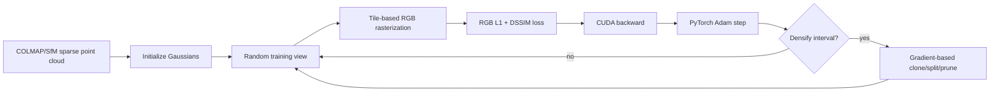
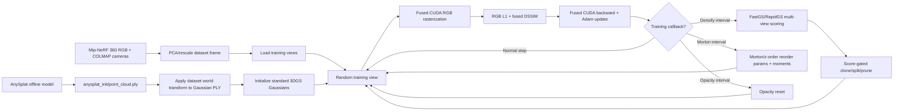
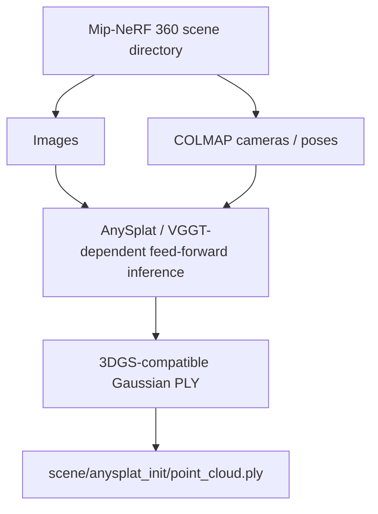
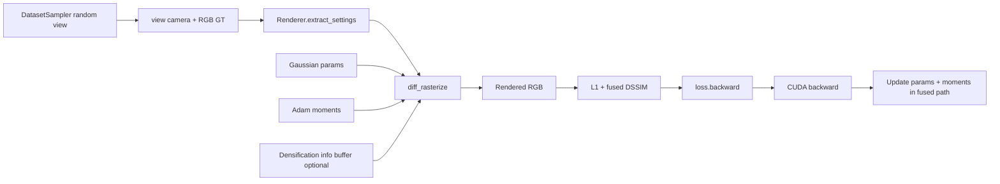
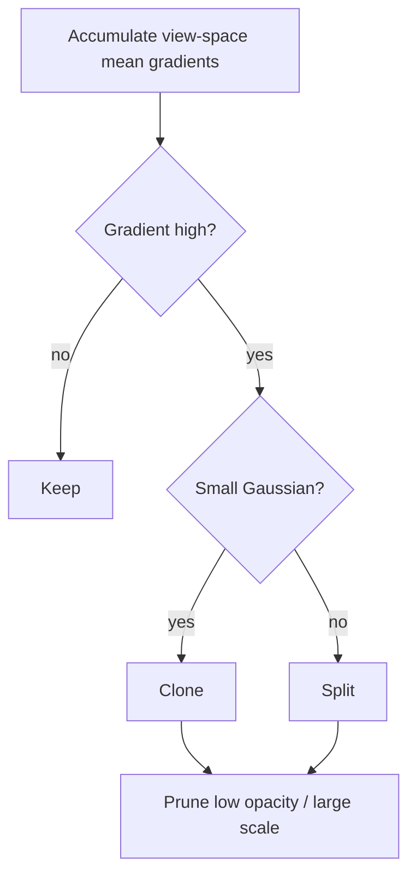
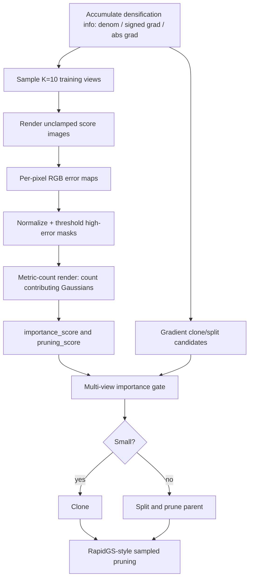
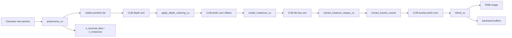
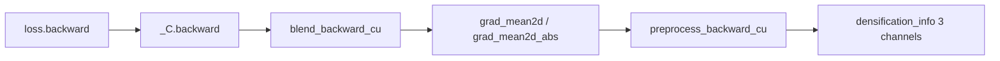
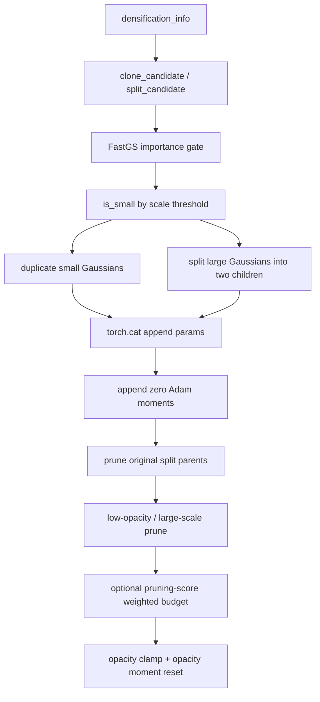

# FasterGSFusedRapid 相比原版 3DGS 的逐项改动说明

本文档只讨论当前维护版：

- 方法：`FasterGSFusedRapid`
- 语义基线配置：`configs/fastergsfusedrapid_v0_4_14_anysplat_only_no_depth`
- 论文推荐实验基线：`configs/fastergsfusedrapid_v0_4_17_early_vcp_17k`
- 语义基线版本：`fastergsfusedrapid-v0.4.14-anysplat-only-no-depth`
- 推荐实验版本：`fastergsfusedrapid-v0.4.17-early-vcp-17k`
- 推荐 benchmark：`fastergsfusedrapid_v0_4_17_early_vcp_17k_r3`
- 代码基线：`38b511f Remove fused rapid depth path`

主干叙事以 v0.4.14 的 AnySplat-only / RGB-only 维护版为语义基线；论文实验和后续
性能/质量对比以 v0.4.17 为推荐基线。原因是 v0.4.17 把 mean train time 从
v0.4.14 的 `94.34s` 降到 `90.03s`，同时 PSNR 只下降约 `0.020dB`。后续
v0.4.18-v0.4.22 继续提速，但相对 v0.4.17 的 PSNR 下降逐步接近或超过
`0.1dB`，更适合作为速度下界探索，而不是默认论文 baseline。

这里的“原版 3DGS”指 Kerbl et al. 的 3D Gaussian Splatting 训练管线：
从 SfM 点云初始化，优化标准 3D Gaussian 参数，用 RGB L1+DSSIM 损失，
每隔固定步数根据 view-space mean gradient 做 clone/split/prune，训练到
30k iteration，并用 tile-based differentiable rasterizer 做 forward/backward。

当前版本不是一个新的 Gaussian 表示法。它仍然训练标准 3DGS Gaussian，
但把原版 3DGS 的初始化、密度控制、CUDA 后端、optimizer 执行方式、实验
脚本和工程管线都换成了更快的版本。

## 0. Pipeline 总览

先把当前版本的端到端流程讲清楚。原版 3DGS 可以简化为：



当前 `FasterGSFusedRapid v0.4.14` 的流程是：



这张图里最重要的变化有四个：

1. **初始化入口变了。** 原版主要从 SfM sparse point cloud 开始；当前版本从
   AnySplat 生成的 Gaussian PLY 开始，并把它变换到 Mip-NeRF 360 的训练坐标系。
2. **训练 step 的执行位置变了。** 原版 backward 后通常回到 PyTorch Adam；
   当前版本把 backward 和 Adam update 融在 CUDA backend 里。
3. **densification 的依据变了。** 原版只看当前训练过程中累积的 image-space
   gradient；当前版本额外用 10 个训练视角做 multi-view high-error scoring。
4. **训练预算变了。** 原版常用 30k iteration；当前 v0.4.14 配置是 18k。

**设计动机。** 这条 pipeline 的目标不是改变 3DGS 表示，而是把“慢在哪里”拆开
处理：初始化阶段减少从 sparse points 长出来的时间；训练 step 阶段减少
Python/PyTorch optimizer 和中间梯度张量；density-control 阶段减少只由局部梯度
诱发的冗余 Gaussian；工程阶段保证 repeat benchmark 能稳定运行。这样论文叙事
可以保持主线清晰：仍优化标准 3DGS，但训练系统更快、更有约束。

### 0.1 离线准备阶段

当前版本把一部分工作前移到了训练前：



这个阶段不是原版 3DGS 的一部分。原版 3DGS 的“先验”主要是 COLMAP sparse
point cloud；当前版本额外引入一个 feed-forward Gaussian prior。训练脚本本身
不在每个 iteration 调 AnySplat，它只消费已经生成好的 PLY。

动机：

- 把重模型推理前移到离线阶段，避免每个训练 run 重复跑 AnySplat；
- 让 benchmark 计时主要反映 3DGS optimization，而不是外部 prior 模型推理；
- 离线 PLY 是可检查、可复用的中间产物，方便定位初始化问题；
- 对论文来说，也能明确区分“初始化 prior 的成本”和“训练迭代的成本”。

离线阶段的输入输出表：

| 阶段 | 输入 | 输出 | 原版 3DGS 是否有 | 当前版本作用 |
| --- | --- | --- | --- | --- |
| COLMAP/Mip-NeRF 360 数据读取 | images, cameras, sparse points | dataset views, point cloud | 有 | 提供训练视角和 fallback point cloud |
| PCA/rescale | dataset coordinates | normalized training frame | 通常没有 | 统一 Mip-NeRF 360 场景尺度 |
| AnySplat prior | images, cameras, weights | Gaussian PLY | 没有 | 提供更密、更接近收敛状态的初始化 |
| PLY world transform | AnySplat PLY, dataset transform | transformed Gaussian tensors | 没有 | 保证 prior 和训练 camera frame 对齐 |

### 0.2 单个训练 iteration

当前版本每个普通训练 iteration 的数据流：



和原版 3DGS 的主要区别是：原版的 optimizer step 是单独的 PyTorch Adam
阶段；当前版本的参数更新已经在 CUDA backward path 里完成。因此当前 profiler
里的 `backward_ms` 应理解为“backward + fused optimizer 主成本”。

动机：

- 单步训练是 15k-30k 次重复执行的热路径，任何 Python 调度和 tensor 分配都会被
  放大；
- 把 render/backward/Adam 串成一个高频 CUDA path，可以减少 kernel launch 和
  大梯度 tensor 的读写；
- 把 densification info 作为 optional side output 放进同一 backward，可避免
  为 density control 额外跑一遍梯度。

### 0.3 Densification/pruning 子流程

原版 3DGS 的 densification 子流程可以写成：



当前版本变成：



这个子流程体现了当前版本和原版 3DGS 的核心算法差异：当前版本不是简单减少
threshold 或减少 iteration，而是把“是否值得增殖 Gaussian”变成一个
multi-view consistency 问题。

动机：

- 原版的 view-space gradient 是局部信号，容易在单个视角高误差或遮挡边缘产生
  过多 Gaussian；
- 多视角 high-error contribution 能过滤掉只在少数视角偶然高梯度的点；
- pruning score 和 importance score 共用 score render，既能控制增长，也能删掉
  多视角低贡献 Gaussian；
- 这为缩短训练 schedule 提供条件，否则单纯减 iteration 容易损失质量。

### 0.4 训练时间线

当前 v0.4.14 的关键 callback 大致沿 iteration 分布如下：

```text
0                600              1000      3000      5000      10000     14900     18000
|----------------|----------------|---------|---------|---------|---------|---------|
init             densify starts    SH up     opacity   Morton    Morton    densify   train ends
                                  every 1k  reset     reorder   reorder   ends
```

详细表：

| 事件 | iteration 范围/间隔 | 原版 3DGS | 当前 v0.4.14 |
| --- | ---: | --- | --- |
| 总训练步数 | 30k 常用 | 30k | 18k |
| Densification start | 约 500/600 | 有 | 600 |
| Densification end | 约 15k | 有 | 14900 |
| Densification interval | 100 | gradient-only | gradient + multi-view score |
| SH degree up | 每 1000 | 有 | 有 |
| Opacity reset | 每 3000 | 有 | 有 |
| Morton reorder | 无标准项 | 无 | 每 5000，到 15000 |
| 后期 VCP pruning | 无 | 无 | 配置为 18000 起，但 18k 训练下主路径基本不触发 |
| Final cleanup | 有 prune/save | 有 | prune degenerate + Morton sort + drop moments |

动机：

- densification 仍基本放在前 15k，是为了保留原版“先长结构、后收敛”的节奏；
- 总 iteration 缩短依赖 AnySplat 初始化，不能孤立理解为“少训就行”；
- Morton/opacity reset 作为低频 callback，不应挤占每步热路径；
- 后续 v0.4.17 选择 17k，是在质量下降约 `0.020dB` 的前提下进一步压缩尾部收敛段。

### 0.5 模块级对照表

| 模块 | 原版 3DGS | 当前 v0.4.14 | 直接影响 |
| --- | --- | --- | --- |
| 初始化 | SfM sparse point cloud | AnySplat Gaussian PLY required | 缩短从粗结构到可用结构的优化距离 |
| 坐标系 | 使用 COLMAP/scene 坐标 | Mip-NeRF 360 PCA/rescale，并同步变换 PLY | 保证 prior 和 cameras 对齐 |
| 表示 | 标准 3D Gaussian | 标准 3D Gaussian | 表示能力不变 |
| RGB loss | L1 + DSSIM | 0.8 L1 + 0.2 fused DSSIM | 目标基本一致，执行更 fused |
| Depth loss | 无 | 无 | v0.4.14 回到 RGB-only |
| Densification 信号 | view-space gradient | signed/abs gradient + FastGS importance | 减少仅由局部梯度导致的冗余增长 |
| Pruning | opacity / scale | opacity / scale + pruning score sampling | 更偏向删多视角低贡献 Gaussian |
| Optimizer | PyTorch Adam | CUDA fused Adam moments | 减少 optimizer overhead |
| 参数布局 | PyTorch 参数 + optimizer state | 参数 tensor + parallel moment buffers | 需要手动同步 prune/sort/split |
| 排序 | tile instance sort | tile sort + Gaussian Morton reorder | 改善训练期间参数内存局部性 |
| 训练长度 | 30k | 18k | 主要速度来源之一 |
| Benchmark 产物 | 通常保留 | metrics 后删除模型 artifact | 支持 repeat 实验 |

### 0.6 代码入口表

| 功能 | 主要文件/函数 | 说明 |
| --- | --- | --- |
| AnySplat PLY 加载 | `Model.py::initialize_from_ply` | 读取 x/y/z、SH、opacity、scale、rotation |
| PLY 坐标变换 | `Model.py::apply_similarity_transform_to_gaussians` | mean/scale/rotation 同步变换 |
| Gaussian 初始化选择 | `Trainer.py::setup_gaussians` | 优先 AnySplat，当前配置 require |
| 普通训练 step | `Trainer.py::training_iteration` | sample view、render、loss、backward |
| 训练渲染 | `Renderer.py::render_image_training` | 调 `diff_rasterize` fused path |
| FastGS score | `Trainer.py::compute_fastgs_scores` | 采样视角、error map、metric counts |
| Metric-count render | `Renderer.py::render_image_metric_counts` | 返回 per-Gaussian high-error pixel counts |
| Clone/split/prune | `Model.py::adaptive_density_control` | gradient candidates + importance gate |
| Morton 排序 | `Model.py::apply_morton_ordering` | 对参数和 moments 同步排序 |
| 训练后清理 | `Trainer.py::finalize`, `Model.py::training_cleanup` | prune、sort、写 Gaussian 数 |

### 0.7 总览：哪些没变，哪些变了

#### 保持不变的核心

当前版本仍然保留原版 3DGS 的这些核心语义：

- 表示仍是 3D Gaussian：`mean + scale + rotation + opacity + SH color`。
- scale 仍用 log-space 参数，训练时通过 `exp` 激活。
- opacity 仍用 raw logit 参数，训练/渲染时通过 `sigmoid` 激活。
- rotation 仍用 quaternion，并在使用时归一化。
- covariance 仍由 `R S S^T R^T` 得到。
- 颜色仍使用 spherical harmonics，当前 `SH_DEGREE=3`。
- 主训练监督仍是 RGB photometric loss：`0.8 * L1 + 0.2 * DSSIM`。
- clone/split 的基础几何规则仍来自 3DGS：小 Gaussian clone，大 Gaussian
  split，split 子 Gaussian 缩放系数仍是 `1 / 1.6 = 0.625`。
- opacity reset 仍保留，默认每 `3000` iteration 把 opacity 上限压到约
  `0.01`。
- 训练后仍导出 3DGS-compatible PLY。

#### 主要变化

当前版本相比原版 3DGS 的主要变化是：

- 初始化从“仅 SfM sparse point cloud”改为“优先读取 AnySplat 预测的
  Gaussian PLY”。
- Mip-NeRF 360 场景会做 PCA/rescale，AnySplat 初始化也要同步应用同一个
  world transform。
- 训练步数从原版常用 `30000` 改为当前配置的 `18000`。
- densification 不再只看 view-space gradient，而是额外受 FastGS/RapidGS
  multi-view score 约束。
- pruning 不再只是 low-opacity / large-scale，还加入了 multi-view score
  逻辑和 RapidGS 风格的采样式 pruning。
- training forward/backward/Adam 不再由原版 PyTorch optimizer 管理，而是
  走 fused CUDA backend。
- optimizer moments 不再挂在标准 PyTorch optimizer 里，而是作为 Gaussian
  tensor 的并行 buffer 管理。
- 定期做 Morton/z-order 排序，改善 densification 后的内存局部性。
- 当前维护版删除了 Metric3D/depth supervision 和 inverse-depth CUDA 路径，
  是 RGB-only。
- benchmark 脚本在评估后删除训练 checkpoint/model artifacts，避免 repeat
  实验占满磁盘。

这些变化的共同动机是：把影响质量的核心 3DGS 表示和 RGB loss 保持稳定，把加速
集中放在初始化、训练执行、density-control policy 和工程执行路径上。这样一旦
质量波动，可以更容易判断是 schedule/pruning 的取舍，而不是表示或监督目标被换掉。

## 1. 初始化 + AnySplat + 数据加载

本节的核心动机是减少优化初期的搜索距离。原版 3DGS 从 sparse SfM 点云开始，
需要较长 densification 才能形成足够密的 Gaussian 分布；当前版本用 AnySplat
提供较强初始 Gaussian prior，再用严格的坐标变换和数据加载策略保证这个 prior
真的落在训练 camera frame 中。

### 1.1 输入和数据预处理

#### 原版 3DGS

原版 3DGS 通常使用 COLMAP/SfM 输出：

- camera pose；
- sparse point cloud；
- RGB training images；
- scene extent 用于学习率和 densification 尺度判断。

原版 3DGS 本身不依赖 Mip-NeRF 360 的 PCA/rescale 这种统一坐标预处理。

#### 当前版本

当前配置明确面向 Mip-NeRF 360：

```yaml
GLOBAL:
  DATASET_TYPE: MipNeRF360
DATASET:
  APPLY_PCA: true
  APPLY_PCA_RESCALE: true
  NORMALIZE_RECENTER: false
```

这意味着数据集坐标会经过 PCA 和 rescale。这个变化带来一个直接后果：
如果初始化 Gaussian 来自外部 AnySplat PLY，不能直接用原坐标读进来，必须
把 Gaussian 的 mean、scale、rotation 一起变换到训练坐标系。

对应实现：

- `src/Methods/FasterGSFusedRapid/Model.py`
  - `apply_similarity_transform_to_gaussians`
  - `initialize_from_ply`
- `src/Methods/FasterGSFusedRapid/Trainer.py`
  - `setup_gaussians`

具体变换：

- mean：乘以 dataset world transform 的线性部分并加 translation；
- scale：log-scale 加上 uniform scale 的 `log`；
- rotation：从 world transform 的线性部分提取旋转矩阵，再左乘原 Gaussian
  rotation；
- quaternion：重新归一化并规范到 `w >= 0`。

这是相比原版 3DGS 很关键的工程差异。没有这个变换时，AnySplat 初始化和
训练 camera frame 不一致，质量会明显变差。

动机：

- AnySplat 输出的是外部模型坐标下的 Gaussian，Mip-NeRF 360 训练时又做 PCA/rescale；
- 如果只变换 mean 而不变换 scale/rotation，Gaussian 的空间位置可能对齐，但形状
  和朝向会错；
- 统一坐标系后，后续 densification/pruning 的尺度阈值才有意义；
- 这一步保证“更好初始化”不是错误坐标下的额外噪声。

### 1.2 初始化方式

#### 原版 3DGS

原版初始化逻辑：

- 从 SfM sparse point cloud 创建初始 Gaussian；
- mean 来自点云位置；
- DC SH 由 RGB 颜色转换；
- higher-order SH 初始化为 0；
- scale 由 KNN 距离估计；
- rotation 初始化为单位 quaternion；
- opacity 初始化为 `0.1` 的 logit。

#### 当前版本

当前版本优先使用 AnySplat 初始化：

```yaml
TRAINING:
  ANYSPLAT_INITIALIZATION:
    ACTIVE: true
    PATH: anysplat_init/point_cloud.ply
    REQUIRE: true
    SET_ACTIVE_SH_DEGREE: false
```

含义：

- `ACTIVE=true`：训练开始时读 `anysplat_init/point_cloud.ply`。
- `REQUIRE=true`：如果 PLY 不存在，直接报错，不 fallback 到 SfM 初始化。
- `SET_ACTIVE_SH_DEGREE=false`：即使 PLY 里有 `f_rest_*`，训练开始也只激活
  SH degree 0，后续按正常 3DGS schedule 逐步提升 SH degree。

相比原版 3DGS，这个变化最大。原版从 sparse SfM 点开始，需要通过大量
clone/split 建出密度；当前版本从 feed-forward model 预测出的较密 Gaussian
集合开始，所以可以把主训练步数降到 `18000`。

当前版本仍保留 fallback 初始化代码：

- 如果没有启用 AnySplat，或者以后配置允许 fallback，则可以走
  `initialize_from_point_cloud`；
- 这一路和原版 3DGS 更接近：KNN scale、单位 rotation、opacity=0.1。

但 v0.4.14 当前配置下，fallback 不应该发生。

动机：

- `REQUIRE=true` 是为了让实验 fail-fast：如果 AnySplat 初始化缺失，结果不应悄悄
  退化成 SfM baseline；
- `SET_ACTIVE_SH_DEGREE=false` 是为了把 AnySplat 的高阶颜色当作可训练先验，而不是
  一开始就完全释放 view-dependent 颜色自由度；
- 保留 fallback 代码是工程兼容性，但论文主线应明确使用 AnySplat PLY。

### 1.3 数据加载和显存策略

#### 原版 3DGS

原版通常把图像和相机数据按自己的 scene/dataset 结构读取，训练随机采样 view。

#### 当前版本

当前配置：

```yaml
TRAINING:
  DATA:
    PRELOADING_LEVEL: 2
    RAYS_TO_DEVICE: true
    PRECOMPUTE_RAYS: false
```

含义：

- 图像/训练数据会较积极地预加载；
- camera rays 相关数据允许放到 GPU；
- 但不预计算全部 rays；
- 这会提高训练时数据访问稳定性，也会占一部分 VRAM。

此外，初始化时会尝试启用：

```text
torch cuda memory allocator expandable_segments:True
```

如果成功，就减少反复 `torch.cuda.empty_cache()` 的必要。这个是工程优化，原版
3DGS 没有对应逻辑。

动机：

- 训练本身 GPU 利用率较高，CPU/GPU 数据搬运不应成为随机瓶颈；
- 预加载图像让每步采样更稳定，尤其在 repeat=3/all scenes benchmark 中更容易比较；
- 不预计算全部 rays 是显存折中：当前 rasterizer主要使用相机参数和像素坐标，
  没必要为所有图像提前存完整 ray field；
- `expandable_segments` 主要减少长期训练中 allocator 碎片和缓存清理压力。

## 2. 参数存储

本节的动机是说明为什么当前版本不能只看 Gaussian 参数本身。由于 Adam update
已经 fused 进 CUDA，optimizer state 变成模型状态的一部分；任何 prune、sort、
clone、split 都必须同步维护 moments，否则训练语义会和标准 Adam 偏离。

### 2.1 Gaussian 参数布局

#### 原版 3DGS

原版 3DGS 通常把每类 Gaussian 参数作为 PyTorch `nn.Parameter`，再交给
PyTorch Adam 管理 optimizer state。

参数包括：

- `_xyz`
- `_features_dc`
- `_features_rest`
- `_scaling`
- `_rotation`
- `_opacity`

#### 当前版本

当前版本仍有同类参数，但存储方式不同：

- `_means`
- `_sh_coefficients_0`
- `_sh_coefficients_rest`
- `_scales`
- `_rotations`
- `_opacities`

更重要的是，每类参数旁边都有一份 fused Adam moment buffer：

- `moments_means`
- `moments_sh_coefficients_0`
- `moments_sh_coefficients_rest`
- `moments_scales`
- `moments_rotations`
- `moments_opacities`

每个 moment buffer 最后一维大小为 2，对应 Adam 的一阶和二阶矩。

这和原版 3DGS 的差异是：

- optimizer state 不由 PyTorch optimizer 对象独立持有；
- prune、sort、clone、split 时必须同步更新参数 tensor 和 moment tensor；
- backward/optimizer 可以在 CUDA backend 中融合执行；
- 代价是模型管理逻辑更复杂，不能随便只改 Gaussian 参数而忘记 moments。

动机：

- PyTorch Adam 的 state 与 parameter object 绑定，增删参数时代码可以依赖 optimizer；
- 当前版本为了减少 optimizer overhead，把 state 显式变成 tensor；
- 显式 moments 让 CUDA kernel 可以按 Gaussian id 连续访问参数和 state；
- 同时也要求所有结构变更都维护“参数 tensor 第 i 行”和“moment tensor 第 i 行”
  的一一对应。

### 2.2 SH 参数和激活策略

#### 原版 3DGS

原版 3DGS 从低阶 SH 开始训练，并每隔固定步数提升 active SH degree，直到
`SH_DEGREE=3`。

#### 当前版本

当前版本也保留这一语义：

```yaml
MODEL:
  SH_DEGREE: 3
TRAINING:
  ANYSPLAT_INITIALIZATION:
    SET_ACTIVE_SH_DEGREE: false
```

训练回调：

```python
@training_callback(priority=110, start_iteration=1000, iteration_stride=1000)
def increase_sh_degree(...)
```

也就是说：

- 即使 AnySplat PLY 带了 higher-order SH；
- 当前版本也不会在第 0 步直接全部启用；
- 而是保持和 3DGS 类似的逐步激活节奏。

这个选择是为了避免 AnySplat 导出的 SH 在坐标变换后出现 harmonics 方向不一致
的问题。AnySplat 初始化提供几何和初始颜色，但 view-dependent SH 仍交给训练
逐步修正。

动机：

- 高阶 SH 能快速拟合视角相关颜色，但也可能掩盖几何/opacity 的早期错误；
- 保留逐步激活可以让早期优化先稳定低频颜色和结构；
- 与原版 3DGS 保持相同 SH schedule 后，质量差异更容易归因到初始化和训练系统，
  而不是颜色自由度释放策略。

## 3. 统一结构编辑理论

这一章对应论文稿里单独拆出的理论部分。它的作用不是引入新的 renderer 或新的
Gaussian primitive，而是解释为什么当前版本可以把 densification 和 pruning
放进同一个结构控制框架里理解。

#### 原版 3DGS

原版 3DGS 的结构编辑是规则式的：

- view-space gradient 大的 Gaussian 进入 clone/split；
- opacity 太低的 Gaussian 被 prune；
- scale 太大的 Gaussian 在特定阶段被 prune；
- split parent 被两个 child 替代后删除。

这些规则有效，但 add 和 delete 的动机在实现上是分开的：一个来自局部梯度，
另一个来自 opacity/scale 阈值。

#### 当前版本

当前版本把 add/delete 都看作对 Gaussian 集合 $\mathcal{G}$ 的离散编辑。若一次
编辑 $a$ 产生 loss 变化 $\Delta\mathcal{L}(a)$ 和成本变化
$\Delta\mathcal{C}(a)$，则带成本正则的目标为：

$$
\min_{\mathcal{G}}\mathcal{L}(\mathcal{G})+\lambda\mathcal{C}(\mathcal{G}).
$$

一次编辑值得执行，当且仅当：

$$
\Delta\mathcal{L}(a)+\lambda\Delta\mathcal{C}(a)<0.
$$

这给出统一解释：

- clone/split 是成本增加的编辑，需要足够大的预期 loss reduction；
- pruning 是成本降低的编辑，只要删除带来的 loss increase 小于节省的成本价值，
  就值得执行；
- multi-view score、gradient、opacity、scale、visibility 等信号都可以看作
  对边际收益或边际删除风险的 proxy。

工程上当前代码没有实现一个单一的全局 $V_i$ controller，而是采用“理论统一、
实现分解”的规则系统。这里需要区分四类量：

| 类别 | 当前代码里的例子 | 用途 |
| --- | --- | --- |
| 原始观测信号 | signed/abs view-space gradient、FastGS/RapidGS metric counts、opacity、scale | 描述 Gaussian 的优化压力、可见贡献、透明度和几何尺度 |
| 派生判据 | importance gate、low-opacity mask、large-scale mask、VCP score mask、split parent mask | 把信号组合成 clone/split/prune 候选 |
| 执行策略 | clone、split、stochastic sampling、VCP hit counter、budget fraction | 决定候选怎么执行、什么时候执行、单轮删多少 |
| 未实现扩展信号 | view coverage、score stability、redundancy、occlusion visibility | 可作为未来更完整 controller 的额外 reliability evidence |

因此，`VCP hit counter` 和 `budget fraction` 不能写成普通信号。前者是候选历史确认状态，后者是删除动作的预算策略；它们不改变 Gaussian 的观测证据，只改变“候选是否现在删、这一轮最多删多少”。

动机：

- 用统一目标解释“增加”和“删除”为什么是同一个成本受限问题；
- 让 high-error contribution 不被误写成单纯 add 信号或 prune 信号，而是与
  gradient、opacity、scale、coverage 组合后决定方向；
- 保留分解式超参数，虽然数量更多，但每个阈值对应明确工程语义；
- 为后续实现更完整的 unified controller、view coverage、score stability 或
  redundancy-based pruning 留出理论接口。

## 4. Forward 渲染路径

Forward 部分的动机是减少无效 splat work，同时保留 3DGS 的 tile-based alpha
blending 语义。当前版本并不是换成另一个 renderer，而是在 projection、tile
contribution、instance 生成、score render 和 backward buffer 记录上做更细的
GPU 路径设计。

#### 原版 3DGS

原版 3DGS rasterizer 做：

- project Gaussian；
- 计算 2D covariance；
- tile culling；
- Gaussian/tile instance sorting；
- front-to-back alpha blending；
- backward 时重新遍历 tile list，回传梯度。

#### 当前版本

当前版本仍是 tile-based differentiable splatting，但后端是
`FasterGSFusedRapidCudaBackend`。

训练渲染入口：

- `Renderer.py::render_image_training`
- 调用 `diff_rasterize`

普通 score/inference 渲染入口：

- `Renderer.py::render_image_fastgs_score`
- `Renderer.py::render_image_metric_counts`
- `Renderer.py::render_image_inference`
- 调用 `rasterize_forward`

相比原版 3DGS，当前 forward 有几个细节变化：

- 训练 forward 同时接收参数和 Adam moments；
- raw scale / raw opacity / raw rotation 直接传给 CUDA，由 CUDA 内部做激活；
- SH degree-0 和 SH rest 分开传入，不在 Python 侧拼接；
- 训练 forward 可选写 densification info；
- FastGS score forward 可以返回 metric counts；
- inference forward 才 clamp 到 `[0, 1]`，score render 保持 unclamped，贴近训练语义；
- camera pose tensor 有 cache，避免每次重复生成同一 view 的 `w2c/position` tensor；
- 当前维护版 forward 不再返回 depth 或 inverse depth。

这部分主要改变的是执行效率和额外统计输出，不改变最终 RGB alpha blending 的
基本目标。

动机：

- 训练 render、score render、metric-count render、inference render 的需求不同，
  不应都走保存 backward context 的重路径；
- score/pruning 需要额外统计，但不需要 autograd；
- raw 参数直接进 CUDA 可以减少 Python 侧激活 tensor；
- unclamped score image 避免高误差区域被 clamp 掩盖，使 FastGS score 更贴近训练
  loss。

### 4.1 CUDA forward 的实际执行流水线

当前训练 forward 不是一个单独的“大 rasterize kernel”，而是一串更细的
GPU/CUB 操作。入口在
`src/Methods/FasterGSFusedRapid/FasterGSFusedRapidCudaBackend/FasterGSFusedRapidCudaBackend/rasterization/src/forward.cu`。



和原版 3DGS 相比，关键差别不只是“用 CUDA 写了 rasterizer”，而是把
forward 拆成了适合 GPU 并行的几个阶段：

相关代码定位：

| 代码位置 | 主要内容 |
| --- | --- |
| `rasterization/src/forward.cu::forward` | forward host 端调度：preprocess、CUB sort/scan、instance 生成、tile range、bucket buffer、blend |
| `rasterization/include/kernels_forward.cuh::preprocess_cu` | projection、covariance、opacity/covariance/depth culling、精确 touched tile 计数 |
| `rasterization/include/kernel_utils.cuh::compute_exact_n_touched_tiles` | warp 协作统计一个 Gaussian 真实贡献的 tile 数 |
| `rasterization/include/kernels_forward.cuh::create_instances_cu` | warp 协作写 compact Gaussian-tile instances |
| `rasterization/include/kernels_forward.cuh::blend_cu` | tile-local RGB alpha blending，并记录 backward 所需 bucket checkpoint |
| `rasterization/src/backward.cu::backward` | backward host 端按 `n_buckets` launch bucket-level backward，再执行 fused Adam |
| `rasterization/include/kernels_backward.cuh::blend_backward_cu` | 一个 bucket 一个 block、一个 lane 一个 Gaussian 的反向 blending |

| 阶段 | 原版 3DGS 的常见做法 | FasterGSFusedRapid |
| --- | --- | --- |
| 投影和 culling | 每个 Gaussian 计算投影、屏幕半径、tile bounds | `preprocess_cu` 同时做 raw activation、projection、EWA covariance、opacity culling、near/far culling |
| tile 覆盖估计 | 主要按矩形 tile bounds 展开 | 先算矩形 bounds，再用 `will_primitive_contribute` 做 tile 内最大贡献测试，得到更精确的 touched tile 数 |
| 深度排序 | Gaussian/instance 排序 | 先按 Gaussian depth 排序，再生成 tile instance |
| instance 生成 | Gaussian 覆盖多少 tile，就写多少 Gaussian-tile pair | `create_instances_cu` 对大 footprint Gaussian 做 warp 协作，减少单线程长循环 |
| tile range | 排序后提取每个 tile 的 instance 范围 | `extract_instance_ranges_cu` 写 `tile_instance_ranges` |
| backward 预备信息 | forward 保存必要中间量 | forward 额外保存 tile/bucket/transmittance/n_processed，供 fused backward 使用 |
| RGB blending | tile 内前向 alpha blending | `blend_cu` 一 tile 一个 CUDA block，256 个线程对应 16x16 像素 |

### 4.2 preprocess：更精确的 tile 贡献判断

`preprocess_cu` 每个线程先负责一个 Gaussian。它做的工作比“投影出屏幕半径”
更完整：

- 读取 raw `mean/scale/rotation/opacity/SH`；
- 在 CUDA 内部做 `sigmoid(opacity)`、`exp(2 * scale)`、quaternion normalize
  相关计算；
- 根据 camera matrix 得到 depth 和 normalized image coordinates；
- 构造 3D covariance，再通过 EWA Jacobian 投影成 2D covariance；
- 根据 opacity 和 `min_alpha_threshold` 得到贡献阈值；
- 算出一个保守的 screen tile rectangle；
- 对 rectangle 内的 tile 调用 `compute_exact_n_touched_tiles`，只保留真实可能
  有贡献的 tile。

这里的 `will_primitive_contribute` 不是简单判断 tile 是否落在 2D ellipse 的
外接矩形内。它会找 tile rectangle 中对该 Gaussian 贡献最大的点，计算该点的
Mahalanobis power，并和 `power_threshold` 比较。结果是：

- 大量“外接矩形碰到了，但 alpha 实际低于阈值”的 Gaussian-tile pair 被提前
  去掉；
- 后续 instance buffer、tile sort、blend 遍历都会变短；
- 这和 FastGS/StopThePop 系列里“减少无效 tile/fragment”的目标一致，但本文档
  不把它写成完整 FastGS compact-box 复现，只写当前代码已经实现的精确
  tile contribution test。

更具体地说，一个 Gaussian 的 tile 集合由两级判定得到。

**第一层：粗 screen-tile bounds。** `preprocess_cu` 先把 Gaussian mean 投到屏幕
坐标：

$$
\mathbf{u}_i=(u_i,v_i).
$$

然后把 3D covariance 通过 EWA Jacobian 投影为 2D covariance：

$$
\Sigma'_{i} =
\begin{bmatrix}
\sigma_x^2 & \sigma_{xy}\\
\sigma_{xy} & \sigma_y^2
\end{bmatrix}.
$$

代码会对对角项加 dilation：

$$
\sigma_x^2 \leftarrow \sigma_x^2 + d,\quad
\sigma_y^2 \leftarrow \sigma_y^2 + d,
$$

其中当前 `d = 0.3`。同时 raw opacity 经过 sigmoid 得到物理 opacity
$\alpha_i^0$。如果 $\alpha_i^0 < 1/255$，该 Gaussian 直接被 cull。否则定义

$$
\tau_i = \log(255\alpha_i^0).
$$

粗 bounds 使用轴向 extent：

$$
e_x=\max(\sqrt{2\tau_i\sigma_x^2}-0.5,0),
$$

$$
e_y=\max(\sqrt{2\tau_i\sigma_y^2}-0.5,0).
$$

然后映射到 tile 坐标，tile 大小为 $16\times16$：

$$
x_{\min}=\left\lfloor\frac{u_i-e_x}{16}\right\rfloor,\quad
x_{\max}=\left\lceil\frac{u_i+e_x}{16}\right\rceil,
$$

$$
y_{\min}=\left\lfloor\frac{v_i-e_y}{16}\right\rfloor,\quad
y_{\max}=\left\lceil\frac{v_i+e_y}{16}\right\rceil.
$$

这里 $x_{\max},y_{\max}$ 是 exclusive，并会 clamp 到 image tile grid。到这一步得到
的只是候选 tile rectangle，不是最终 tile list。

**第二层：精确 tile contribution test。** 对候选 rectangle 内每个 tile，代码
调用 `will_primitive_contribute(mean2d - 0.5, conic, tile_x, tile_y,
power_threshold)`。其中 conic 是 $\Sigma_i'^{-1}$：

$$
Q_i =
\begin{bmatrix}
a & b\\
b & c
\end{bmatrix}.
$$

如果 Gaussian mean 落在该 tile 内，直接认为它会贡献；否则在 tile 矩形内找一个
使 Gaussian 贡献最大的点 $\mathbf{p}^{\star}$，并计算

$$
P_i(\mathbf{p}^{\star})
=
\frac{1}{2}
\left(
a\Delta x^2 + c\Delta y^2
\right)
+ b\Delta x\Delta y.
$$

只有当

$$
P_i(\mathbf{p}^{\star}) \le \tau_i
$$

时，这个 tile 才会进入该 Gaussian 的 touched tile list。换成 alpha 语义，就是
该 tile 内至少存在一个位置使

$$
\alpha_i^0\exp(-P_i(\mathbf{p})) \ge 1/255.
$$

因此，当前实现里的“一个 Gaussian 投影到了哪些 tile”不是单纯的外接矩形问题，
而是：

```text
projected Gaussian
  -> conservative tile rectangle from opacity-aware covariance extent
  -> per-tile max-contribution test
  -> compact touched tile list
```

`preprocess_cu` 还有两个 warp 级早退：

- depth/opacity/covariance 等判断后，如果整个 warp 都 inactive，就直接 return；
- tile bounds 为空或精确 touched tile 数为 0 的 Gaussian 不进入后续 sort。

这类早退对大场景很重要，因为训练后期 Gaussian 数量高，但单个视角可见且
真正贡献的 Gaussian 只是其中一部分。

### 4.3 forward 里的 warp 级负载均衡

用户提到的“不同线程之间负载均衡”主要发生在两个 forward 子过程：

1. `compute_exact_n_touched_tiles`
2. `create_instances_cu`

它们解决的是同一个问题：不同 Gaussian 的屏幕 footprint 差异很大。有的 Gaussian
只覆盖 1 到 4 个 tile，有的可能覆盖几十甚至上百个 tile。如果仍然坚持“一个线程
完整处理一个 Gaussian 的全部 tile”，大 Gaussian 对应的线程会长时间循环，而同一
warp 里的其它 lane 已经空闲，造成严重 warp divergence。

当前实现用 `config::n_sequential_threshold = 4` 把工作分成两段：

```text
每个 Gaussian 的前 4 个 tile:
    由所属 lane 自己顺序处理，开销很小，不值得协作

超过 4 个 tile 的剩余部分:
    整个 warp 轮流协作处理这些“大 Gaussian”
```

具体机制如下：

- 每个 lane 先处理自己 Gaussian 的前几个 tile；
- 如果某个 lane 的 Gaussian 仍有大量 tile 要检查，就把该 lane 标记为
  `compute_cooperatively`；
- `warp.ballot(compute_cooperatively)` 得到当前 warp 里所有“大 Gaussian”的
  lane mask；
- warp 逐个选择这些 lane，把该 Gaussian 的 `screen_bounds/mean2d/conic/threshold`
  通过 shared memory 或 `warp.shfl` 广播给整个 warp；
- 32 个 lane 按 `instance_idx = i * 32 + lane_idx + threshold` 分摊剩余 tile；
- 每个 lane 独立调用 `will_primitive_contribute`；
- `warp.ballot(write)` 汇总本轮哪些 lane 要写 instance；
- `__popc(write_ballot & previous_lanes_mask)` 计算 lane 内稳定写入偏移；
- `__popc(write_ballot)` 更新当前 Gaussian 的写指针。

这个设计的语义仍然是“为每个 Gaussian 写出所有有贡献的 tile instance”，但执行
方式从“单 lane 长循环”变成“warp 内协作扫描”。因此它不会改变 alpha blending 的
数学含义，改变的是：

- 大 footprint Gaussian 不再拖慢单个 lane；
- 同一 warp 的线程利用率更高；
- touched tile count 和 instance 写入都保持 compact，不为无贡献 tile 占空间；
- 写入顺序仍由 prefix-sum offset 和 tile sort 统一规整，不依赖未定义的线程顺序。

这部分是 FasterGSFusedRapid 相比原版 3DGS 很重要的 CUDA 细节。原版文档里如果
只写“tile culling + sort”，会漏掉这个 forward 阶段的负载均衡。

### 4.4 instance 不是单纯矩形展开

原版 3DGS 风格实现通常可以粗略理解为：

```text
Gaussian -> screen rectangle -> rectangle 内所有 tile instance
```

当前实现更接近：

```text
Gaussian -> conservative screen rectangle
         -> per-tile contribution test
         -> only contributing Gaussian-tile instances
```

这个区别对训练速度影响很直接。假设一个 Gaussian 的外接 rectangle 覆盖 40 个 tile，
但真实 alpha 大于阈值的 tile 只有 12 个：

- 矩形展开会生成 40 个 instance；
- 当前代码只生成 12 个 instance；
- 后面的 tile-key sort、tile range、blend forward、blend backward 都少处理
  28 个无效 pair。

由于 Gaussian 数量到中后期可能超过百万级，这个差异会放大成显著的 sort 和
rasterization 工作量差异。

### 4.5 blending forward：一 tile 一个 block，按像素并行

`blend_cu` 的 forward launch 是：

```text
grid  = image tiles
block = 16 x 16 threads
```

也就是一个 CUDA block 负责一个 tile，block 内 256 个线程对应 tile 内最多
256 个像素。每个 block 会：

- 根据 `tile_instance_ranges[tile_idx]` 找到当前 tile 的 sorted Gaussian list；
- 以 `block_size_blend = 256` 为批次，把 Gaussian 参数加载到 shared memory；
- 每个线程负责自己的 pixel，按前到后顺序遍历 Gaussian；
- 对每个 Gaussian 计算 exponent、alpha、blending weight；
- 当 transmittance 小于阈值时，该 pixel 提前停止；
- block 内用 `__syncthreads_count(done)` 判断是否全部 pixel 完成，从而提前退出；
- 写出 RGB；
- 训练 forward 还写出每个 pixel 的 final transmittance 和 processed count。

这里需要特别区分：

- forward RGB blending 本身没有改成“一个 bucket 一个 block”；
- forward 的 bucket 相关写入主要是为了 backward 做准备；
- forward 的主要负载均衡来自前面的 exact tile contribution test 和 warp-cooperative
  instance generation，以及 pixel 级 early stop。

### 4.6 bucket buffers：forward 记录，backward 并行化

虽然 `blend_cu` forward 仍是一 tile 一个 block，但它会在训练模式下记录 bucket
信息：

- `extract_bucket_counts` 把每个 tile 的 instance list 按 32 个 Gaussian 一组计数；
- prefix sum 得到每个 tile 在全局 bucket buffer 里的 offset；
- `blend_cu<true>` 写 `bucket_tile_index`，建立 bucket 到 tile 的映射；
- forward 每处理到 32 个 Gaussian 的边界，就把当前 pixel 的
  `color_pixel/transmittance` 写到 `bucket_color_transmittance`；
- 同时记录 `tile_max_n_processed` 和每个 pixel 的 `tile_n_processed`。

这些 buffer 让 backward 可以按 bucket launch：

```text
blend_backward_cu<<<n_buckets, 32>>>
```

每个 backward block 对应一个 bucket，32 个 lane 对应该 bucket 内最多 32 个
Gaussian。它会反向遍历 tile 内像素，并用 `warp.shfl_up` 在 lane 之间传递
per-pixel 的反向递推状态。最后通过 atomic add 汇总到 Gaussian 的
`grad_mean2d/grad_conic/grad_opacity/grad_color`。

这样做的意义是：

- forward 不需要为 backward 保存完整 per-Gaussian-per-pixel 状态；
- backward 不再由“一个 tile 的超长 Gaussian list”独占一个 block；
- 大 tile 的反向工作被拆成多个 32-Gaussian bucket；
- bucket 粒度也和 warp 宽度一致，适合用 lane 表示 bucket 内 Gaussian。

因此，FasterGSFusedRapid 的 forward 细节和 backward 细节是配套的：forward
负责生成 compact instance list 和足够的 bucket checkpoint，backward 才能用
bucket-level 并行恢复 alpha blending 梯度。

### 4.7 线程粒度对照表

| 数据粒度 | 当前代码中的线程/块映射 | 作用 |
| --- | --- | --- |
| Gaussian | `preprocess_cu` 默认一个线程处理一个 Gaussian | 投影、2D covariance、opacity/covariance culling |
| 大 footprint Gaussian | 一个 warp 协作处理剩余 tile | 避免单 lane 长循环 |
| Gaussian-tile instance | `create_instances_cu` compact 写入 | 只保留真实贡献 tile |
| tile | `blend_cu` 一个 block 处理一个 tile | 256 个像素并行 forward blending |
| pixel | `blend_cu` 中一个 thread 对应一个 tile-local pixel | 独立维护 color/transmittance/early stop |
| backward bucket | `blend_backward_cu` 一个 block 处理一个 32-Gaussian bucket | 把长 tile list 拆成多个反向任务 |
| bucket 内 Gaussian | backward 一个 lane 对应一个 Gaussian | 用 warp shuffle 复原 per-pixel 反向递推 |

### 4.8 和原版 3DGS 的 forward 细节差异总结

| 细节 | 原版 3DGS | 当前 FasterGSFusedRapid |
| --- | --- | --- |
| 参数激活 | Python/PyTorch 侧常见 `exp/sigmoid/normalize` 或 rasterizer 内部分散处理 | CUDA preprocess 里集中处理 raw scale/opacity/rotation |
| tile 覆盖 | 更偏向外接矩形展开 | 外接矩形后追加 per-tile contribution test |
| 大 Gaussian 处理 | 单线程/单 lane 更容易出现长尾循环 | 超过阈值后 warp 协作扫描 tile |
| instance 写入 | 写出 Gaussian-tile pair 后排序 | ballot + popcount 做 compact 写入，再 tile-key sort |
| forward RGB | tile 内前到后 alpha blending | 仍保持同一 alpha blending 语义 |
| forward early stop | transmittance early stop | 保留，并用 block 级 done 计数提前退出 tile block |
| backward 准备 | 保存 backward 所需状态 | 额外保存 bucket checkpoint、tile max processed、per-pixel processed count |
| score 支持 | 原版无 FastGS score path | forward 可选基于 `metric_map` 给 Gaussian 累积 metric contribution counts |

## 5. Backward + Loss + Optimizer

### 5.1 训练损失

#### 原版 3DGS

原版 3DGS 的主要损失是 RGB L1 加 DSSIM：

```text
L = (1 - lambda) * L1 + lambda * DSSIM
```

常用 `lambda=0.2`。

#### 当前版本

当前版本保持这个损失，不加入 depth：

```yaml
TRAINING:
  LOSS:
    LAMBDA_L1: 0.8
    LAMBDA_DSSIM: 0.2
```

实现：

- `src/Methods/FasterGSFusedRapid/Loss.py`
- `src/Methods/FasterGSFusedRapid/Trainer.py::training_iteration`

和原版不同的地方不是 loss 公式，而是执行路径：

- `fused_dssim` 用 fused 实现；
- loss.backward() 触发的是 fused rasterizer 的 backward；
- CUDA backend 在 backward 中处理 Gaussian 梯度和 Adam update。

当前版本明确没有：

- Metric3D depth loss；
- inverse-depth loss；
- disparity loss；
- depth-gradient CUDA path。

这些在 v0.4.14 已从维护版删除。

### 5.2 Backward 和 Optimizer

#### 原版 3DGS

原版 3DGS 的典型结构：

1. CUDA rasterizer backward 产生参数梯度；
2. PyTorch autograd 把梯度挂到 `nn.Parameter`；
3. Python/PyTorch Adam optimizer 遍历参数并更新；
4. optimizer state 由 PyTorch 管理。

#### 当前版本

当前版本训练 step 的外层仍调用：

```python
loss.backward()
```

但实际更新方式不同：

- `render_image_training` 把 moment buffers、当前 mean learning rate、Adam
  step count 传入 CUDA；
- autograd dummy 只用于把 CUDA fused path 挂进 PyTorch backward；
- CUDA backward 计算梯度并融合 Adam update；
- Python 侧没有常规 `optimizer.step()`。

相比原版 3DGS，这带来几个后果：

- 少了大量 Python/PyTorch optimizer kernel launch；
- Adam moments 和 Gaussian 参数布局更紧；
- prune/sort/densify 必须同步维护 moments；
- profiler 中 optimizer 独立列目前为 0，因为 optimizer 已融合进 backward。

因此，当前版本的 `backward_ms` 实际包含了大部分原本属于 backward 和 optimizer
的成本。

### 5.3 CUDA backward/optimizer 的调用链

结论先写清楚：**训练时 Gaussian 参数的 backward 和 Adam optimizer 都在 CUDA
后端里执行**。Python 侧没有常规的 `torch.optim.Adam.step()`。

训练 iteration 的实际链路是：


关键代码位置：

| 位置 | 作用 |
| --- | --- |
| `Trainer.py::training_iteration` | 调 `loss.backward()`，不调 `optimizer.step()` |
| `torch_bindings/rasterization.py::_Rasterize.backward` | PyTorch autograd 入口，只把 `grad_image` 和 saved CUDA buffers 交给 `_C.backward` |
| `rasterization/src/backward.cu::backward` | host 端调度 CUDA backward 和 fused Adam kernels |
| `kernels_backward.cuh::blend_backward_cu` | 从 RGB loss 回传到 `grad_mean2d/grad_conic/grad_opacity/grad_color` |
| `kernels_backward.cuh::preprocess_backward_cu` | 从 2D/SH/covariance 梯度回传到 raw Gaussian 参数，并直接做 Adam update |
| `kernel_utils.cuh::adam_step_helper` | 可见 Gaussian 的逐元素 Adam 更新 |
| `kernels_backward.cuh::adam_step_invisible` | 不可见 Gaussian 的 Adam moment decay/update |

Python autograd 在这里的角色很薄：它只负责把 `loss.backward()` 接到
`_Rasterize.backward`，然后 `_Rasterize.backward` 返回全 `None`。也就是说，
Gaussian 参数没有走 PyTorch `.grad` 张量和 PyTorch optimizer；参数 tensor 和
moment tensor 是被 CUDA kernel 原地更新的。

### 5.4 fused Adam 的状态存储在哪里

当前模型为每类 Gaussian 参数维护一组 CUDA tensor，最后一维大小为 2，表示 Adam
的一阶/二阶 moment：

| 参数 | 参数 tensor | moment tensor |
| --- | --- | --- |
| mean | `_means` | `moments_means` |
| SH degree-0 | `_sh_coefficients_0` | `moments_sh_coefficients_0` |
| SH rest | `_sh_coefficients_rest` | `moments_sh_coefficients_rest` |
| scale | `_scales` | `moments_scales` |
| rotation | `_rotations` | `moments_rotations` |
| opacity | `_opacities` | `moments_opacities` |

这些 moment 在 `Model.py::_set_gaussian_tensors` 里用 CUDA tensor 初始化：

```python
self.moments_means = torch.zeros(*self.means.shape, 2, dtype=torch.float32, device='cuda')
self.moments_scales = torch.zeros(*self._scales.shape, 2, dtype=torch.float32, device='cuda')
...
```

density control 会改变 Gaussian 数量，所以 Python 仍然要维护这些 optimizer state
的结构一致性：

- prune 时按 `valid_mask` 同步裁剪参数和 moments；
- sort 时按 Morton/order 同步重排参数和 moments；
- clone/split 新增 Gaussian 时，为新 Gaussian 拼接零初始化 moments；
- opacity reset 时不仅 clamp opacity，也清零 `moments_opacities`。

这部分不是 PyTorch optimizer step，而是数据结构维护。真正的数值更新仍在 CUDA。

### 5.5 可见 Gaussian 的 Adam 更新

`preprocess_backward_cu` 默认一个线程处理一个可见 Gaussian。它先检查：

```cpp
if (primitive_idx >= n_primitives || primitive_n_touched_tiles[primitive_idx] == 0) return;
```

也就是说，只有当前 view 里实际触达 tile 的 Gaussian 进入完整 backward。这个
kernel 里做三类事情：

1. 从 `blend_backward_cu` 累积出的 2D 梯度恢复到 3D Gaussian 参数梯度；
2. 处理 SH color backward；
3. 对 raw 参数直接调用 `adam_step_helper` 原地更新。

`adam_step_helper` 的核心逻辑是标准 Adam 形式：

```cpp
moment1 = beta1 * moment1 + (1 - beta1) * grad
moment2 = beta2 * moment2 + (1 - beta2) * grad * grad
param  -= step_size * moment1 / (sqrt(moment2) / sqrt(1 - beta2^t) + eps)
```

当前代码写成 fused multiply-add 形式：

```cpp
const float moment1 = fmaf(config::beta1, moment.x - grad, grad);
const float moment2 = fmaf(config::beta2, moment.y - grad_sq, grad_sq);
const float denom = sqrtf(moment2) * bias_correction2_sqrt_rcp + config::epsilon;
param[element_idx] -= step_size * moment1 / denom;
moments[element_idx] = make_float2(moment1, moment2);
```

其中 `step_size` 已经在 host 端乘过 `bias_correction1_rcp`：

```cpp
step_size_means = current_mean_lr * bias_correction1_rcp
step_size_scales = lr_scales * bias_correction1_rcp
...
```

所以最终等价于 Adam 的 bias-corrected update。

可见 Gaussian 的各参数更新位置：

| 参数 | 梯度来源 | CUDA 更新位置 |
| --- | --- | --- |
| opacity | `blend_backward_cu` 的 alpha 梯度，再乘 sigmoid derivative | `preprocess_backward_cu` 开头直接 `adam_step_helper<1, 0>` |
| mean | splatting mean2d 梯度 + SH color 对 mean 的梯度 | `adam_step_helper<3, 0/1/2>` |
| scale | conic/covariance 梯度回传到 raw log-scale | `adam_step_helper<3, 0/1/2>` |
| rotation | covariance 梯度回传到 quaternion | `adam_step_helper<4, 0/1/2/3>` |
| SH degree-0/rest | color 梯度 | `convert_sh_to_color_backward` 内部使用 moments 做 fused update |

这也是 profiler 里 `optimizer_ms = 0` 的原因：optimizer 没有单独 Python 阶段，
被包含在 `loss.backward()` 对应的 CUDA backward 时间里。

### 5.6 不可见 Gaussian 也会更新 optimizer state

一个容易漏掉的细节是：不可见 Gaussian 没有当前 view 的新梯度，但 Adam state
仍需要按 Adam 语义衰减。当前代码用 `adam_step_invisible` 单独处理：

```cpp
if (idx >= n_elements || primitive_n_touched_tiles[primitive_idx] != 0) return;
new_moments = moments[idx] * (beta1, beta2);
param[idx] -= step_size * new_moments.x / (sqrt(new_moments.y) * bias_correction2_sqrt_rcp + eps);
moments[idx] = new_moments;
```

host 端会对各参数分别 launch：

- `adam_step_invisible<3>` for means；
- `adam_step_invisible<3>` for scales；
- `adam_step_invisible<4>` for rotations；
- `adam_step_invisible<1>` for opacities；
- `adam_step_invisible<3>` for SH degree-0；
- 如果 active SH bases > 1，再对 SH rest launch
  `adam_step_invisible<elements_per_primitive_sh_coefficients_rest>`。

这样做保持了 fused optimizer 与 Adam step count 的一致性：即使某个 Gaussian
当前视角不可见，它的 moment decay 仍随全局 step 推进。

### 5.7 CUDA 里还承担哪些训练语义

除 forward rasterization 外，CUDA backend 当前还承担很多“训练语义”。这里的
训练语义不是只指“算一张图”，而是指：哪些参数被激活、哪些梯度被定义、Adam
step 如何推进、densification 统计如何产生、score/pruning 所需的贡献计数如何
计算。

先给总表：

| CUDA 子系统 | 当前职责 | 动机 | 是否仍存在 |
| --- | --- | --- | --- |
| autograd bridge | 用 dummy tensor 把 `loss.backward()` 接到 `_C.backward`，但参数不走 PyTorch `.grad` | 保留 PyTorch loss 写法，同时绕开 PyTorch optimizer 和参数梯度张量 | 是 |
| raw activation | 在 CUDA 内处理 `sigmoid(opacity)`、`exp(scale)`、quaternion normalize、SH active bases | 保持 3DGS raw-parameter 语义，并避免 Python/PyTorch 中间激活张量 | 是 |
| RGB alpha/bucket backward | 从 RGB loss 回传 alpha blending、background、mean2d、conic、opacity、color 梯度 | tile/bucket 内复用 forward checkpoints，减少保存完整 per-pixel/per-Gaussian 状态 | 是 |
| projection/covariance backward | 从 mean2d/conic 梯度回传到 mean/scale/rotation | 让几何梯度和参数更新留在同一个 CUDA path，避免把大梯度 tensor 拉回 PyTorch autograd | 是 |
| SH color backward | 按 active SH bases 更新 DC/rest SH，并把 view-dependent color 对 mean 的梯度传回几何 | 保留 3DGS SH 颜色模型，同时把颜色参数 Adam 更新融合进 backward | 是 |
| fused Adam visible update | 对当前 view 可见 Gaussian 直接更新参数和 moment tensors | 删除独立 `optimizer.step()`，减少 kernel launch 和 Python 调度 | 是 |
| invisible Adam decay/update | 对当前 view 不可见 Gaussian 推进 Adam moments/params | 保持全局 Adam step 语义，避免可见性稀疏导致 optimizer state 时间不同步 | 是 |
| densification info | 可选累积 count、signed mean2d grad norm、abs mean2d grad norm | 给 clone/split 提供和当前 backward 同源的梯度统计，避免额外 backward | 是 |
| FastGS metric counts | score render 时按 high-error pixel 统计 Gaussian contribution | 给 multi-view pruning/importance score 提供 GPU 上的贡献计数 | 是 |
| stage specialization | densification 结束后跳过 densification info 相关 helper/atomic | 后期这些统计不再被消费，跳过可减少无效 backward work | 是 |
| numerical/boundary semantics | alpha threshold、transmittance threshold、edge tile guard、background alpha gradient | 保持 alpha compositing 数值稳定，并保证任意图像尺寸下不越界 | 是 |
| depth/inverse-depth | Metric3D/depth supervision 相关输出和梯度 | 实验显示收益不稳定且增加复杂度/VRAM，维护版回到 RGB-only | 已删除 |

所以，如果问“CUDA 的部分还剩东西吗”，答案是：**主要训练内核都还在 CUDA**。
已删除的是 depth/inverse-depth supervision 分支；没有删除的是 RGB forward、
bucket backward、projection/covariance/SH backward、fused Adam optimizer、
densification info 和 FastGS score 统计。

#### 5.7.1 autograd bridge：为什么还有 `loss.backward()`

外层训练代码仍然写：

```python
loss.backward()
```

但 `_Rasterize.forward` 里把 Gaussian 参数和 moments 都标记成
`mark_non_differentiable`，`_Rasterize.backward` 最后也对所有输入返回 `None`。
也就是说，这里没有 PyTorch `.grad` 张量，也没有标准 PyTorch optimizer 读取这些
`.grad`。

实际语义是：

- RGB loss 由 PyTorch 计算；
- loss 对 rendered image 的 `grad_image` 由 PyTorch autograd 给出；
- `_Rasterize.backward` 把 `grad_image`、forward 保存的 buffers、参数 tensor、
  moment tensor 交给 `_C.backward`；
- `_C.backward` 在 CUDA 内原地更新参数和 moments；
- Python 侧只保留 autograd 调用接口，不承担 Gaussian 参数梯度更新。

动机：

- 保留上层 loss 组合的灵活性，例如 L1/DSSIM 仍可在 Python/PyTorch 侧写；
- 避免为 millions of Gaussians 构造和保存 PyTorch `.grad`；
- 避免 `torch.optim.Adam` 对多组大 tensor 做额外 kernel launch 和 Python 调度；
- 让 profiler 中的 `backward_ms` 更接近真实训练 step 主成本。

#### 5.7.2 raw activation：CUDA 里维护 3DGS 参数化

当前模型仍存 raw 参数：

| 物理量 | raw tensor | CUDA 中的激活/使用 | 动机 |
| --- | --- | --- | --- |
| opacity | raw logit `_opacities` | forward/backward 用 `sigmoid`，backward 乘 `opacity * (1-opacity)` | 保证 opacity 在 `[0,1]`，和原版 3DGS 一致 |
| scale | raw log-scale `_scales` | covariance 中用 `exp(2 * raw_scale)`，backward 回传到 raw scale | 保证 scale 为正，同时保留 log-space 优化稳定性 |
| rotation | raw quaternion `_rotations` | 转 rotation matrix 时除以 quaternion norm，backward 回传 raw quaternion | 保留 quaternion 表示，避免每步 Python 侧 normalize 后再传入 |
| SH color | `_sh_coefficients_0/rest` | 按 `active_sh_bases` 计算颜色和颜色梯度 | 保留 3DGS 的 SH schedule，逐步释放颜色自由度 |

动机：

- 原版 3DGS 的训练稳定性依赖 raw 参数化，而不是直接优化物理 constrained 参数；
- 把激活放在 CUDA 内，可以让 forward、backward、Adam update 共用同一套中间量；
- 这避免了 Python 侧产生 `activated_opacity/scale/rotation` 大 tensor，再由 CUDA
  backward 反推 raw 参数。

#### 5.7.3 RGB alpha/bucket backward：不只是反向渲染

`blend_backward_cu` 负责把 `grad_image` 回传到每个 Gaussian 的局部渲染量：

- `grad_mean2d_helper`
- `grad_mean2d_abs_helper`
- `grad_conic_helper`
- `grad_opacities`
- `grad_colors`

它同时处理这些 alpha compositing 语义：

- front-to-back transmittance；
- background color 对 alpha/opacity 的梯度贡献；
- color clamp 的梯度门控；
- `alpha < 1/255` 的低贡献跳过；
- image edge tile 的 valid-pixel guard；
- 每个 bucket 记录的 color/transmittance checkpoint。

动机：

- 原版 3DGS backward 需要沿 alpha blending 顺序恢复每个 Gaussian 对像素的贡献；
- 如果保存每个 pixel 和每个 Gaussian 的完整中间状态，显存会爆炸；
- 当前 fused backend 用 bucket checkpoint 折中：forward 每隔固定粒度保存一段
  color/transmittance，backward 从 checkpoint 恢复局部 remainder；
- 这样保留同一 alpha blending 梯度语义，同时减少 full history 的显存压力。

这个阶段还不会直接更新 mean/scale/rotation。它先把像素级 RGB loss 转成
2D splat 层面的梯度和颜色梯度，下一阶段再回传到 raw 3D Gaussian 参数。

#### 5.7.4 projection/covariance backward：从 2D splat 回到 3D Gaussian

`preprocess_backward_cu` 对每个当前 view 可见的 Gaussian 做几何 backward：

1. 从 world mean 通过 `w2c` 和 pinhole projection 得到 view-space/depth/2D mean；
2. 从 raw scale 和 quaternion 得到 3D covariance；
3. 用 projection Jacobian 把 3D covariance 投影成 2D covariance/conic；
4. 把 `grad_mean2d` 和 `grad_conic` 回传到：
   - 3D mean；
   - raw log-scale；
   - raw quaternion rotation；
5. 直接调用 `adam_step_helper` 更新对应参数。

动机：

- mean/scale/rotation 的梯度链条很长，如果拆回 PyTorch 会产生多个大中间 tensor；
- 当前 path 把 projection、covariance、quaternion backward 和 Adam update 放在同
  一个 per-Gaussian CUDA kernel 里；
- 这减少中间写回，也避免 PyTorch autograd 对 3DGS 几何公式做逐算子调度；
- 对 FasterGSFusedRapid 来说，后期主要耗时在 backward，这一块是核心训练内核。

需要注意：这不是改变 3DGS 几何公式。它仍然是 EWA splatting 的 covariance
链式求导，只是执行位置从“CUDA backward 产梯度 + PyTorch optimizer 更新”改成
“CUDA backward 内直接更新”。

#### 5.7.5 SH color backward：颜色更新也 fused 进 CUDA

颜色参数分两组：

- `_sh_coefficients_0`：DC/低频颜色；
- `_sh_coefficients_rest`：高阶 SH 颜色。

`convert_sh_to_color_backward` 做两件事：

1. 根据 `grad_colors` 更新 SH coefficients；
2. 计算 view-dependent color 对 Gaussian position 的梯度，并把它加回
   `dL_dmean3d`。

动机：

- 3DGS 的 SH color 是 view-dependent 的，高阶 SH 不只影响颜色参数，也会通过
  view direction 影响 mean 的梯度；
- 如果只更新 SH 而忽略 color-to-position gradient，会改变原版 SH backward 语义；
- 把 SH coefficient Adam update 放在这个函数里，可以减少一次单独的 SH optimizer
  pass；
- `active_sh_bases` 仍由 Python schedule 控制，因此保留“每 1000 step 增加 SH
  degree”的训练节奏。

#### 5.7.6 fused Adam：CUDA 直接写回参数和 moments

可见 Gaussian 的所有主参数都在 CUDA 里调用 `adam_step_helper`：

| 参数 | 更新位置 | 学习率来源 | 动机 |
| --- | --- | --- | --- |
| mean | `preprocess_backward_cu` | Python 传入当前 mean LR schedule | mean LR 有 schedule，需要每步传入 |
| opacity | `preprocess_backward_cu` 开头 | CUDA config `lr_opacities` | opacity 梯度来自 alpha backward，直接更新减少中间梯度存储 |
| scale | `preprocess_backward_cu` | CUDA config `lr_scales` | scale 梯度来自 covariance backward，局部更新 |
| rotation | `preprocess_backward_cu` | CUDA config `lr_rotations` | quaternion 梯度来自 covariance backward，局部更新 |
| SH DC | `convert_sh_to_color_backward` | CUDA config `lr_sh_coefficients_0` | 颜色梯度已在 CUDA 内，直接更新 |
| SH rest | `convert_sh_to_color_backward` | CUDA config `lr_sh_coefficients_rest` | 高阶 SH 只在 active 后更新 |

Adam 的 bias correction 在 host 端和 device 端分担：

- host 端计算 `bias_correction1_rcp` 和 `bias_correction2_sqrt_rcp`；
- mean 的 `step_size_means = current_mean_lr * bias_correction1_rcp`；
- 其它参数用 CUDA config 中的固定 LR 乘 `bias_correction1_rcp`；
- device 端更新 first/second moments，并写回参数。

动机：

- 原版 PyTorch Adam 会对每类参数执行独立 optimizer kernel 和 Python 调度；
- 当前版本把“算梯度”和“应用梯度”合并，减少大 tensor gradient 的读写；
- moments 和参数同布局，prune/sort/clone/split 时可以同步维护；
- profiler 里的 `optimizer_ms=0` 不是没有 optimizer，而是 optimizer 已包含在
  `backward_ms` 里。

#### 5.7.7 invisible Adam：不可见 Gaussian 也推进 optimizer 时间

当前 view 不可见的 Gaussian 不进入完整 `preprocess_backward_cu`，因为
`primitive_n_touched_tiles == 0`。但 CUDA 仍会为它们 launch
`adam_step_invisible`：

```text
new_moment1 = beta1 * moment1
new_moment2 = beta2 * moment2
param -= step_size * new_moment1 / denom
```

动机：

- Adam 的 step count 是全局推进的，不是“某个 Gaussian 可见时才推进”；
- 如果不可见 Gaussian 的 moments 不衰减，它们的 optimizer state 会停在旧时间；
- 稀疏可见性下，不同 Gaussian 的 Adam 时间尺度会不一致，和原版全参数 Adam
  语义偏离；
- 单独处理 invisible Gaussian 可以保留 optimizer 语义，同时避免对不可见 Gaussian
  做完整几何 backward。

这也是当前 fused optimizer 和普通 PyTorch Adam 对齐时最容易漏掉的一点。

#### 5.7.8 densification info：CUDA 生产 clone/split 统计

训练窗口内，`render_image_training` 会把 `densification_info` tensor 传给 CUDA；
窗口外则传空 tensor。CUDA 根据这个指针是否为空选择模板分支：

```cpp
blend_backward_cu<update>
preprocess_backward_cu<update>
```

当 `update=true` 时，CUDA 累积三类统计：

| densification_info 区间 | 内容 | 下游用途 | 动机 |
| --- | --- | --- | --- |
| `[0:N]` | 可见/被处理次数 count | 归一化梯度统计 | 只对实际参与训练 view 的 Gaussian 统计 |
| `[N:2N]` | signed mean2d grad norm | clone 候选判断 | 对齐原版 3DGS 的 view-space gradient 逻辑 |
| `[2N:3N]` | abs mean2d grad norm | split 候选判断 | 对齐 FastGS/RapidGS 的 absolute-gradient density 逻辑 |

动机：

- densification 需要的梯度统计本来就来自 RGB backward；
- 如果额外跑一次 backward 或 Python 侧统计，会增加训练开销；
- 将统计写入 CUDA side buffer，可以让 density-control callback 只消费结果；
- densification 结束后传空 tensor，CUDA 模板分支跳过这部分 atomic 和 helper
  更新，减少后期无效工作。

#### 5.7.9 FastGS metric counts：score/pruning 的贡献计数在 CUDA 中产生

FastGS/RapidGS 的 multi-view score 需要回答一个问题：

> 在 high-error pixels 上，哪些 Gaussian 实际贡献了颜色？

当前版本不是在 Python 里遍历像素和 Gaussian，而是在 no-grad render 中传入
`metric_map`，CUDA forward 返回 `metric_counts`：

- `render_image_fastgs_score` 先渲染图像，计算 RGB error map；
- Python 得到 high-error mask；
- `render_image_metric_counts` 把 mask 作为 `metric_map` 传入 CUDA；
- CUDA 在 rasterization 过程中统计每个 Gaussian 命中过多少 high-error pixel；
- Python 再用这些 counts 形成 importance/pruning score。

动机：

- high-error contribution 依赖真实 rasterization 可见性和 alpha 阈值；
- Python 侧后处理无法廉价复原“某个 Gaussian 是否真实贡献了某个 pixel”；
- 把 count 放在 CUDA forward 中，可以复用 tile/instance/blending 判断；
- 这让 multi-view score 和训练 render 使用同一套可见性/alpha 语义。

这部分不更新参数，但它影响后续 clone/split/prune 的决策，所以也属于训练语义。

#### 5.7.10 numerical/boundary semantics：稳定性也是训练语义

CUDA 后端还固定了一些训练期间必须一致的数值边界：

| 项 | 当前值/行为 | 动机 |
| --- | --- | --- |
| `min_alpha_threshold` | `1/255` | 跳过视觉贡献极小的 Gaussian-pixel pair，减少无效 work |
| `one_minus_alpha_eps` | `1e-6` | backward 中除以 `1-alpha` 时防止高 opacity 数值爆炸 |
| `transmittance_threshold` | `1e-4` | alpha compositing 早停，避免处理已经几乎完全遮挡的后方 Gaussian |
| edge tile guard | pixel 坐标越界时不读写 image/grad/count | 支持任意宽高，不要求图像尺寸整除 16 |
| background alpha gradient | backward 保留 `final_transmittance * background` 对 alpha 的影响 | 保证非黑背景和 alpha 合成时 opacity 梯度正确 |

动机：

- 这些常量看起来是 implementation detail，但会影响哪些贡献被忽略、何时早停、
  opacity 梯度如何计算；
- 如果训练 render、score render、eval render 的阈值不一致，densification 和
  pruning 的分数会偏离训练 loss；
- 因此它们应当在文档里作为“CUDA 中保留的训练语义”说明。

#### 5.7.11 depth/inverse-depth：删除了什么，为什么删除

v0.4.0-v0.4.13 曾经尝试把 Metric3D inverse-depth supervision 加进 CUDA：

- forward 输出 blended inverse depth；
- bucket buffers 保存 depth 相关 checkpoint；
- backward 接收 depth gradient；
- alpha/opacity/conic/mean2D/centroid depth 都要接 depth loss 梯度；
- profiler 记录 depth loss timing。

v0.4.14 删除这条路径，当前维护版回到 RGB-only。

动机：

- 原版 3DGS 本身没有 depth supervision，删除 depth path 更容易和 3DGS 主线比较；
- 实验中 Metric3D/depth 没有稳定提升质量，反而增加 VRAM、ABI 复杂度和调试成本；
- 删除 depth 后，CUDA ABI 简化为 RGB-only，benchmark 更稳定；
- 这不是删除 CUDA 训练能力，而是删除一个实验性监督分支。

#### 5.7.12 哪些训练语义不在 CUDA

为了避免夸大 CUDA 后端，这里也列出仍在 Python/torch 层的部分：

| 部分 | 当前位置 | 为什么不放进 CUDA |
| --- | --- | --- |
| RGB loss 组合 | `Trainer.py::training_iteration` | L1/DSSIM 组合简单，保留 Python 侧便于实验 |
| view sampling | dataset sampler / trainer | 数据集逻辑和随机采样不适合写进 rasterizer |
| clone/split/prune 决策 | `Model.py::adaptive_density_control` | 会改变 tensor 数量，需要和框架的参数/moment 管理配合 |
| Morton 全局排序 | `Model.py::apply_morton_ordering` | 依赖 PyTorch tensor 重排和 moments 同步 |
| opacity reset | `Model.py::reset_opacities` | 低频 callback，torch tensor 操作足够 |
| benchmark artifact cleanup | benchmark script | 实验工程逻辑，不属于训练 kernel |

因此当前架构可以概括为：

- **CUDA 负责每步高频数值训练语义**：render、backward、Adam、density statistics、
  score counts。
- **Python/torch 负责低频结构变更**：sample view、loss 组合、clone/split/prune、
  reset、sort、benchmark 管理。

## 6. Densification

本节的动机是解释当前版本如何在更短训练预算下仍保持足够模型容量。Densification
不能简单提前结束或减少频率，否则细节区域可能长不出来；也不能无约束增长，否则
Gaussian 数量、backward cost 和显存都会上升。当前策略是在原版 gradient 信号
之外加入 abs-gradient 和多视角 score，让“增长”更集中在稳定高误差区域。

### 6.1 Densification 信息收集

#### 原版 3DGS

原版 3DGS 累积 view-space 2D mean gradient，用它判断哪些 Gaussian 应该
densify。

#### 当前版本

当前版本的 densification info 是三通道：

```text
{denominator, signed_gradient, abs_gradient}
```

实现：

```python
self._densification_info = torch.zeros((3, N), dtype=torch.float32, device='cuda')
```

相比原版 3DGS，主要变化是：

- clone 判断使用 signed gradient 通道；
- split 判断使用 absolute gradient 通道；
- 两者都除以/乘以 denominator 做可见性归一；
- 这个设计是为了和 RapidGS/FastGS 移植语义保持一致。

当前配置：

```yaml
DENSIFICATION_START_ITERATION: 600
DENSIFICATION_END_ITERATION: 14900
DENSIFICATION_INTERVAL: 100
DENSIFICATION_GRAD_THRESHOLD: 0.0002
DENSIFICATION_ABS_GRAD_THRESHOLD: 0.001
DENSIFICATION_PERCENT_DENSE: 0.001
```

和原版 3DGS 相比，densification 的时间窗口基本仍在前 15k 内，但当前训练总步数
只有 18k，所以 densification 结束后只剩约 3k 步做收敛。

动机：

- signed gradient 继承原版 3DGS 的 clone 信号，适合小 Gaussian 增加自由度；
- absolute gradient 对大 Gaussian 的 split 更敏感，和 RapidGS/FastGS 的密度控制
  更一致；
- denominator 归一化避免“被看见次数多”的 Gaussian 因累积次数多而更容易被误判；
- densification 窗口仍接近 15k，是为了保留原版前期结构增长的基本节奏。

### 6.2 Densification 信息在哪里产生，在哪里消费

这部分要分清两层：

- **统计信息产生**：在 CUDA backward 里产生；
- **Clone/Split/Prune 决策和 tensor 增删**：在 Python `Model.py` 里用 PyTorch CUDA
  tensor 操作完成。

统计信息的 CUDA 路径是：



具体来说：

- `blend_backward_cu` 在 bucket backward 里累积每个 Gaussian 的
  `grad_mean2d`；
- 如果 `update_densification_info=True`，还会累积 `grad_mean2d_abs`；
- `preprocess_backward_cu` 把 2D mean gradient 换算到 NDC 尺度；
- 然后写入：
  - `densification_info[0, i] += 1`，作为 denominator；
  - `densification_info[1, i] += ||signed grad||`；
  - `densification_info[2, i] += ||abs grad||`。

这个开关由训练 forward 传入：

```python
update_densification_info = iteration < DENSIFICATION_END_ITERATION
```

也就是 densification 窗口内 backward 会额外维护这三个通道；窗口结束后，相关
CUDA 路径会编译/运行到不更新 densification info 的分支，减少无用 atomics 和
buffer 写入。

消费端在 `Trainer.py::densify`：

```text
每 100 step:
    compute_fastgs_scores()
    model.gaussians.adaptive_density_control(...)
    reset_densification_info()
```

所以 densification info 是跨多个 training iteration 累积的；每次 densify callback
消费完以后重置，下一轮重新累计。

动机：

- 统计产生放在 CUDA backward，是因为相关梯度已经在那里计算，额外写 side buffer
  比重新计算便宜；
- 决策和 tensor 增删放在 Python/torch 层，是因为 clone/split/prune 会改变 tensor
  形状，和 moments、densification info 的同步管理强相关；
- 这种分工避免把动态结构管理硬塞进 CUDA kernel，同时保留高频梯度统计的效率。

### 6.3 FastGS/RapidGS 多视角打分

原版 3DGS 没有这一部分。

当前版本在 densification/pruning 时执行：

1. 从训练集采样 `K=10` 个 view。
2. 对每个 view 渲染 unclamped score image。
3. 和 GT RGB 计算 per-pixel L1 error。
4. 对 error map 做 min-max normalization。
5. 用 `FASTGS_LOSS_THRESHOLD=0.1` 得到 high-error mask。
6. 再调用 metric-count render，统计每个 Gaussian 对 high-error pixel 的贡献。
7. 对 K 个 view 的 counts 求和/平均得到 densification importance。
8. 用 photometric loss 加权 counts，得到 pruning score。

代码入口：

- `Trainer.py::compute_fastgs_scores`
- `Renderer.py::render_image_fastgs_score`
- `Renderer.py::render_image_metric_counts`

和原版 3DGS 的区别非常直接：

- 原版 densification 只用当前训练 view 的 gradient 统计；
- 当前版本额外抽多个训练 view 做 score；
- 原版没有 metric-count render；
- 当前版本需要 CUDA backend 额外支持“高误差像素贡献计数”。

这会增加 densify/prune 回调的开销，但减少不必要的 Gaussian 增长。实际 profiler
显示主要瓶颈仍在 fused backward/Adam，而不是 densify/prune。

动机：

- 单视角 gradient 不能区分“真实几何/纹理缺失”和“偶然视角误差”；
- 多视角 high-error mask 更接近“这个 Gaussian 是否帮助解释稳定难点区域”；
- metric-count render 直接复用 rasterizer 可见性，比 Python 后处理更准确；
- 以少量 score render 换取更少冗余 Gaussian，目标是降低中后期 backward 负担。

## 7. Clone/Split

本节的动机是说明当前版本没有抛弃 3DGS 的 clone/split 几何规则，而是在候选选择
上更保守。Clone/Split 是模型容量增长的入口；它能补细节，也最容易带来 Gaussian
数膨胀。因此当前版本保留“小点 clone、大点 split”的原版语义，同时用多视角
importance gate 控制增长位置。

#### 原版 3DGS

原版逻辑可以概括为：

```text
if grad high and Gaussian small: clone
if grad high and Gaussian large: split
```

它只依赖局部 gradient 和 Gaussian size。

#### 当前版本

当前版本先算原始候选：

```text
clone_candidate = signed_grad >= grad_threshold * denominator
split_candidate = abs_grad >= abs_grad_threshold * denominator
```

然后加入 FastGS/RapidGS importance gate：

```text
candidate = candidate AND importance_score > FASTGS_IMPORTANCE_THRESHOLD
```

当前配置：

```yaml
FASTGS_SCORE_VIEWS: 10
FASTGS_LOSS_THRESHOLD: 0.1
FASTGS_IMPORTANCE_THRESHOLD: 5.0
```

这就是相比原版 3DGS 最核心的算法变化之一：

- 原版问：“这个 Gaussian 的局部梯度大不大？”
- 当前版本多问：“它是否也反复落在多视角高误差区域？”

只有两个条件都满足，Gaussian 才会 clone/split。

动机：

- 只靠梯度阈值会在噪声、边界、遮挡处产生大量候选；
- importance gate 要求候选在多视角高误差区域有贡献，从而减少无效增殖；
- 保留 clone/split 的原始几何规则，可以维持 3DGS 的表示演化方式；
- 这比直接大幅调高阈值更稳，因为阈值硬调可能同时压掉真正需要增长的区域。

### 7.1 Clone/Split 在哪里执行

Clone/Split 的真正执行函数是：

```text
src/Methods/FasterGSFusedRapid/Model.py::adaptive_density_control
```

这个函数由训练回调调用：

```text
src/Methods/FasterGSFusedRapid/Trainer.py::densify
```

触发条件由 decorator 控制：

```python
@training_callback(
    priority=100,
    start_iteration='DENSIFICATION_START_ITERATION',
    end_iteration='DENSIFICATION_END_ITERATION',
    iteration_stride='DENSIFICATION_INTERVAL',
)
```

也就是默认从 600 step 开始，到 14900 step 结束，每 100 step 做一次。这个回调
运行在 `torch.no_grad()` 下，所有参数增删都是 PyTorch CUDA tensor 操作，不走
PyTorch autograd，也不是自定义 CUDA kernel。

动机：

- Clone/Split 是低频结构变更，不需要塞进每步 CUDA backward；
- 用 PyTorch CUDA tensor 操作可以直接处理变长 tensor、mask、cat、index；
- `torch.no_grad()` 避免 autograd 跟踪结构变更；
- 与 moments 同步维护比 kernel 内动态分配更可控。

### 7.2 adaptive_density_control 的具体步骤

当前 `adaptive_density_control` 的流程是：



候选 mask：

```python
denominator = densification_info[0].clamp_min(1.0)
clone_candidate = densification_info[1] >= grad_threshold * denominator
split_candidate = densification_info[2] >= abs_grad_threshold * denominator
```

FastGS/RapidGS importance gate：

```python
importance_mask = importance_score > FASTGS_IMPORTANCE_THRESHOLD
clone_candidate &= importance_mask
split_candidate &= importance_mask
```

small/large 判断：

```python
is_small = max(raw_scale) <= log(DENSIFICATION_PERCENT_DENSE * training_cameras_extent)
```

因此：

- `clone = clone_candidate & is_small`
- `split = split_candidate & ~is_small`

动机：

- small/large 分流保留原版 3DGS 的容量增长逻辑；
- signed/abs gradient 分别对应 clone/split，避免一个梯度通道同时承担两种语义；
- importance gate 在分流前后都保持统一，可以让 clone 和 split 都受多视角约束；
- 每 100 step 批量执行一次，比每步增删 tensor 更稳定。

### 7.3 Clone 的具体语义

Clone 对 small Gaussian 做直接复制：

```python
duplicated_means = means[duplicate_mask]
duplicated_sh = sh[duplicate_mask]
duplicated_opacities = opacities[duplicate_mask]
duplicated_scales = scales[duplicate_mask]
duplicated_rotations = rotations[duplicate_mask]
```

然后把这些复制出来的 Gaussian append 到当前参数 tensor 后面：

```python
means = cat([means, duplicated_means, split_means])
...
```

Clone 不改变原 Gaussian，也不缩放 child 的 scale。它的含义是：局部梯度高且
Gaussian 已经足够小，就增加一个同位置、同形状、同颜色的自由度，让后续优化把
两个 Gaussian 分开。

动机：

- 小 Gaussian 已经不适合继续 split，否则 scale 会过小且优化不稳定；
- 复制一个相同 Gaussian 是最小扰动的容量增加方式；
- 后续不同 view 的梯度会自然把两个副本推向不同位置/颜色/opacity；
- 不立即删除 parent 可以避免小结构突然丢失。

### 7.4 Split 的具体语义

Split 对 large Gaussian 生成两个 child：

```python
split_scales = exp(raw_scale)
offsets = R(q) @ (split_scales * randn_like(split_scales))
split_means = parent_mean + offsets
split_scales = log(split_scales * 0.625)
```

也就是：

- 每个 parent 生成 2 个 child；
- child 在 parent 的局部椭球尺度内随机偏移；
- child 继承 parent 的 SH、opacity、rotation；
- child scale 乘 `0.625`，也就是原版 3DGS 常见的 `1 / 1.6` shrink；
- append 新 child 以后，原 split parent 会被马上 prune 掉。

这一步的实现细节是：

```python
split_prune_mask = cat([split_mask, zeros(n_new_gaussians)])
self.prune(split_prune_mask)
```

所以最终保留的是两个缩小后的 child，而不是 parent + child。

动机：

- 大 Gaussian 的问题通常是覆盖区域太粗，复制不改变覆盖尺度；
- 在局部椭球内采样 child 可以把一个粗 splat 分解成多个局部 splat；
- 删除 parent 避免父子同时存在导致 opacity/颜色重复解释同一区域；
- `0.625` shrink 继承原版 3DGS 经验，保持分裂后体积和覆盖范围不过度膨胀。

### 7.5 新 Gaussian 的 optimizer state

因为当前版本是 fused CUDA Adam，Clone/Split 后必须同步维护 moment tensors。
新增 Gaussian 的 moments 全部置零：

```python
moments_means = cat([moments_means, zeros_for_new_gaussians])
moments_scales = cat([moments_scales, zeros_for_new_gaussians])
...
```

这和 PyTorch optimizer 版本不同：这里没有 optimizer param group 要更新，但必须
手工保证 Gaussian 参数 tensor 和 fused Adam moment tensor 的第一维完全对齐。

动机：

- 新 Gaussian 没有历史梯度，Adam moments 应从 0 开始；
- 如果复制 parent moments，新 child 会继承 parent 的优化惯性，可能带来不合理的
  初始更新方向；
- moments 对齐是 fused CUDA Adam 正确性的前提；
- 这也是当前版本结构管理比原版 PyTorch optimizer 更复杂的代价。

## 8. Pruning

本节的动机是控制 Gaussian 数量和解释冗余。AnySplat 初始化和 densification 都会
提供大量容量，如果不配套 pruning，中后期 backward cost 会随着 Gaussian 数膨胀。
当前版本保留原版 low-opacity/large-scale pruning，同时加入 score-guided pruning，
让删除更关注多视角低贡献或不一致的 Gaussian。

#### 原版 3DGS

原版 pruning 主要包括：

- low-opacity pruning；
- overly-large Gaussian pruning；
- opacity reset 后让无用 Gaussian 更容易被删。

#### 当前版本

当前版本保留 low-opacity / large-scale pruning，但加了两层逻辑。

第一层：densification-stage pruning。

- 先得到 low-opacity / large-scale mask；
- 如果有 pruning score，则按 RapidGS 风格构造采样权重；
- 删除预算为当前 prune mask 数量的一半；
- 用 `torch.multinomial` 做加权采样，不是一次性删光。

第二层：multi-view score pruning。

```python
prune_mask = opacity < min_opacity
prune_mask |= pruning_score > score_threshold
```

当前配置里后期 pruning window 是：

```yaml
FASTGS_PRUNING_START_ITERATION: 18000
FASTGS_PRUNING_END_ITERATION: 27000
FASTGS_PRUNING_INTERVAL: 3000
FASTGS_PRUNING_MIN_OPACITY: 0.05
FASTGS_PRUNING_SCORE_THRESHOLD: 0.9
```

需要注意：当前主配置 `NUM_ITERATIONS=18000`。如果训练 loop 是常规
`0..17999`，那么这个 `start_iteration=18000` 的后期 pruning callback 不会成为
主训练路径。当前 v0.4.14 的主要 pruning 来源是：

- densification callback 内部 pruning；
- opacity reset interval 之后，densification callback 内部启用 large-scale pruning；
- post-training cleanup。

这和原版 3DGS 的不同在于：即使后期 VCP callback 不触发，densification 期间
也已经引入了 multi-view score-guided pruning 语义。

动机：

- low-opacity pruning 解决“几乎不贡献颜色”的 Gaussian；
- large-scale pruning 解决“过大、解释过宽”的 Gaussian；
- score-guided pruning 解决“opacity 不低但多视角贡献差”的 Gaussian；
- 当前主配置下 VCP 后期窗口不一定触发，因此 densification-stage pruning 是主线。

### 8.1 Pruning 在哪里执行

底层 prune 函数是：

```text
src/Methods/FasterGSFusedRapid/Model.py::prune
```

它只做一件事：根据 `prune_mask` 对所有 per-Gaussian tensor 做同步筛选：

```python
valid_mask = ~prune_mask
means = means[valid_mask].contiguous()
sh = sh[valid_mask].contiguous()
opacities = opacities[valid_mask].contiguous()
scales = scales[valid_mask].contiguous()
rotations = rotations[valid_mask].contiguous()
moments_* = moments_*[valid_mask].contiguous()
densification_info = densification_info[:, valid_mask].contiguous()
```

所以 pruning 也是 PyTorch CUDA tensor 操作，不是自定义 CUDA kernel。重要的是：
参数、moments、densification_info 必须一起筛，否则 fused Adam 的 state 会和
Gaussian 参数错位。

动机：

- pruning 改变 tensor 第一维长度，使用 PyTorch mask/index 更直接；
- 低频执行的结构筛选不值得写复杂动态 CUDA kernel；
- 同步筛选 moments 和 densification info 是为了保持后续 CUDA backward/Adam 的
  Gaussian id 一致；
- `.contiguous()` 保证筛选后的 tensor 继续适合 CUDA backend 直接访问。

### 8.2 当前版本有几类 pruning

| pruning 类型 | 触发位置 | 作用 |
| --- | --- | --- |
| split parent pruning | `adaptive_density_control` 内部 | split 后删除原 parent，只保留两个 child |
| densification-stage low-opacity pruning | `adaptive_density_control` 内部 | 删除 opacity 低于阈值的 Gaussian |
| densification-stage large-scale pruning | `adaptive_density_control` 内部 | opacity reset 之后，删除过大的 Gaussian |
| score-guided budget pruning | `adaptive_density_control` 内部 | 有 pruning score 时，不一次删光，而是按 score 权重抽样一部分 |
| post-densification VCP pruning | `Trainer.py::prune_multiview_inconsistent` | 按 multi-view pruning score 删除不一致 Gaussian |
| final cleanup pruning | `Model.py::training_cleanup` | 训练结束后删 low-opacity 和 degenerate rotation Gaussian |

动机：

- 不同 pruning 类型解决不同阶段的问题：split parent pruning 保证结构替换，
  densification-stage pruning 控制增长副作用，VCP pruning 处理后期不一致，final
  cleanup 保证输出模型干净；
- 把这些类型分开写，可以避免把所有删除都误解为同一个阈值规则；
- 这也解释了为什么 early VCP 在 16k schedule 下仍有价值，而 no-VCP Gaussian 数
  会明显更多。

### 8.3 densification-stage pruning 细节

Clone/Split 结束后，`adaptive_density_control` 会构造常规 prune mask：

```python
prune_mask = raw_opacity < logit(min_opacity)
if prune_large_gaussians:
    prune_mask |= max(raw_scale) > log(0.1 * training_cameras_extent)
```

其中 `prune_large_gaussians` 在 trainer 里由：

```python
iteration > OPACITY_RESET_INTERVAL
```

控制。也就是说，前期主要低 opacity pruning；过了 opacity reset interval 后，才
启用 large-scale pruning。

如果传入 `pruning_score`，当前实现不会直接删掉所有 `prune_mask=True` 的点，而是：

```python
scores = 1.0 - pruning_score
sample_weights = 1 / (1e-6 + clamp(scores, min=0))
remove_budget = int(0.5 * prune_mask.sum())
sampled_indices = torch.multinomial(sample_weights, remove_budget, replacement=False)
prune_mask &= selected_mask
```

直观理解：

- `prune_mask` 给出“可以删”的候选；
- `pruning_score` 调整候选中的删除偏好；
- `remove_budget` 限制这轮只删候选的一半；
- 用 `torch.multinomial` 保持 RapidGS 风格的随机预算 pruning，而不是一次性硬删。

最后：

```python
self.prune(prune_mask)
self._opacities.clamp_max_(logit(0.8))
self.moments_opacities.zero_()
```

也就是每轮 density control 后会限制 opacity 上界，并清空 opacity 的 Adam moments。

动机：

- 采样式 budget pruning 避免一次性删掉所有候选导致质量突降；
- pruning score 作为权重而非硬阈值，可以保留一定随机性和鲁棒性；
- opacity 上界 clamp 避免新一轮 density control 后 opacity 快速饱和；
- 清空 opacity moments 是为了让 clamp 后的 opacity 不被旧 Adam 动量马上推回去。

### 8.4 VCP / multi-view pruning 细节

后期 VCP pruning 的入口是：

```text
Trainer.py::prune_multiview_inconsistent
```

它先调用：

```python
_, pruning_score = compute_fastgs_scores(dataset, compute_importance=False)
```

然后：

```python
prune_mask = opacity < FASTGS_PRUNING_MIN_OPACITY
prune_mask |= pruning_score > FASTGS_PRUNING_SCORE_THRESHOLD
self.prune(prune_mask)
```

这部分和 densification-stage pruning 的区别是：

- 它不做 clone/split；
- 它不做 weighted budget sampling；
- 它是直接按 opacity 或 multi-view score threshold 删除；
- 默认配置的 start 是 `FASTGS_PRUNING_START_ITERATION=18000`，如果实际训练
  `NUM_ITERATIONS=18000` 且 loop 不包含第 18000 step，那么这条后期 callback
  不会触发。

动机：

- VCP 的目标是 densification 结束后清理多视角不一致或低 opacity 的残留 Gaussian；
- 它更适合放在 ablation/schedule 实验中解释，因为是否触发取决于训练总步数；
- v0.4.19-v0.4.22 把 VCP window 前移，就是为了让短 schedule 下也能获得模型规模
  控制收益；
- v0.4.20 no-VCP control 证明 active early VCP 在 16k 预算下仍然有价值。

### 8.5 和 CUDA backend 的关系

Densification/Clone/Split/Pruning 不是完全在 CUDA kernel 里完成的。准确边界是：

| 阶段 | 执行位置 |
| --- | --- |
| per-view RGB forward/backward | custom CUDA backend |
| densification gradient/abs-gradient 统计 | custom CUDA backward |
| FastGS metric counts | custom CUDA forward |
| multi-view score 组合 | Python/PyTorch no-grad |
| Clone/Split 参数生成 | Python/PyTorch CUDA tensor ops |
| Prune mask 应用 | Python/PyTorch CUDA tensor indexing |
| fused Adam moments 的新增/筛选/重排 | Python/PyTorch CUDA tensor ops |
| fused Adam 数值更新 | custom CUDA backward |

因此论文里应避免写成“所有 density control 都在 CUDA kernel 中完成”。更准确的写法是：
CUDA backend 提供高效的梯度统计和 metric-count 统计；density-control policy 和
Gaussian set mutation 在训练框架层用 GPU tensor 操作完成，并同步维护 fused Adam
state。

动机：

- 这条边界能避免论文表述过度：CUDA 加速的是高频统计和训练 step，不是把所有动态
  数据结构操作都 kernel 化；
- 动态增删 Gaussian 更适合由框架层管理，因为它牵涉参数、moments、统计 buffer 和
  checkpoint 输出；
- 明确边界后，后续优化也更容易定位：慢在 backward 就看 CUDA，慢在 callback 就看
  score render 和 tensor mutation。

## 9. Morton 排序、Opacity Reset、背景 alpha 及其它小改动

这一节把不属于初始化、主 forward/backward、density-control policy 的工程和语义小改动集中放在一起。它们单独看都不是“主算法”，但会影响训练稳定性、profile 解释、复现实验和长时间 repeat benchmark 的工程成本。

本节的共同动机是减少“非核心但会放大”的误差和开销。3DGS 训练由上万次 iteration
和多轮结构变更组成，小的 wrapper 分配、背景不一致、moment 错位、边缘 tile 访问
或 artifact 堆积，在单次实验里可能不显眼，但在 7 scenes repeat=3 中会直接影响
可复现性、速度判断和磁盘/显存稳定性。

这里需要特别区分两类改动：

- **语义改动**：会改变训练输入、初始化、可见性、opacity reset 或 pruning 行为，需要在论文/实验里明确说明。
- **执行改动**：不改变 loss 或 Gaussian 更新目标，只减少 wrapper、allocation、空 tensor、无梯度 forward、后期无用 atomics 等执行开销。

根据 `CHANGELOG.md`，第 8 点应覆盖下面这些内容：

| 改动 | 位置/版本线索 | 是否影响训练语义 | 作用 |
| --- | --- | --- | --- |
| Morton/z-order 参数重排 | `Model.py::apply_morton_ordering` | 不改渲染目标，但改变参数内存顺序 | densification 后恢复空间局部性，利于 fused CUDA backend |
| Opacity reset 和额外 reset | `reset_opacities`, `EXTRA_OPACITY_RESET_ITERATION` | 保留 3DGS 语义并适配非黑背景 | 避免 opacity 卡死，必要时在 500 step 额外 reset |
| 背景色和 alpha 合成 | `Trainer.py::_compose_gt`, training/score render | 影响指标复现 | GT alpha 与背景一致合成，score render 使用同一背景语义 |
| alpha 阈值和边缘 tile guard | CUDA rasterization config / v0.1.0 | 保持 3DGS alpha blending 语义，修正边界访问 | 跳过低 alpha 贡献，partial edge tile 不越界读写 |
| SH schedule | `increase_sh_degree` 每 1000 step | 保留 3DGS 逐步激活语义 | AnySplat PLY 可含高阶 SH，但训练仍按配置 SH degree 和 schedule 使用 |
| AnySplat SH 截断/激活控制 | v0.4.4/v0.4.9 | 影响初始化颜色自由度 | 截断超过 `SH_DEGREE=3` 的 PLY SH，并默认不在 step 0 激活全部 rest SH |
| RGB-only/depth 分支清理 | v0.4.11-v0.4.14 | 当前维护版回到原版 3DGS 的 RGB-only 监督 | 删除 Metric3D/inverse-depth loss、buffers、grad ABI 和 profiler depth column |
| no-grad score/inference forward | v0.3.5-v0.3.6 | 不改 training render/backward | score、metric-count、inference 走 `rasterize_forward/forward_image`，避免 autograd context |
| camera pose cache / direct pointers | v0.3.12-v0.3.13 | 不改 camera 数值 | 缓存 `w2c/position` CUDA tensor，C++ 直接取指针，减少 wrapper 开销 |
| empty sentinel tensors | v0.3.14 | 不改空 map/空 densification 语义 | 复用空 bool/float tensor，避免每次 render 分配 `torch.empty(0)` |
| metric_map bool + metric_counts float | v0.3.9/v0.3.11 | 保持 one-count-per-contributing-Gaussian | 减少 dtype conversion 和 metric-count 路径开销 |
| post-densification densification-backward 模板化 | v0.3.7/v0.3.10 | densification 窗口内语义不变 | densification 结束后跳过 abs-grad helper/atomics 和 info 更新 |
| opacity grad helper buffer 复用 | v0.3.8 | 梯度数值不变 | 用 `{4, N}` helper 复用 conic/opacity 梯度 buffer，少一次 allocation/zero-fill |
| bucket backward edge guards | v0.1.0 | 修正边缘 tile 访问语义 | partial image-edge tile 不越界读 image/grad/transmittance/count |
| 数据预加载和 allocator | `PRELOADING_LEVEL=2`, `expandable_segments` | 不改算法 | 更稳定的数据访问，减少 cache 清理压力，占用一定 VRAM |
| benchmark artifact cleanup | benchmark script | 不改训练 | repeat=3/7 scenes 后删除 run 目录训练模型 artifact，避免磁盘爆炸 |

### 9.1 Morton/z-order 排序

#### 原版 3DGS

原版 3DGS 每次 render 内部会把 Gaussian-tile instances 按 tile/depth 排序，
但不强调训练期间周期性按 Morton code 重排全部 Gaussian 参数本体。
也就是说，原版主要排序的是“本次渲染要处理的 instance 列表”，不是全局
Gaussian 参数 tensor。

#### 当前版本

当前版本定期做 Morton ordering：

```yaml
MORTON_ORDERING_INTERVAL: 5000
MORTON_ORDERING_END_ITERATION: 15000
```

实现：

- `Model.py::apply_morton_ordering`
- `Model.py::sort`
- `CudaUtils.MortonEncoding::morton_encode`

排序对象不只是 means，而是所有参数和所有 Adam moments：

- means；
- SH DC/rest；
- opacity；
- scale；
- rotation；
- moments。

目的：

- densification 会不断把新 Gaussian append 到 tensor 尾部；
- 空间上接近的 Gaussian 在内存中可能变得很远；
- z-order 重排让空间邻近更可能内存邻近；
- fused CUDA backend 的 preprocess、blend、backward、Adam update 都按 Gaussian
  id 访问参数和 moments，空间局部性更好时 cache/memory transaction 更稳定。

Morton 排序不会改变 Gaussian 的集合、参数值或 loss，只改变 tensor 顺序。为了
保持语义一致，当前版本在排序时必须同步重排 optimizer moments；否则 Adam 的
一阶/二阶状态会错配到别的 Gaussian。这个同步排序是当前 fused optimizer 版本
和普通 PyTorch Adam 版本最大的工程差异之一。

它和 per-render tile sort 的关系：

| 排序对象 | 发生时机 | 目的 | 是否改变 Gaussian 参数值 |
| --- | --- | --- | --- |
| Tile instance sort | 每次 forward | 同一个 tile 内按 depth 做 alpha blending | 否 |
| Morton Gaussian reorder | 每 5000 step，到配置 end iteration | 让全局参数 tensor 恢复空间局部性 | 否 |

这是来自 Faster-GS 思路的 backend-level 优化，不是原版 3DGS 的标准训练项。

动机：

- densification 会破坏参数 tensor 的空间局部性；
- fused CUDA backend 的访问模式受 Gaussian id 顺序影响；
- 只重排 tensor 顺序，不改变任何参数值，是低风险的 locality 优化；
- 同步 moments 是为了保证 Adam state 不错位。

### 9.2 Opacity Reset 和额外 Reset

#### 原版 3DGS

原版会周期性 reset opacity，避免透明/漂浮 Gaussian 长期卡住。它的直觉是：
densification 早期容易生成很多 opacity 已经很高、但几何或颜色还没有稳定的
Gaussian，如果长期让它们保持高 opacity，后续优化会被遮挡关系和 alpha 饱和
拖住。

#### 当前版本

当前版本保留：

```yaml
OPACITY_RESET_INTERVAL: 3000
EXTRA_OPACITY_RESET_ITERATION: 500
```

实现：

- `Model.py::reset_opacities`
- `Trainer.py::reset_opacities`
- `Trainer.py::reset_opacities_extra`

常规 reset：

```text
raw_opacity <= -4.595119953155518
sigmoid(raw_opacity) <= 0.01
```

这里 reset 的是 raw opacity 参数的上限，不是直接把全部 opacity 设成同一个值。
已经低于该上限的 Gaussian 会保持更低 opacity。这样保留了原版 3DGS 的“压低过
高 opacity”语义，而不是重置所有透明度历史。

额外 reset：

- 如果默认 background 不是黑色，在 iteration 500 额外 reset 一次；
- 这是为了适配 NeRFICG 数据模型中的任意背景色；
- 原版官方实现主要假设黑/白背景。

这项额外 reset 是一个数据管线兼容改动，不是 FasterGS/RapidGS 的核心算法。它
的作用是让非黑背景数据在早期也经历一次 opacity 校准，避免初始 prior 或 SfM 点
在错误背景合成下快速形成过强遮挡。

动机：

- opacity 过早饱和会阻碍后续几何和颜色调整；
- reset 是原版 3DGS 已验证的稳定化机制；
- 额外 reset 只针对非黑背景适配，不改变 RGB loss 或 Gaussian 表示；
- 清零 opacity moments 能避免 reset 后被旧动量立即抵消。

### 9.3 背景色和 alpha 处理

#### 原版 3DGS

原版训练通常使用固定背景，常见是黑或白。数据如果有 alpha，需要在读数据或训练
时把 RGB 与背景合成。这个处理看起来只是输入预处理，但会直接影响 PSNR/SSIM/LPIPS，
因为指标比较的是合成后的 GT RGB。

#### 当前版本

当前版本：

```yaml
USE_RANDOM_BACKGROUND_COLOR: false
DATASET:
  BACKGROUND_COLOR: [0.0, 0.0, 0.0]
```

训练中：

- 如果 `view.alpha` 存在，则把 GT RGB 和背景合成；
- 如果启用 random background，可以每步随机背景，但当前配置关闭；
- score render 使用同一个 view background，避免 scoring 和 training 语义不一致。

forward/backward 的 alpha blending 仍是标准 front-to-back：

```text
C_pixel = sum_i T_i * alpha_i * color_i + T_final * background
T_{i+1} = T_i * (1 - alpha_i)
```

当前版本对背景的关键要求是：训练 render、score render、metric-count render 和
GT 合成必须用同一种 background 语义。如果 score 阶段用黑背景、训练阶段用数据
背景，高误差 mask 会偏向背景区域，进而影响 FastGS/RapidGS pruning score。

这部分不是算法主贡献，但对复现指标和 pruning 稳定性都有影响。

动机：

- GT 合成、training render、score render 背景必须一致，否则 error map 会偏；
- 背景项参与 alpha 梯度，不能只当成可视化设置；
- random background 当前关闭，是为了让 benchmark 对比更可控；
- 这类输入语义不清时，PSNR/SSIM/LPIPS 的差异很容易被误判为算法差异。

### 9.4 alpha 阈值、透射率和边缘 tile 保护

#### 原版 3DGS

原版 rasterizer 会跳过几乎没有贡献的 Gaussian-pixel pair，并按 tile 处理图像。
图像宽高不一定是 16 的倍数，因此最后一行/列 tile 可能是 partial tile。

#### 当前版本

当前 CUDA 后端显式维护：

```cpp
min_alpha_threshold = 1.0f / 255.0f
one_minus_alpha_eps = 1e-6f
```

对应语义：

- `alpha < 1/255` 的贡献直接跳过；
- `1 - alpha` 的倒数在 backward 中用 epsilon 保护；
- 图像边缘 tile 的像素 id 做边界 guard，避免 partial tile 访问越界；
- backward 中保留 background alpha contribution，确保背景项对 opacity/alpha
  梯度仍然存在。

这类改动不是为了改变渲染方程，而是为了让 fused backend 在所有图像尺寸和高
opacity 区域都保持数值稳定。它解释了为什么当前版本的 CUDA 后端不只是“更快的
forward”，还包含了一些原版 3DGS Python/CUDA 组合路径里不明显的边界语义。

动机：

- alpha 阈值减少视觉上无意义的 pair，直接降低 blend/backward 工作量；
- `one_minus_alpha_eps` 防止高 opacity 区域梯度除零或爆炸；
- edge guard 保证 Mip-NeRF 360 各种分辨率不需要为了 tile size 额外裁剪；
- 这些常量必须在 training/score/eval 路径一致，才能保证 pruning score 可靠。

### 9.5 SH schedule 和 AnySplat SH 控制

#### 原版 3DGS

原版从较低 SH degree 开始，每 1000 step 增加 active SH degree，直到配置的最高
阶数。这样早期主要先优化几何、opacity 和低频颜色，后期再释放高频颜色自由度。

#### 当前版本

AnySplat PLY 可能已经包含高阶 SH 系数，但当前维护版仍保留 3DGS 的逐步 SH 激活：

- 配置最高 `SH_DEGREE=3`；
- 导入 PLY 时截断超过配置阶数的 SH；
- 默认不在 step 0 直接激活全部 rest SH；
- 训练中仍按 `increase_sh_degree` 每 1000 step 提升 active SH bases。

这个选择很重要：AnySplat 初始化提高的是起点质量，但如果一开始释放全部高阶颜色，
早期错误几何可能被颜色自由度掩盖，densification score 也更难解释。保留 SH
schedule 可以让当前版本和原版 3DGS 的优化节奏更接近。

动机：

- AnySplat 的高阶 SH 是有用先验，但直接全部激活会增加早期优化自由度；
- 逐步激活让几何、opacity、低频颜色先稳定；
- 截断到 `SH_DEGREE=3` 保证和当前 CUDA config 的 SH basis 数一致；
- 这也是和原版 3DGS 做公平对比的重要控制项。

### 9.6 CUDA 后端 ABI 和 RGB-only 清理

#### 原版 3DGS

原版 rasterizer 主要提供 RGB forward/backward，optimizer 在 PyTorch 层执行。

#### 当前版本

当前维护版 CUDA backend 的训练 ABI 是 RGB-only fused path：

- forward 输出 RGB 和必要的内部 buffers；
- backward 接收 RGB loss gradient；
- CUDA 内部处理激活梯度、Gaussian 梯度和 Adam update；
- 无 inverse-depth output；
- 无 inverse-depth gradient；
- 无 Metric3D depth loss 分支。

v0.4.14 相比之前 depth 分支的清理包括：

- trainer 删除 depth prior loading；
- config 删除 `TRAINING.DEPTH_SUPERVISION`；
- script 删除 Metric3D task；
- CUDA primitive/bucket/image inverse-depth buffers 删除；
- autograd binding 不再接收 depth gradient；
- profiler 删除 `depth_loss_ms`，`loss_ms` 等于 RGB loss timing。

这和原版 3DGS 的对比要分清：

- 原版也没有 depth supervision；
- 当前 v0.4.14 回到了 RGB-only；
- 但当前 CUDA backend 仍比原版更 fused、更专门化。

这项清理也影响环境一致性：如果 Python 绑定和已安装 `.so` 的 ABI 不一致，就会
出现 forward 参数数量不匹配。因此 benchmark 必须在重新编译/安装过的 `nerficg`
环境里运行，不能混用旧 `py312` 环境里的扩展。

动机：

- depth path 增加 forward output、backward gradient、bucket state 和 ABI 参数；
- 实验没有证明它能稳定提升质量；
- 删除后回到原版 3DGS 同样的 RGB-only supervision，论文对比更清楚；
- ABI 变简单后，安装和复现实验也更不容易出错。

### 9.7 no-grad score/inference forward

#### 原版 3DGS

原版训练主路径主要围绕 differentiable render 展开。评估/渲染可以 no-grad，但
训练中的额外 score render 不是原版标准项。

#### 当前版本

当前版本有多类 render：

| render 类型 | 是否需要 autograd | 用途 |
| --- | --- | --- |
| training render | 需要 | 产生 RGB loss 并进入 backward/Adam |
| score render | 不需要 | 计算 high-error mask 和 importance/pruning score |
| metric-count render | 不需要 | 统计每个 Gaussian 对高误差像素的贡献 |
| inference/eval render | 不需要 | benchmark 评估渲染 |

v0.3.5-v0.3.6 把 score、metric-count、inference 路径转到 no-grad
`rasterize_forward/forward_image`，避免构造 autograd context 和保存 backward
buffers。它不改变 training render 的语义，但对当前版本很关键，因为
FastGS/RapidGS score 每次要额外渲染多个训练视角。

动机：

- score/eval 路径不需要 backward buffers，保存 autograd context 是纯开销；
- no-grad forward 让多视角 scoring 的额外成本可控；
- 分离 training render 和 score render 后，可以保持训练语义不变，同时优化辅助路径；
- 这也是为什么 FastGS score 能集成进训练而不把 densify callback 变成主瓶颈。

### 9.8 wrapper、空 tensor 和 camera cache 清理

这一组是纯执行层改动，目的都是减少 Python/C++ 边界和小 allocation。

| 改动 | 具体内容 | 语义影响 |
| --- | --- | --- |
| camera pose cache | renderer 侧缓存 `w2c`、camera position CUDA tensor | camera 数值不变 |
| direct pointer binding | C++ binding 直接取 contiguous pose/background 指针 | rasterization math 不变 |
| empty sentinel tensor | 复用空 bool/float tensor | 空 map/空 densification 语义不变 |
| metric_map bool | high-error mask 保持 bool | 避免无意义 dtype conversion |
| metric_counts float | count buffer 用 CUDA 期望 dtype | 避免 wrapper 侧转换 |

这些改动对单次 iteration 的影响很小，但在 15k-18k iteration、7 scenes、repeat=3
下会累计成可测差异。它们也让 profile 更容易解释：如果 wrapper 自己反复
`contiguous()` 或分配空 tensor，CUDA kernel profile 很难对应到真实热点。

动机：

- 小 allocation 和 `.contiguous()` 在单步里看似轻微，但会重复上万次；
- camera pose 对同一 view 是稳定数据，缓存后能减少 Python/C++ 边界准备成本；
- empty sentinel 避免每次构造空 metric/densification tensor；
- 清理 wrapper 噪声后，profile 才更能反映 CUDA kernel 本身的问题。

### 9.9 densification 结束后的模板化和 buffer 复用

#### 原版 3DGS

原版 densification 到某个 step 后停止，但普通 rasterizer/backward 本身并不
一定因为 densification 结束而改变 kernel specialization。

#### 当前版本

当前版本在 densification 结束后可以跳过一部分只服务 density-control 的工作：

- 不再更新 abs-grad densification helper；
- 不再做 densification info 相关 atomic；
- 后期 backward 走不需要 densification side output 的模板分支；
- conic/opacity 梯度 helper buffer 复用，减少一次 allocation/zero-fill。

这类改动要求非常谨慎：densification 窗口内不能改变统计语义，否则 clone/split
候选会变；densification 结束后这些统计不再被消费，才能安全跳过。它是“训练阶段
感知”的执行优化，不是 pruning 或 clone/split 规则变化。

动机：

- densification 结束后继续写梯度统计没有下游消费者；
- 跳过 abs-grad helper 和 atomics 可以减少后期 backward 的无效 work；
- 用模板分支而不是 runtime if，是为了让编译器消掉不需要的路径；
- 这类优化只在阶段边界之后启用，避免改变 density-control 决策。

### 9.10 数据预加载、VRAM 和 allocator

#### 原版 3DGS

原版实现通常按数据集和训练脚本习惯加载图像，未必把所有训练图像主动预加载到
GPU。

#### 当前版本

当前配置使用：

```yaml
DATA_LOADER:
  PRELOADING_LEVEL: 2
  RAYS_TO_DEVICE: true
  PRECOMPUTE_RAYS: false
```

含义：

- 训练图像/相机相关数据更积极地放到 GPU，减少每步 CPU 到 GPU 的同步压力；
- 不预计算全部 rays，避免额外占用；
- `expandable_segments:True` 尽量减少 PyTorch CUDA allocator 的碎片化；
- 这会提高训练时 GPU 利用率，但占用一定 VRAM。

这也解释了实验中 VRAM allocated 约 2.5-6.0GiB 的差异：不同 scene 的图片数量、
分辨率、Gaussian 数量不同，预加载和训练参数共同决定峰值显存。

动机：

- 数据加载抖动会污染训练时间比较；
- 预加载牺牲一部分 VRAM，换取更稳定的 iteration throughput；
- 不预计算 rays 是避免把显存花在当前 renderer 不需要的大缓存上；
- allocator 设置减少碎片化风险，尤其适合长时间多 scene benchmark。

### 9.11 Benchmark 和产物清理

#### 原版 3DGS

原版训练通常保留训练后的 checkpoint / PLY / 中间输出。

#### 当前版本

benchmark 脚本会在提取指标后删除 run 目录中的训练模型 artifact：

- `model_artifacts_deleted=1`
- 记录删除字节数；
- 避免 7 scenes * repeat=3 时磁盘占用快速膨胀。

这不是训练算法变化，但对大规模实验很重要。

当前 v0.4.14 repeat=3 结果中，每个 run 都记录了删除的 artifact 大小。

动机：

- 7 scenes * repeat=3 会产生大量 checkpoint/model artifact；
- 不清理会让后续实验因为磁盘而失败，而不是因为算法问题；
- 删除发生在指标提取之后，不影响 PSNR/SSIM/LPIPS；
- 记录删除字节数和标记可以让 benchmark 产物可审计。

## 10. 各种超参数

本节的动机是把“代码改动”和“schedule/threshold 取舍”分开。当前版本的主要训练
语义由代码路径决定，但最终速度/质量落点由 iteration budget、densification end、
VCP window 和阈值共同决定。文档必须明确哪些是推荐 baseline，哪些只是速度下界
探索。

### 10.1 训练步数和 schedule

#### 原版 3DGS

原版常用：

- `30000` iterations；
- densification 到 `15000` 左右；
- 每 `1000` 步提升 SH degree；
- 每 `3000` 步 opacity reset。

#### 当前版本

当前 v0.4.14：

```yaml
NUM_ITERATIONS: 18000
DENSIFICATION_START_ITERATION: 600
DENSIFICATION_END_ITERATION: 14900
DENSIFICATION_INTERVAL: 100
OPACITY_RESET_INTERVAL: 3000
MORTON_ORDERING_INTERVAL: 5000
MORTON_ORDERING_END_ITERATION: 15000
```

所以和原版相比：

- 总训练步数减少 40%；
- densification 结束位置基本不变；
- densification 结束后收敛阶段从约 15k 步缩短到约 3k 步；
- 这个缩短依赖 AnySplat 初始化，否则质量风险更高；
- SH schedule 仍保持每 1000 步提升。

动机：

- 缩短总步数是最大速度来源之一，但必须依赖更强初始化和更稳 density control；
- densification end 不宜过早，否则容量不足；也不宜过晚，否则后期收敛时间太短；
- Morton end 跟随 densification end，是因为结构变更停止后再排序收益降低；
- v0.4.17 的 17k schedule 是当前质量/速度折中点。

### 10.2 当前语义基线的关键超参数

| 类别 | 参数 | 当前说明 |
| --- | --- | --- |
| 初始化 | `ANYSPLAT_INITIALIZATION.ACTIVE/REQUIRE` | 使用离线 AnySplat PLY；缺失时可配置为 fail-fast |
| 初始化 | `ANYSPLAT_INITIALIZATION.SET_ACTIVE_SH_DEGREE` | 后续推荐为按正常 SH schedule 激活，避免 step 0 直接用全部 imported SH |
| 数据 | `PRELOADING_LEVEL=2`, `RAYS_TO_DEVICE=true`, `PRECOMPUTE_RAYS=false` | 图像/训练数据积极预加载，但不预计算全部 rays |
| 损失 | `LAMBDA_L1=0.8`, `LAMBDA_DSSIM=0.2` | RGB-only photometric loss |
| density | `DENSIFICATION_START_ITERATION=600` | 从 600 step 开始 density control |
| density | `DENSIFICATION_END_ITERATION=14900` | v0.4.14 语义基线；后续 16k/17k schedule 会相应提前 |
| density | `DENSIFICATION_INTERVAL=100` | 每 100 step 消费一次 densification info |
| density | `DENSIFICATION_GRAD_THRESHOLD=0.0002` | clone 的 signed-gradient threshold |
| density | `DENSIFICATION_ABS_GRAD_THRESHOLD=0.001` | split 的 abs-gradient threshold，v0.4.14 benchmark config 明确覆盖为 0.001 |
| density | `DENSIFICATION_PERCENT_DENSE=0.001` | small/large Gaussian 分界，来自 BasisRapid/FastGS 对齐 |
| FastGS score | `FASTGS_SCORE_VIEWS=10` | 每次 score 采样 10 个 train views |
| FastGS score | `FASTGS_LOSS_THRESHOLD=0.1` | high-error pixel mask 阈值 |
| FastGS score | `FASTGS_IMPORTANCE_THRESHOLD=5.0` | clone/split importance gate 阈值 |
| pruning | `FASTGS_PRUNING_SCORE_THRESHOLD=0.9` | VCP pruning score threshold；0.85 实验收益不明显 |
| ordering | `MORTON_ORDERING_INTERVAL=5000` | 周期性按 Morton code 重排参数和 moments |
| opacity | `OPACITY_RESET_INTERVAL=3000` | 周期性 opacity reset |
| CUDA | `tile_width=16`, `tile_height=16`, `n_sequential_threshold=4` | tile block 和 warp-cooperative instance 生成关键常量 |

这些超参数的共同动机：

- 初始化相关字段保证 AnySplat prior 被显式使用，而不是静默 fallback；
- density 相关字段控制“何时长、长多少、按什么信号长”；
- FastGS score 相关字段控制多视角约束强度；
- pruning 相关字段控制模型规模，但不能过强以免删掉有用结构；
- ordering/CUDA 常量控制执行效率，通常不应和质量调参混在一起改。

### 10.3 后续 schedule 实验的结论

从 v0.4.15 到 v0.4.22，主要不是改代码，而是在保持 AnySplat-only、RGB-only、fused backend 语义的前提下移动训练预算、densification end、Morton end 和 VCP window：

| 版本 | 主要超参数变化 | 结论 |
| --- | --- | --- |
| v0.4.15 | 18k 内启用 15k/16k/17k VCP | Gaussian 数下降约 30k，速度小幅提升，质量基本正常 |
| v0.4.16 | VCP threshold 0.90 -> 0.85 | 基本中性，不作为推荐方向 |
| v0.4.17 | 17k schedule，density/Morton end 到 14k，VCP 14.5k 起 | **推荐论文 baseline**：mean train `90.03s`，PSNR `28.5336`，相对 v0.4.14 只低约 `0.020dB` |
| v0.4.18 | 16.5k schedule，density/Morton end 到 13.5k | 继续提速，但相对 v0.4.17 PSNR `-0.0449dB` |
| v0.4.19 | 16k schedule，density/Morton end 到 13k，VCP 13.5k 起 | 16k 速度点，mean train `84.90s`，相对 v0.4.17 PSNR `-0.0665dB` |
| v0.4.20 | 16k no-VCP control | 比 v0.4.19 略慢且 Gaussian 更多，说明短 schedule 下 early VCP 仍有价值 |
| v0.4.21 | 15.5k schedule，density/Morton end 到 12.5k | 速度边界点，mean train `82.78s`，相对 v0.4.17 PSNR `-0.1086dB`，不作为默认 baseline |
| v0.4.22 | 15k schedule，density/Morton end 到 12k | 80s 速度点，mean train `80.82s`，相对 v0.4.17 PSNR `-0.1579dB`，只作为下界探索 |
| v0.4.23 | v0.4.17 schedule + delayed confirmation + budgeted VCP | 保守删除变体，mean train `89.70s`，PSNR `28.5601`，质量不降但 Gaussian 数增至 `714k`，不是 80s 方向 |
| v0.4.24 | v0.4.22 15k schedule + mean LR decay horizon 30k -> 15k | 当前最佳 80s 速度点，mean train `80.47s`，PSNR `28.3960`，比 v0.4.22 回升 `0.0203dB`，但仍低于 v0.4.17 |
| v0.4.25 | v0.4.23 schedule 只把尾部从 17k 压到 16.8k | mean train `88.46s`，PSNR `28.5355`，相对 v0.4.23 低 `0.0246dB`，超过 `0.01dB` 预算，淘汰 |
| v0.4.26 | v0.4.23 schedule 只把尾部从 17k 压到 16.925k | mean train `88.90s`，PSNR `28.5233`，相对 v0.4.23 低 `0.0368dB`，仍超过 `0.01dB` 预算，淘汰 |
| v0.4.27 | v0.4.23 schedule + per-iteration training-mode guard | mean train `88.99s`，PSNR `28.5726`，速度和质量都优于 v0.4.23，提升为新严格质量基线 |
| v0.4.28 | v0.4.27 + direct loss fast path local experiment | mean train `88.62s`，PSNR `28.5431`，低于 v0.4.27 新门槛 `28.5626`，代码回退、不保留 |
| v0.4.29 | v0.4.27 + cached FastGS score-view list local experiment | mean train `89.09s`，PSNR `28.5530`，低于 v0.4.27 新门槛且速度更慢，代码回退、不保留 |
| v0.4.30 | v0.4.27 + profiler disabled local config experiment | mean train `89.02s`，PSNR `28.5320`，低于 v0.4.27 新门槛且没有提速，配置不保留 |
| v0.4.31 | v0.4.27 + precomputed mean LR schedule local experiment | mean train `88.54s`，PSNR `28.5524`，低于 v0.4.27 新门槛，代码回退、不保留 |

因此，后续论文主表可以根据叙事选择 v0.4.17 或 v0.4.27：v0.4.17 是更直接的
schedule/pruning baseline，v0.4.27 是当前严格质量门槛下的最佳实现基线。v0.4.19-v0.4.22
可以放在 ablation 或 speed/quality trade-off 表里，用来说明训练预算继续压缩时的质量代价。
v0.4.23 说明 conservative VCP 可以稳住质量，但它主要通过少删来降低误删风险，没有带来
明显训练时间收益；v0.4.27 则说明不改变训练语义的小型工程开销清理也能带来可测收益。

动机：

- `0.1dB` PSNR 对 repeat=3 全场景均值已经不能简单当作噪声；
- v0.4.17 比 v0.4.14 快约 4.31s，PSNR 只低约 0.020dB，适合做主表；
- v0.4.21/v0.4.22 接近 80s，但相对 v0.4.17 质量损失更明显；
- v0.4.23 质量略高但速度接近 v0.4.17，因此更适合作为 pruning 策略 ablation；
- v0.4.24 说明短 schedule 下加快 mean LR 衰减有帮助，但不能完全补回 15k 少训带来的质量损失；
- v0.4.25/v0.4.26 说明在 v0.4.23 这个严格质量基线下，继续压缩最后 tail step 的收益很小且不稳定，会超过 `0.01dB` 质量预算；
- v0.4.27 说明在不改采样、loss、densification、VCP 和 optimizer 语义的前提下，减少 hot loop 里的重复 mode setter 可以得到小幅但可靠的端到端收益；
- v0.4.28 说明即使是理论上等价的 Python loss 快路径，也必须用全场景 repeat=3 质量门槛筛选；该实验速度略好但未过线，因此不进入主线；
- v0.4.29 说明 densification/VCP 侧的小型 Python 缓存没有形成有效收益，并且在严格门槛下不应保留；
- v0.4.30 说明关闭 profiler 不是可依赖的 baseline 提升；全量 repeat=3 下没有更快且质量未过线；
- v0.4.31 说明 scalar LR schedule 缓存可以带来速度收益，但严格质量门槛下仍然不能替换 v0.4.27；
- 把这些版本放在 trade-off 表中，比把最快版本当默认 baseline 更严谨。

## 11. 实验及其结论

本节的动机是用 repeat=3 全场景结果约束工程判断。单场景、单次运行容易受随机性、
系统负载和 scene 难度影响；因此当前文档把 7 scenes repeat=3 作为主要依据，并且
同时报告 train time、PSNR/SSIM/LPIPS、Gaussian 数和 VRAM。

推荐论文 baseline 的 7 scenes repeat=3：

```text
python ./scripts/benchmark_360v2.py \
  -m FasterGSFusedRapid \
  --config-dir configs/fastergsfusedrapid_v0_4_17_early_vcp_17k \
  --repeats 3 \
  --suite-name fastergsfusedrapid_v0_4_17_early_vcp_17k_r3
```

结果：

| scene | train time | PSNR | SSIM | LPIPS | n_gaussians | VRAM allocated |
| --- | ---: | ---: | ---: | ---: | ---: | ---: |
| bicycle | 129.7619s | 25.2965 | 0.7445 | 0.2990 | 1,463,113 | 4.8838GiB |
| bonsai | 81.5528s | 31.2747 | 0.9358 | 0.2593 | 403,481 | 5.7147GiB |
| counter | 76.2630s | 28.4818 | 0.8948 | 0.2842 | 269,498 | 4.9929GiB |
| garden | 86.3814s | 26.7579 | 0.8347 | 0.1914 | 857,827 | 2.9970GiB |
| kitchen | 88.9667s | 30.8205 | 0.9187 | 0.1757 | 393,713 | 5.5863GiB |
| room | 78.7916s | 31.2671 | 0.9119 | 0.3063 | 348,669 | 6.0448GiB |
| stump | 88.4798s | 25.8364 | 0.7280 | 0.3027 | 1,164,398 | 2.5717GiB |
| mean | 90.0282s | 28.5336 | 0.8526 | 0.2598 | 700,100 | 4.6845GiB |

保守删除变体 v0.4.23 的 7 scenes repeat=3：

```text
python ./scripts/benchmark_360v2.py \
  -m FasterGSFusedRapid \
  --config-dir configs/fastergsfusedrapid_v0_4_23_async_budgeted_vcp_17k \
  --repeats 3 \
  --suite-name fastergsfusedrapid_v0_4_23_async_budgeted_vcp_17k_r3
```

结果：

| scene | train time | PSNR | SSIM | LPIPS | n_gaussians | VRAM allocated |
| --- | ---: | ---: | ---: | ---: | ---: | ---: |
| bicycle | 128.4967s | 25.3001 | 0.7441 | 0.2989 | 1,492,873 | 4.8918GiB |
| bonsai | 80.8067s | 31.4461 | 0.9364 | 0.2582 | 413,964 | 5.7162GiB |
| counter | 76.0116s | 28.4851 | 0.8947 | 0.2837 | 275,370 | 4.9943GiB |
| garden | 86.6574s | 26.8155 | 0.8348 | 0.1917 | 867,562 | 2.9974GiB |
| kitchen | 88.5137s | 30.7985 | 0.9186 | 0.1753 | 402,218 | 5.5879GiB |
| room | 79.0686s | 31.2416 | 0.9120 | 0.3060 | 359,719 | 6.0463GiB |
| stump | 88.3125s | 25.8339 | 0.7279 | 0.3022 | 1,186,660 | 2.5757GiB |
| mean | 89.6953s | 28.5601 | 0.8527 | 0.2594 | 714,052 | 4.6871GiB |

解释：v0.4.23 相比 v0.4.17 质量略高、速度几乎相同、Gaussian 数更多。它验证了
delayed/budgeted VCP 不会破坏质量，但不是继续逼近 80s 的主路径。

以 v0.4.23 为新基线时，当前质量门槛为：

$$
\mathrm{PSNR}_{\min}=28.5601-0.01=28.5501.
$$

v0.4.25 和 v0.4.26 尝试只缩短最后 tail step，结果如下：

| version | mean train | mean PSNR | delta PSNR vs v0.4.23 | conclusion |
| --- | ---: | ---: | ---: | --- |
| v0.4.23 | 89.6953s | 28.5601 | 0.0000 | new baseline |
| v0.4.25 | 88.4566s | 28.5355 | -0.0246 | 超过 `0.01dB` 预算，淘汰 |
| v0.4.26 | 88.8976s | 28.5233 | -0.0368 | 速度收益更小且仍超预算，淘汰 |
| v0.4.27 | 88.9945s | 28.5726 | +0.0125 | 速度和质量都优于 v0.4.23，提升为新基线 |
| v0.4.28 | 88.6177s | 28.5431 | -0.0170 | 相对 v0.4.27 新门槛不合格，回退代码 |
| v0.4.29 | 89.0913s | 28.5530 | -0.0072 | 相对 v0.4.27 新门槛不合格且更慢，回退代码 |
| v0.4.30 | 89.0193s | 28.5320 | -0.0282 | 相对 v0.4.27 新门槛不合格且没有提速，不保留配置 |
| v0.4.31 | 88.5439s | 28.5524 | -0.0202 | 速度提升但相对 v0.4.27 新门槛不合格，回退代码 |

v0.4.27 的改动不改变 CUDA rasterizer、loss、采样序列、densification、Clone/Split、
Pruning、Morton 排序或 optimizer 更新。它只把每步都会执行的
`self.model.train()`、`dataset.train()`、`self.loss.train()` 改成状态检查：
如果上一轮没有 W&B/validation/rendering 回调把状态切到 eval/test，就不重复执行这些
Python-side mode setter。当前 benchmark 中 W&B 和 validation 都关闭，因此这是 hot loop
里的固定开销清理。以 v0.4.27 为新基线后，新的质量门槛为：

$$
\mathrm{PSNR}_{\min}=28.5726-0.01=28.5626.
$$

当前 80s-class 速度点 v0.4.24 的 7 scenes repeat=3：

```text
python ./scripts/benchmark_360v2.py \
  -m FasterGSFusedRapid \
  --config-dir configs/fastergsfusedrapid_v0_4_24_15k_meanlr15k \
  --repeats 3 \
  --suite-name fastergsfusedrapid_v0_4_24_15k_meanlr15k_r3
```

结果：

| scene | train time | PSNR | SSIM | LPIPS | n_gaussians | VRAM allocated |
| --- | ---: | ---: | ---: | ---: | ---: | ---: |
| bicycle | 115.8190s | 25.2884 | 0.7406 | 0.3044 | 1,429,952 | 4.8981GiB |
| bonsai | 73.9441s | 31.0869 | 0.9340 | 0.2637 | 407,395 | 5.7162GiB |
| counter | 68.6883s | 28.2707 | 0.8933 | 0.2869 | 270,014 | 4.9942GiB |
| garden | 75.7736s | 26.6521 | 0.8283 | 0.2024 | 864,620 | 2.9917GiB |
| kitchen | 79.6852s | 30.7409 | 0.9191 | 0.1747 | 419,707 | 5.5879GiB |
| room | 71.7122s | 30.9968 | 0.9108 | 0.3093 | 354,513 | 6.0464GiB |
| stump | 77.6459s | 25.7364 | 0.7198 | 0.3104 | 1,164,162 | 2.5948GiB |
| mean | 80.4669s | 28.3960 | 0.8494 | 0.2646 | 701,480 | 4.6899GiB |

解释：v0.4.24 在 v0.4.22 的 15k schedule 上只改 mean-position LR decay
horizon，从 30k 改为 15k。它比 v0.4.22 略快且 PSNR 回升约 `0.0203dB`，
说明短 schedule 需要更快的 position LR 衰减；但相对 v0.4.17 仍低约
`0.1375dB`，因此只能作为 80s-class trade-off，而不是主 baseline。

作为语义基线的 v0.4.14 7 scenes repeat=3：

```text
python ./scripts/benchmark_360v2.py \
  -m FasterGSFusedRapid \
  --config-dir configs/fastergsfusedrapid_v0_4_14_anysplat_only_no_depth \
  --repeats 3 \
  --suite-name fastergsfusedrapid_v0_4_14_anysplat_only_no_depth_r3
```

结果：

| scene | train time | PSNR | SSIM | LPIPS | n_gaussians | VRAM allocated |
| --- | ---: | ---: | ---: | ---: | ---: | ---: |
| bicycle | 135.7220s | 25.3103 | 0.7453 | 0.2971 | 1,534,332 | 4.8970GiB |
| bonsai | 84.8711s | 31.3792 | 0.9357 | 0.2575 | 422,402 | 5.7147GiB |
| counter | 79.3743s | 28.3819 | 0.8939 | 0.2839 | 281,798 | 4.9930GiB |
| garden | 91.1657s | 26.8063 | 0.8356 | 0.1894 | 885,973 | 2.9974GiB |
| kitchen | 92.1517s | 30.8779 | 0.9192 | 0.1743 | 411,060 | 5.5863GiB |
| room | 82.7529s | 31.2651 | 0.9128 | 0.3046 | 376,021 | 6.0448GiB |
| stump | 94.3442s | 25.8549 | 0.7292 | 0.3016 | 1,216,121 | 2.5811GiB |
| mean | 94.3403s | 28.5537 | 0.8531 | 0.2584 | 732,530 | 4.6878GiB |

相比上一个已完成的 v0.4.12 全场景 repeat=3：

| version | mean train | mean PSNR | mean SSIM | mean LPIPS | mean n_gaussians | mean VRAM |
| --- | ---: | ---: | ---: | ---: | ---: | ---: |
| v0.4.12 | 96.9419s | 28.5738 | 0.8532 | 0.2583 | 730,799 | 4.7432GiB |
| v0.4.14 | 94.3403s | 28.5537 | 0.8531 | 0.2584 | 732,530 | 4.6878GiB |

解释：

- v0.4.14 平均训练时间比 v0.4.12 快约 `2.60s`，说明删除 depth 路径后 RGB-only
  维护版更简单，并且速度略好、质量基本在正常波动范围内。
- v0.4.17 平均训练时间比 v0.4.14 再快约 `4.31s`，PSNR 只低约 `0.020dB`，
  因此是更合适的论文实验 baseline。
- v0.4.21/v0.4.22 虽然能把 mean train time 压到 `82.78s/80.82s`，但相对
  v0.4.17 的 PSNR 分别低 `0.1086dB/0.1579dB`，这个幅度不应当简单视为
  repeat 噪声。

### 11.1 实验主结论

| 对比 | 结论 |
| --- | --- |
| v0.4.14 vs v0.4.12 | 删除 depth 路径后，mean train time 快约 `2.60s`，质量变化在 repeat 噪声范围内 |
| v0.4.15 early VCP vs v0.4.14 | mean train time 基本持平但 Gaussian 数减少约 `30k`，说明 VCP 能压模型规模但 score render 也有成本 |
| v0.4.17 vs v0.4.14 | mean train time 快约 `4.31s`，PSNR 只低约 `0.020dB`，作为推荐 baseline |
| v0.4.19 16k early VCP vs v0.4.20 16k no VCP | early VCP 仍略优，final Gaussian 更少，质量基本不变 |
| v0.4.21/v0.4.22 vs v0.4.17 | 更快但 PSNR 下降超过或接近 `0.1dB`，作为速度下界探索，不作为默认 baseline |
| v0.4.23 vs v0.4.17 | delayed/budgeted VCP 质量略高但速度基本不变，说明保守删除不是 80s 方向 |
| v0.4.24 vs v0.4.22 | mean LR decay horizon 对齐 15k 后质量小幅回升，但还不能补回短 schedule 的全部损失 |
| AnySplat-only 18k vs v0.3.x 30k baseline | 大幅缩短训练预算，速度提升主要来自初始化 + schedule，而非牺牲表示 |
| Metric3D/depth 实验 | 未带来稳定质量收益，并显著增加 VRAM/复杂度，因此维护版删除 depth path |

实验设计动机：

- train time 和 wall time 分开看，避免评估渲染/指标计算掩盖训练速度；
- Gaussian 数用来判断速度变化是来自 schedule、模型规模，还是两者共同作用；
- VRAM 用来确认优化没有引入不可接受的显存代价；
- repeat=3 用来过滤单次运行噪声，但 PSNR 均值下降接近 `0.1dB` 时仍应谨慎。

## 12. 讨论：为什么快并且保持质量

当前版本的加速不是单一技巧，而是多层叠加：

1. **从更好的初始点开始。** AnySplat 给出的是已经接近可用结构的 Gaussian prior，因此不需要像原版 3DGS 那样完全依赖 SfM sparse points 和长时间 densification 从粗到细长出来。
2. **减少无效 Gaussian 增长。** signed/abs gradient + multi-view importance gate 让 clone/split 更偏向多视角高误差区域，而不是只按单一局部 gradient 增殖。
3. **模型规模更可控。** split parent pruning、score-guided pruning、VCP pruning 和 Morton reorder 让中后期 Gaussian 数和内存访问更稳定。
4. **训练 step 更 fused。** RGB rasterization、bucket backward、projection/covariance/SH backward 和 Adam update 都在 CUDA path 内完成，避免 PyTorch optimizer 的大量外层调度。
5. **forward/backward 的无效 work 更少。** exact tile contribution test、warp-cooperative instance generation、bucket checkpoint backward、post-density branch template、no-grad score forward 等减少了无效 tile、无效 atomics 和无用 autograd context。
6. **保留标准 3DGS 目标。** 表示仍是标准 Gaussian，loss 仍是 RGB L1+DSSIM，clone/split 的几何语义和 opacity reset 仍保留，因此质量不会因为换了一个不兼容目标而系统性崩掉。

速度和质量之间的关键权衡是：

- 训练步数可以从 30k 降到 18k/17k，但不能无限压缩。当前建议以 v0.4.17 的
  17k schedule 作为主线；16k/15.5k/15k 是速度下界探索。
- VCP pruning 能减少 Gaussian 数，但 score render 有开销；短 schedule 下 v0.4.19 说明 active early VCP 仍略优于 no-VCP。
- Metric3D/depth prior 在当前实现里不是收益项；删除它反而让 RGB-only 主线更简单、更稳定。

建议写法：

> 我们保持标准 3DGS Gaussian 表示和 RGB reconstruction loss，不改变最终渲染
> 目标；改动集中在训练系统：用 AnySplat 提供更强初始化，用 FastGS/RapidGS
> 多视角一致性分数约束 densification/pruning，用 Faster-GS 风格 fused CUDA
> backend 降低 backward/optimizer 开销。

不建议写法：

- 不要说这是新的 Gaussian 表示。
- 不要说质量全面超过原版/所有 baseline。
- 不要说 v0.4.14 使用 depth supervision；当前维护版明确没有。
- 不要声称完整移植了 FastGS compact box，除非后续逐行确认 CUDA compact-box
  语义并单独 benchmark。
- 不要把 v0.4.11-v0.4.13 的 depth-buffer cleanup 描述成主要速度来源；主要速度
  来源是 AnySplat 初始化 + 18k schedule + fused backend + multi-view density control。

相对于原版 3DGS，当前 v0.4.14 版本没有改变“训练标准 3D Gaussian 并用 RGB
loss 优化”的核心目标；它改变的是从哪里开始、在哪里增加/删除 Gaussian、以及
训练一步如何在 GPU 上执行。初始化更强，densification/pruning 更受多视角误差
约束，backend 更 fused，训练步数更短，最终在 Mip-NeRF 360 7 个场景上达到
约 `94.34s` 的平均训练时间，同时保持质量指标在当前正常区间。
